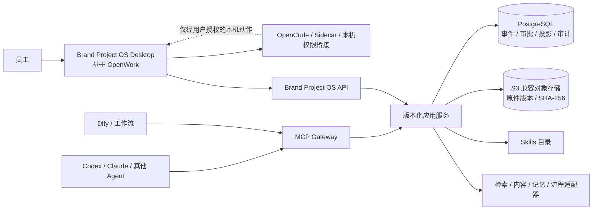

# ADR-0005：单一客户端与服务器权威服务

- 状态：已接受
- 日期：2026-07-22
- 决策人：Fox
- 影响范围：产品形态、团队部署、数据权威、身份权限、MCP/Skills、工作流和可靠性
- 取代：[ADR-0001](0001-team-server-authority.md) 的远期候选结论，以及 [ADR-0003](0003-local-first-hongri-validation.md) 的长期本地单用户拓扑
- 配套：[ADR-0004](0004-openwork-single-client.md)

## 背景

本地单用户切片已经证明领域事件、人工确认、证据回源、Task Packet、CLI 和 stdio MCP 可以形成同一套业务语义。团队实际使用不能依赖某一台员工电脑持续在线，也不能让每台电脑各自保存一份正式状态。

Fox 同时明确了客户端边界：员工只安装公司定制版 OpenWork。Brand Project OS 不再另做一个客户端；它是同一产品中的业务能力和服务器服务。

Brand Project OS 是当前项目名，不是已锁定的最终发行品牌。后续改名只更新产品标识和服务命名，不改变本 ADR 的单一客户端、服务器权威和权限边界。

## 决策

1. Brand Project OS 是一个产品，包含两类部署组件：基于 OpenWork 的唯一员工客户端，以及公司服务器上的 Brand Project OS Service。组件数量不等于员工要安装多个软件。
2. 客户端负责交互、OpenCode Runtime、Sidecar 和经用户授权的本机文件/终端/桌面桥接。客户端会话、运行库、缓存和本地草稿不是正式事实。
3. 服务器负责版本化业务 API、权威事件与审批、当前投影、证据元数据、MCP Gateway、Skills 目录、审计和工作流适配。
4. 团队阶段以 PostgreSQL 作为唯一可写正式状态源，以公司控制的 S3 兼容对象存储保存原始文件版本。客户端不得直接访问数据库或对象存储。
5. Phase 1 SQLite 在服务器迁移完成前继续是本地验证权威。切换时执行导出、校验、冻结本地写入和一次性迁移；切换后 SQLite 只作只读归档、缓存或草稿，不允许长期双写。
6. MCP 是 Agent 访问协议，不是业务核心。OpenWork 使用业务 API 完成员工操作；Codex、Claude、Dify 和其他 Agent 通过受控 MCP/Skills 调用同一应用服务。
7. AI、MCP、Skill、工作流和服务账号只能读取或创建 Proposal。正式事实、决定、负责人、日期和承诺必须由有权限的员工在交互式客户端确认。
8. 所有正式写入使用幂等键、`expected_version` 和数据库事务。版本冲突返回差异，不做最后写入覆盖。事件、投影、审批、审计和 Outbox 在同一事务内形成一致提交。
9. 原始证据按 SHA-256 和来源版本管理。检索、摘要、Zvec、Open Notebook、Nubase、Dify、FlowLong 和模型会话均可删除重建，不得成为正式状态源。
10. 必须访问员工电脑的工具留在客户端受控桥接中。服务器 MCP 不能绕过用户授权读取本机目录、终端或桌面。
11. 服务器发布前必须通过身份撤权、项目隔离、备份恢复、并发冲突、审计完整、无双主和故障降级验收。高可用档位依据试点负载实施，但恢复能力不是可选项。

## 目标拓扑

## 一致性边界

| 动作 | 权威处理位置 | 冲突处理 |
|:---|:---|:---|
| 读取当前状态、证据、任务 | 服务器应用服务 | 返回状态版本和数据水位 |
| AI 创建 Proposal | 服务器应用服务 | 幂等创建；基线过期时标记待刷新 |
| 员工确认、修改或驳回 | 服务器人工确认用例 | 校验身份、项目权限和 `expected_version`；冲突返回差异 |
| 本机文件、终端、桌面操作 | 客户端本机桥接 | 每次按工具权限和路径范围授权，不产生业务批准 |
| 离线工作 | 客户端草稿区 | 只保存草稿和待提交 Proposal；恢复联网后重新校验版本 |

## 发布门

- 一个安装包可完成登录、选项目、读状态、回证据、运行 AI 和处理 Proposal。
- 两个客户端同时修改同一状态时，只有一个版本提交成功，另一端收到可理解的差异。
- 服务账号和 MCP 令牌无法调用人工批准处理器。
- PostgreSQL、对象存储和审计可从备份恢复，恢复后事件、投影和原件哈希对账一致。
- 服务暂时不可用时，客户端明确进入只读或草稿状态，不把本地缓存冒充最新正式状态。
- 清理 OpenWork/OpenCode 运行数据不影响服务器上的正式状态和证据。

## 不采用

- 每台员工电脑各自保存可写正式状态，再依赖双向同步解决冲突。
- 用 OpenWork Session、OpenCode SQLite、MCP 日志、Dify 数据库或向量库保存正式决定。
- 让远程 MCP 直接操作员工电脑，或让 Tool Permission 兼任业务批准。
- 为了统一入口再建设第二个员工 Web/PWA 或桌面客户端。
