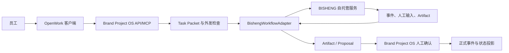

# BISHENG 接入评估

> 评估对象：[dataelement/bisheng](https://github.com/dataelement/bisheng)
> 固定版本：`v2.6.0`，提交 `779d8fb87a1125744af065a21e032c2573167f91`
> 评估日期：2026-07-22
> 当前结论：`future-candidate`、`not-approved-for-current-49-tasks`、`review-after-hongri-pilot`

## 一句话结论

BISHENG 值得保留为 Phase 4 真实试点后的组件候选。最有价值的是可视化工作流、人工中断/恢复、文档处理和派生知识检索；最不该做的是让它接管正式状态、业务批准、FoxWork 客户端或品牌 Agent 的唯一运行时。它不计入当前 56 项，启动前需 Fox 单独批准 rescope。

## 它是什么

BISHENG 是一套服务器端 AI 应用平台，不是桌面客户端。社区仓库采用 Apache-2.0，v2.6.0 由 FastAPI、React、LangGraph、Celery、MySQL、Redis、Milvus、Elasticsearch、MinIO 和 OpenFGA 等组成。官方快速部署要求至少 4 核、16 GB 内存，推荐 18 核、48 GB，并默认部署多个基础设施服务。

它当前提供的能力包括：

- 可视化工作流，支持条件、循环、并行、批处理、RAG、工具、报告和人工输入节点。
- Linsight 任务式 Agent，支持任务拆解、子任务、Skills、MCP、暂停、恢复和人工介入。
- 文档知识库与知识空间，覆盖 PDF、Office、图片、音视频、网页、版本和引用定位。
- `/api/v2` 外部接口，可触发工作流、管理文件库、检索、调用助手和模型。
- 多租户、RBAC/ReBAC、知识权限过滤等团队能力。

## 1. 接入的必要性

### 对产品能力有价值

| 当前需求 | BISHENG 能补什么 | 价值 |
|:---|:---|:---|
| 品牌工作需要多步流程和人工检查 | 可视化工作流、输入节点、中断与恢复 | 运营人员能看懂并调整流程，不必每次写代码 |
| 大量 PDF、PPT、Word、图片和音视频需要处理 | 文档解析、OCR、分块、批处理、引用定位 | 可减少自建复杂解析链的工作量 |
| 团队需要查看长任务进度 | Celery/Redis 执行、事件流、停止接口 | 可把长流程状态送回 OpenWork 展示 |
| 同一流程需要重复执行 | 已发布工作流 + 固定输入输出 | 适合会议整理、资料检查、报告生成等重复工作 |
| 后续可能需要团队知识空间 | 文件版本、检索、权限过滤 | 可作为派生知识层候选，不必马上自研完整知识平台 |

### BISHENG 本身不是必需品

Brand Project OS 的核心问题是：当前状态是什么、结论从哪里来、谁批准了什么，以及新资料如何形成可确认的变化。BISHENG 解决的是 AI 应用编排和知识处理，不负责这套业务真相。

因此必须区分：

- 可视化工作流、文档处理和人工介入可能是团队阶段的必要能力。
- BISHENG 只是这些能力的一种实现，Dify、FlowLong 或直接 Worker 仍可替换。
- 当前 Phase 2-4 不依赖 BISHENG。现在把它设为前置，会把 MySQL、Redis、Milvus、Elasticsearch、MinIO、OpenFGA 和 Docker 一起带入，偏离服务器权威、联网闭环和团队试点目标。
- 只有鸿日试点证明 Brand Project OS 本身有价值后，才值得比较 BISHENG 带来的增量是否覆盖部署和运维成本。

## 2. 能怎么接入

### 方案比较

| 方案 | 做法 | 判断 |
|:---|:---|:---|
| API 适配器 | Brand Project OS 通过已规划的 `AIWorkflowPort` 调用 BISHENG `/api/v2/workflow/invoke`，接收事件、人工输入和结果 | 推荐，能与 Dify/直接 Worker 使用同一边界 |
| 派生知识适配器 | 通过 `/api/v2/filelib` 上传已授权副本、查询处理状态并检索；结果映射回原始 `evidence_ref` | 可做 POC，不得变成真相源 |
| MCP 反向接入 | 给 BISHENG 暴露 Brand Project OS 的只读状态、证据和 Proposal 工具 | 后置；工具必须白名单，禁止批准和直接写状态 |
| 嵌入 BISHENG 页面 | 在 OpenWork 内用 WebView/iframe 打开完整管理后台 | 不推荐，登录、权限、导航和品牌体验会形成第二套产品 |
| Fork BISHENG | 直接改它的后端和前端，合并成 Brand Project OS | 不推荐，升级成本高，也会把领域核心绑在大型平台上 |
| 直连数据库 | 读取或写入 BISHENG MySQL、Redis、Milvus | 禁止，绕过 API、权限、版本和审计 |

### 推荐边界

BISHENG 只在图的右侧。OpenWork 不直连它，领域核心不导入它的 SDK，正式状态也不写入它的数据库。

## 3. 接入哪一部分

### 第一批接入

1. 工作流调用与停止
   - `POST /api/v2/workflow/invoke`
   - `POST /api/v2/workflow/stop`
   - SSE 事件转换为统一 `ExternalWorkflowEvent`
   - BISHENG `session_id` 与 Brand Project OS `run_id` 建立映射

2. 人工输入
   - 当工作流进入输入节点时，在 OpenWork 显示问题和所需字段。
   - 用户回答先进入 Brand Project OS 审计，再由适配器恢复原工作流。
   - 这里的人工输入只允许推进流程，不等于业务批准。

3. 结果与附件
   - 最终文字、报告和文件登记为 `Artifact`。
   - 涉及事实、决定、负责人、日期或对外承诺时，只能生成 `Proposal`。
   - BISHENG 返回的引用必须映射回 Brand Project OS 的原始证据；映射失败时标记 `untraceable`，不得进入正式结果。

4. 一个受控知识库 POC
   - 只同步明确授权的 P0/P1 或经单次批准的 P2 派生副本。
   - 每条记录携带 `source_id`、`source_version`、`source_sha256`、`evidence_ref` 和保密级别。
   - 检索结果是派生索引，删除后可从权威原件重建。

### 第二批候选

- 文档解析、OCR、PPT/Word/音视频转写。
- 工作流画布的发布、版本和回滚管理。
- 只读 Brand Project OS MCP 工具，供受控工作流查询当前状态和证据。
- 团队阶段的知识空间和按用户权限过滤。

### 明确不接

- BISHENG 的用户批准记录作为 Brand Project OS 业务批准。
- BISHENG 会话、Redis 状态、MySQL 记录或知识库作为正式项目状态。
- Linsight 替换 OpenWork/OpenCode 的通用 Agent Runtime。
- Skills 双向自动同步；两个平台各自维护的 Skill 不能成为两套规则真相。
- 模型微调、应用市场、完整聊天工作台、分享页和商业 Gateway。
- 任何无需 Brand Project OS 数据检查即可读取远程原件的入口。

## 4. 接入后怎么用

### 普通员工

1. 在 OpenWork 打开项目，看到当前阶段、任务、决定、开放问题和最近变化。
2. 从已批准流程中选择“会议资料整理”“产品证据检查”或“报告生成”。
3. Brand Project OS 根据当前任务生成 Task Packet，只放入必要证据，并检查保密级别。
4. 适配器触发 BISHENG。员工仍留在 OpenWork 查看节点进度、日志摘要和待输入项。
5. BISHENG 完成后，结果作为 Artifact 或 Proposal 回到当前项目。
6. 员工可修改工作稿；只有 Fox 或指定审批人通过 Brand Project OS 确认后，正式状态才改变。

### 流程管理员

1. 在 BISHENG 管理端设计和测试流程。
2. 发布后，把固定的 `workflow_id`、版本、输入输出 Schema 和允许的数据级别登记到 Brand Project OS 白名单。
3. Brand Project OS 只允许调用已登记版本；临时修改节点参数默认禁止。
4. 新版本先跑黄金用例和同一 Task Packet 回归，再替换生产映射。

### 负责人

负责人主要在 OpenWork 看四类信息：运行到哪一步、现在等谁输入、产出了什么、是否形成待确认变化。BISHENG 的后台只供流程配置和故障排查，不要求负责人日常切换系统。

## 风险与硬门

| 风险 | 当前证据 | 必须措施 |
|:---|:---|:---|
| `/api/v2` 身份边界弱 | v2 工作流源码直接使用配置中的 `default_operator`，WebSocket 注释写明免登录 | BISHENG 后端只放内网；前置自有网关或服务网格认证；OpenWork 不可直连 |
| “代用户”参数扩大权限面 | v2 文件库支持传入 `user_id` 解析操作身份 | 适配器禁止透传任意用户 ID；服务账号和项目映射固定 |
| 商业能力不可默认获得 | SSO、内容安全、流控 Gateway 是独立私有仓库 | 社区版 POC 自行补认证、限流和审计；采购前单列许可证核验 |
| 默认部署不适合生产 | Compose 暴露多个端口并带示例密码/密钥 | 不使用默认凭据；数据库和基础设施不暴露公网；镜像、配置和 Secret 固定版本 |
| 基础设施较重 | 默认需要 MySQL、Redis、Milvus、ES、MinIO、OpenFGA 等 | 独立服务器部署；不得塞进 OpenWork 桌面端或 Phase 1 本机进程 |
| 双运行时重叠 | OpenWork/OpenCode 与 Linsight 都能运行 Agent、Skills 和 MCP | 第一批只用确定性工作流；Linsight 必须单独证明比现有 Runtime 更好 |
| 派生知识覆盖真相 | BISHENG 支持版本、检索和权限，但不了解 Brand Project OS 五态 | 所有结果携带来源与状态版本；BISHENG 不能批准有效性 |

## 与 Dify、FlowLong 和 OpenWork 的关系

| 组件 | 建议角色 | 与 BISHENG 的关系 |
|:---|:---|:---|
| OpenWork | 员工日常客户端、运行状态与 Proposal 入口 | 不替换，BISHENG 在服务端被调用 |
| OpenCode | 默认通用 Agent Runtime | 不替换；BISHENG 先做固定工作流 |
| Dify | 轻量工作流/AI 应用候选 | 与 BISHENG 做同场 POC，原则上二选一，不同时成为核心依赖 |
| FlowLong | 复杂业务审批/流程协调候选 | 适合更严格的业务流；不得与 BISHENG 重复承载同一审批状态 |
| BISHENG | 可视化 AI 工作流、文档处理、派生知识 | 通过端口接入，可随时禁用和替换 |

## 采用判断

当前判定为“有条件值得接”。满足以下条件后，才进入代码级 POC：

- 鸿日本地原型通过真实价值门，团队确实需要可视化复用流程。
- 已有一台独立服务器，能承担 BISHENG 的基础设施和备份。
- `/api/v2` 已被网络隔离并补上服务身份认证。
- 选定一个真实流程，与直接 Worker/Dify 用相同输入做对比。
- 社区版能力和商业版缺口已经逐项核对，不把私有 Gateway 能力写进社区版验收。

任何一项不满足，BISHENG 保持候选，不影响 Brand Project OS 和 OpenWork 继续工作。

## 核验来源

- [BISHENG v2.6.0 README](https://github.com/dataelement/bisheng/blob/779d8fb87a1125744af065a21e032c2573167f91/README_CN.md)
- [系统架构总览](https://github.com/dataelement/bisheng/blob/779d8fb87a1125744af065a21e032c2573167f91/docs/architecture/01-architecture-overview.md)
- [工作流引擎架构](https://github.com/dataelement/bisheng/blob/779d8fb87a1125744af065a21e032c2573167f91/docs/architecture/03-workflow-engine.md)
- [知识库与 RAG](https://github.com/dataelement/bisheng/blob/779d8fb87a1125744af065a21e032c2573167f91/docs/architecture/04-knowledge-rag.md)
- [Linsight 与 MCP](https://github.com/dataelement/bisheng/blob/779d8fb87a1125744af065a21e032c2573167f91/docs/architecture/05-linsight-agent.md)
- [v2 工作流开放端点](https://github.com/dataelement/bisheng/blob/779d8fb87a1125744af065a21e032c2573167f91/src/backend/bisheng/open_endpoints/api/endpoints/workflow.py)
- [v2 默认操作身份](https://github.com/dataelement/bisheng/blob/779d8fb87a1125744af065a21e032c2573167f91/src/backend/bisheng/open_endpoints/domain/utils.py)
- [商业 Gateway 边界](https://github.com/dataelement/bisheng/blob/779d8fb87a1125744af065a21e032c2573167f91/docs/architecture/11-gateway.md)
- [Apache-2.0 许可证](https://github.com/dataelement/bisheng/blob/779d8fb87a1125744af065a21e032c2573167f91/LICENSE)
