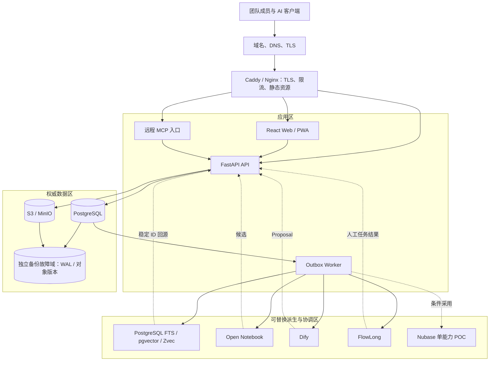
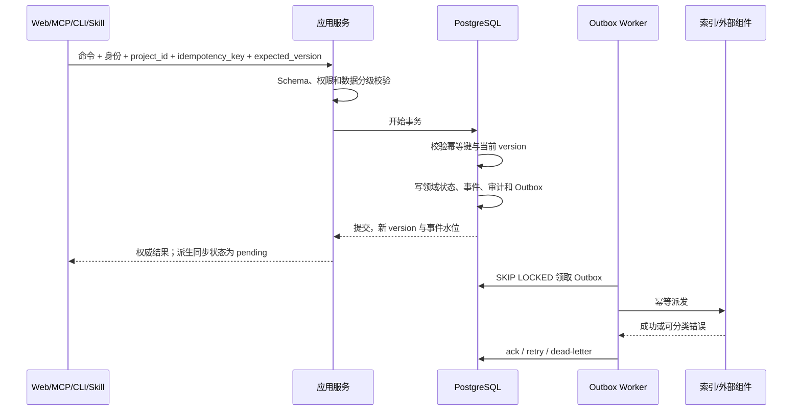

# 团队服务端部署拓扑评估

## 结论

Brand Project OS 不应以某位成员的电脑作为生产权威节点。团队生产环境采用“一个逻辑权威服务端、多个访问客户端”：标准 PostgreSQL 保存正式状态，S3 兼容对象存储保存不可变原件，Web/PWA、HTTPS API、远程 MCP、CLI 和 Skills 统一经过应用服务。

推荐从 **T2 团队生产版** 起步：一台应用服务器运行反向代理、Web、API 和 Worker；PostgreSQL 使用独立实例并启用连续归档与 PITR；对象数据进入独立故障域的 S3 兼容存储。规模和业务依赖证明需要后，再升级两个 API 实例和数据库高可用。首版不需要 Kubernetes。

## 目标与非目标

### 目标

- 多名团队成员看到同一正式状态，并能检测并发冲突。
- 服务器持续提供 Web、API、远程 MCP、CLI 和 Skills 访问。
- 单个 AI、索引、Notebook 或工作流组件故障不破坏权威数据。
- 数据库与对象原件可在独立环境恢复，索引和派生状态可重建。
- 部署方案可以从小团队平滑升级，不更换领域契约。

### 非目标

- 首版不追求跨地域双活和零停机灾备。
- 首版不为“可能有一天会用到”而引入 Kubernetes、Kafka 或多套数据库平台。
- 不允许脱离统一应用服务的客户端直写数据库。
- 不把 Zvec、Open Notebook、Nubase、Dify 或 FlowLong 的可用性计入权威状态可读性的必要条件。

## 逻辑拓扑

“一个逻辑权威服务端”不等于所有进程必须位于一台机器。API 可以水平扩展，Worker 可以多实例竞争任务，数据库可以主备；只要正式写入最终由同一个 PostgreSQL 权威集群按同一事务和权限规则提交，真相仍然唯一。

## 写入一致性设计

### 正式命令流程

### 并发规则

| 场景 | 机制 | 客户端行为 |
|:---|:---|:---|
| 普通对象编辑 | `expected_version` 乐观并发控制 | `409 Conflict` 后显示服务端版本和差异，人工选择重试 |
| 批准、角色变更、外部承诺 | 事务内版本校验；必要时行锁 | 不允许自动合并或“最后写入者获胜” |
| 重复提交和网络重试 | `project_id + actor_id + idempotency_key` 唯一约束 | 返回首次提交结果，不重复执行副作用 |
| Worker 并发 | `FOR UPDATE SKIP LOCKED`、租约和幂等处理器 | 任一任务可重复投递，但结果不可重复生效 |
| 外部流程回调 | 外部实例 ID、步骤 ID、事件 ID 唯一约束 | 重复回调返回已处理结果 |

### 强一致与最终一致

- **强一致**：正式状态、事件、权限、审批、审计、幂等记录和 Outbox。
- **最终一致**：全文/向量索引、Zvec、Open Notebook、Dify、FlowLong、通知和统计。
- **不允许降级**：外部组件不可用时，可以停止 AI 和自动化，但不能把派生数据临时当权威数据。
- **可见水位**：检索和研究结果返回 `source_version`、`event_watermark`、`indexed_at`；落后时界面明确提示并提供权威回源。

## 原始文件一致性

PostgreSQL 事务无法与任意 S3 服务形成单一 ACID 事务，因此使用可对账的两阶段应用协议：

1. 客户端向临时对象键上传，服务端限制大小、类型和项目范围。
2. Worker 或 API 计算 SHA-256，核对大小和媒体类型。
3. PostgreSQL 事务写入 Source、SourceVersion、对象键、哈希、审计和 Outbox。
4. 提交后将对象标记为正式版本；失败时保留短期临时对象等待回收。
5. 定期检查“数据库有记录但对象缺失”和“对象存在但无数据库记录”两类不一致。

生产对象存储应开启版本控制、服务端加密、最小权限 Bucket Policy 和生命周期策略。删除业务记录默认只写逻辑删除事件；原件物理删除需独立保留策略和人工授权。

## 三档部署方案

| 档位 | 拓扑 | 适用范围 | 建议目标 | 主要风险 | 结论 |
|:---|:---|:---|:---|:---|:---|
| T1 试点单机版 | 单台 VPS：Caddy、Web、API、Worker、PostgreSQL、MinIO；备份异地 | 3-5 人、非关键试点、可接受小时级中断 | SLO `99.0%`；RPO `<= 24h`，启用 WAL 后争取 `<= 15min`；RTO `<= 4h` | 主机、磁盘、网络共同单点；维护即停机 | 仅试点，不作为稳定生产承诺 |
| T2 团队生产版 | 1 台应用服务器；独立 PostgreSQL；外部 S3；WAL/备份独立故障域 | 5-30 人、日常生产、有限运维人力 | SLO `99.5%`；RPO `<= 5min`；RTO `<= 1h` | 应用服务器仍是单点；短时维护需窗口 | **首发推荐** |
| T3 高可用版 | 负载均衡；2+ API；独立 Worker；托管/主备 PostgreSQL；多可用区 S3 | 业务关键、跨团队、停机成本高 | SLO `99.9%-99.95%`；RPO `<= 1min`；RTO `<= 15min` | 成本和运维复杂度显著上升；仍需应用级演练 | 达到升级门槛后采用 |

### T1 试点单机版

- 使用 Docker Compose 管理固定镜像摘要，Caddy 自动 TLS。
- 数据卷与容器分离，但 PostgreSQL、MinIO 和应用仍共享主机故障域。
- 每日全量备份和 WAL/对象增量复制到另一供应商、区域或账号。
- 仅适合验证产品流程，不得宣称高可用；必须提前告知团队维护窗口。

### T2 团队生产版

- 应用服务器运行 Caddy/Nginx、静态 Web、API 和 Worker；进程分别配置资源限制和健康检查。
- PostgreSQL 使用独立虚拟机或托管实例，启用 TLS、自动备份、WAL 连续归档、连接池和慢查询监控。
- 原件使用外部 S3；若自托管 MinIO，必须与应用主机分离，并有对象版本的异地复制。
- 初期直接使用 PostgreSQL Outbox，不额外引入 Redis 队列；只有吞吐和延迟测量证明需要时才增加专用消息系统。
- 发布可有短维护窗口；数据库迁移使用扩展-迁移-收缩，禁止应用启动时自动迁移生产 Schema。

### T3 高可用版

- 两个或更多无状态 API 实例置于负载均衡后；会话和上传状态不得保存在本机内存。
- Worker 多实例通过 PostgreSQL 锁竞争任务；长任务按类型隔离队列和资源上限。
- PostgreSQL 使用托管多可用区或经验证的主备方案，连接端点可自动故障转移。
- 对象存储开启跨可用区持久性和版本控制；备份仍需独立账号或独立故障域，不能只依赖服务商内部冗余。
- Kubernetes 只有在已有平台团队、多个服务共享编排能力或发布规模证明收益时才考虑；它不是数据库一致性或灾备的替代品。

## 组件部署边界

| 组件 | 生产拓扑 | 可用性要求 | 故障降级 |
|:---|:---|:---|:---|
| PostgreSQL | 独立实例或托管集群 | 权威读取和写入的必要依赖 | 进入只读维护页；禁止改写到 SQLite 或其他数据库 |
| S3/MinIO | 独立故障域 | 新文件导入和原件回源的必要依赖 | 暂停上传；已有元数据仍可读，缺原件的回答必须阻断 |
| PostgreSQL FTS/pgvector | 权威库内的基线索引 | 可降级为结构化查询和回源 | 标记搜索能力受限 |
| Zvec | 独立索引 Worker 维护 | 非必要依赖 | 切回 PostgreSQL 检索；稍后全量重建 |
| Open Notebook | 独立 sidecar、独立数据库和凭据 | 非必要依赖 | 暂停研究处理；保留原件、任务和人工操作 |
| Dify | 独立网络、数据库、Redis、Worker 和凭据 | 非必要依赖 | 暂停 AI Workflow；核心 Worker 可执行必要的直接模型适配或转人工 |
| FlowLong | 独立 Java 服务和数据库 | 仅复杂流程必要 | 新流程回退核心审批队列；在途流程进入对账，不自动批准 |
| Nubase | 隔离 POC 或单能力适配 | 非必要依赖 | 禁用对应适配器，回退标准 PostgreSQL/S3/独立身份方案 |

Dify 与 FlowLong 不应共享“工作流”端口：Dify 属于 `AIWorkflowPort`，负责模型和工具计算；FlowLong 属于 `ApprovalWorkflowPort`，负责人工任务路由。两者的结果都必须回到应用服务，经版本、权限和幂等校验后才能影响正式状态。

## 身份与远程访问

### 人员角色

| 角色 | 最小能力 |
|:---|:---|
| Owner | 项目设置、成员管理、恢复授权和最终治理 |
| Approver | 在授权范围内批准、驳回或要求修改 |
| Contributor | 导入、编辑、提交 Proposal 和执行任务 |
| Viewer | 只读正式状态和被授权证据 |

### 客户端边界

- Web/PWA 使用短期会话或 OIDC，敏感动作要求重新确认。
- 远程 MCP 使用独立客户端凭据或 OAuth，不复用浏览器管理员 Cookie；工具按项目和能力允许列表开放。
- CLI 使用设备登录或短期令牌；长期服务令牌只给自动化，并限制来源、项目和作用域。
- Skills 只描述工作流程，不保存长期业务数据和管理员密钥；运行时通过 MCP/API 取最小上下文。
- 所有入口统一生成请求 ID、记录操作者、客户端、项目、用途和结果；反向代理和应用层都执行限流。

## 备份与恢复

### 备份集合

1. PostgreSQL 基础备份、WAL 连续归档、角色和必要配置。
2. S3 对象版本、Bucket 配置、生命周期和对象清单。
3. 应用配置的加密备份、固定镜像摘要、迁移版本和部署清单。
4. Dify/FlowLong/Open Notebook 等派生组件只备份难以重建的流程定义、Prompt 和人工配置，不把它们当权威数据恢复源。

### 恢复顺序

1. 在隔离环境恢复 PostgreSQL 到目标时间点并运行结构、事件和审计校验。
2. 恢复或挂载对象版本，逐条校验数据库对象键、大小和 SHA-256。
3. 重建当前状态投影和 PostgreSQL 检索基线。
4. 从权威数据重建 Zvec 与其他派生索引。
5. 恢复 Dify Workflow、Open Notebook 研究区和 FlowLong 配置，并与权威事件对账。
6. 运行 V5 金标、关键用户旅程和权限测试，通过后才切换流量。

### 演练频率

- 每日自动检查备份和 WAL 归档新鲜度。
- 每月执行 PostgreSQL 隔离恢复与抽样对象校验。
- 每季度执行完整灾难恢复演练，包括应用重建、对象恢复、索引重建和用户验收。
- 每次重大 Schema、存储、身份或部署变更后追加专项恢复演练。

## 发布与数据库迁移

- 构建产物和容器镜像固定版本与摘要，同一产物逐环境提升。
- 生产迁移由单独命令显式执行，并记录操作者、迁移版本、开始/结束时间和结果。
- 采用扩展-迁移-收缩：先添加兼容字段/表，再回填和切换读取，最后在后续版本删除旧结构。
- 大表迁移设置锁等待和语句超时，先在 V5 数据和生产规模副本测量。
- API 至少兼容前一个客户端版本；远程 MCP 工具和 Schema 使用显式版本。
- 发布失败优先回滚应用；数据库变更不可逆时采用前向修复，不依赖未经验证的降级脚本。

## 可观测性与稳定性控制

### 必须采集

- HTTP 请求率、错误率、p50/p95/p99 延迟、活动用户和限流次数。
- PostgreSQL 连接池、事务冲突、锁等待、慢查询、磁盘、复制/归档延迟。
- Outbox 队列深度、最老事件年龄、重试、死信和处理耗时。
- S3 上传失败、对象缺失、哈希不一致、版本和生命周期异常。
- 登录失败、跨项目拒绝、批准操作、管理员操作和密钥使用。
- 外部组件调用成功率、延迟、数据分级、提供商、费用和熔断状态。
- 索引事件水位与权威事件水位差。

日志输出到 stdout，并采用结构化字段；密钥、原文、完整 Prompt 和个人敏感数据不得进入普通日志。告警必须有责任人、处理手册和升级路径，不能只发无人查看的通知。

## SLO、RPO 与 RTO 建议

### 首发承诺

| 目标 | 建议值 | 说明 |
|:---|:---|:---|
| 月度应用可用性 | `>= 99.5%` | 约 3 小时 39 分/月不可用预算；计划维护是否计入需事先定义 |
| 权威读取 API | `p95 <= 500ms` | 不含模型生成、全文 OCR 和大文件下载 |
| 普通写入 API | `p95 <= 1s` | 返回 PostgreSQL 权威提交结果，不等待派生组件 |
| Outbox 新鲜度 | `95% <= 60s`，`99% <= 5min` | 超时不影响权威提交，但必须可见和告警 |
| 权威证据回源完整率 | `100%` | 任一已批准对象无法回源即视为严重故障 |
| 未授权状态升级 | `0` | 安全不变量，不用百分比稀释 |
| RPO | `<= 5 分钟` | 依赖 WAL 连续归档和独立故障域对象版本 |
| RTO | `<= 1 小时` | 必须由完整恢复演练证明 |

### SLO 计算边界

- 从反向代理接收有效请求到应用返回结果计入；客户端网络和外部模型长任务单独计量。
- 权威读写 SLO 与 AI 自动化 SLO 分开。Dify、Open Notebook、Zvec 或 FlowLong 故障不应直接把权威 API 判定为不可用。
- 文件导入采用异步任务 SLO，分别记录上传接收、原件登记、解析和索引完成时间。
- 任何 SLO 只有具备监控、错误预算和复盘机制后才是承诺，否则只是设计目标。

## 升级门槛

从 T2 升级 T3 应至少满足一项，并经过成本评审：

- 过去三个月单应用服务器故障或维护消耗超过一半错误预算；
- 同时在线人数、请求量或 Worker 负载需要独立扩缩容；
- 合同要求 `99.9%` 以上可用性、`RTO < 1 小时` 或多可用区；
- 单次停机的业务损失高于双实例和托管高可用的持续成本；
- 已有团队能够承担故障转移、容量、证书、备份和安全值班责任。

## 采用决策

- **当前目标拓扑**：T2 团队生产版。
- **首版编排**：Docker Compose；不引入 Kubernetes。
- **权威数据**：标准 PostgreSQL + S3 兼容对象存储。
- **异步一致性**：PostgreSQL Outbox + 幂等 Worker，不先引入额外消息系统。
- **客户端**：Web/PWA 为主，HTTPS API、远程 MCP、CLI 和 Skills 共用应用服务。
- **恢复目标**：`RPO <= 5 分钟`、`RTO <= 1 小时`，以恢复演练为准。
- **派生组件**：按决策门逐个接入，任一组件停用时仍可读取正式状态并完成人工批准。
