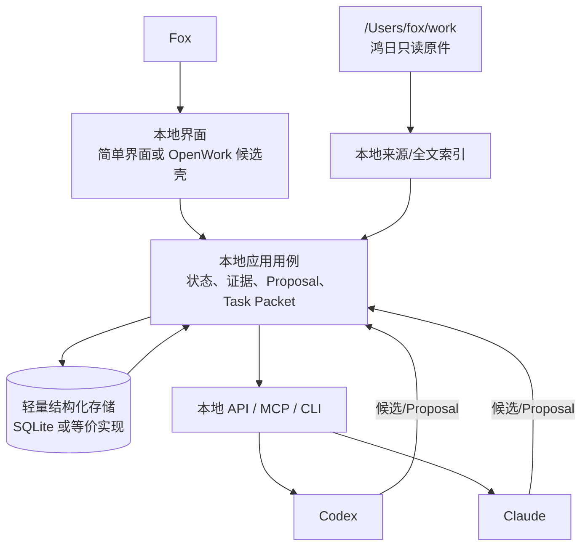
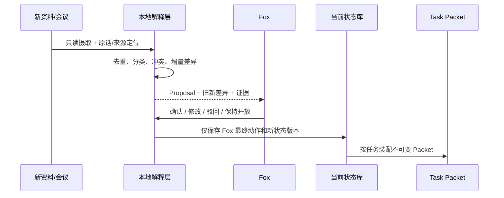
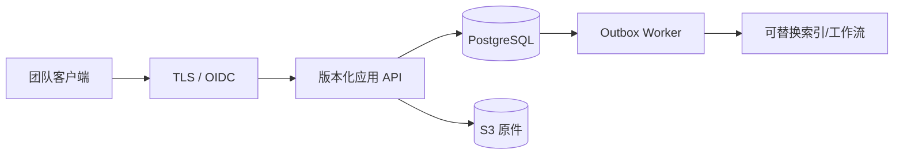

# 部署拓扑评估

## 当前决策

CURRENT 不是团队服务器部署，而是 Fox 在 `/Users/fox/work` 上验证鸿日的本地单用户 MVP。

| 方案 | 状态 | 结论 |
|:---|:---|:---|
| 本地鸿日单用户原型 | **CURRENT** | 当前唯一实施与验收目标 |
| OpenWork 本地桌面壳 | CURRENT 候选 | 可以验证界面适配，但不是 MVP 前置条件 |
| 团队服务器 | `future-candidate` | 保留设计，不实施 |
| PostgreSQL、S3、OIDC、并发、HA、PITR、灾备 | `not-approved-for-current-mvp` | 不进入当前依赖、工期和完成标准 |
| 服务器化复审 | `review-after-hongri-pilot` | 由鸿日真实使用和团队需求重新决定 |

## CURRENT 本地拓扑

### 当前边界

- 所有组件运行在 Fox 的本地环境；不开放公网团队服务。
- `/Users/fox/work` 原件只读，系统写入独立应用数据目录。
- 轻量结构化存储承载单用户当前状态、关系、Proposal 和确认历史。
- 当前状态只有 Fox 确认后改变；模型会话和检索结果不直接写入。
- Codex 与 Claude 通过本地 API/MCP/CLI 读取同一 Task Packet。
- OpenWork 若使用，只提供本地界面、会话或工具运行；OpenWork Server/OpenCode 不是业务真相源。

## 当前文件与状态一致性

CURRENT 不需要 PostgreSQL/S3 两阶段提交，但仍需防止损坏 Fox 原始工作：

1. 扫描获准资料，只记录路径、SHA-256、大小、媒体类型、时间和版本关系。
2. 解析文本、索引和缩略图写入独立派生目录，不回写原件。
3. 文件哈希变化时建立新版本候选，不静默覆盖旧索引记录。
4. 文件缺失、移动或无法读取时显示来源缺口，不用模型摘要补齐。
5. 重要结论保存稳定 Source ID 和可打开的原文定位。

本地元数据备份可以使用版本化快照或导出文件；是否需要更强恢复能力由真实使用风险决定。

## 当前状态写入流程

CURRENT 不需要多人乐观锁，但 Proposal 仍应带基础状态版本，避免 Fox 打开旧页面后覆盖较新的本地状态。

## 增量会议运行路径

1. 新会议作为独立来源登记。
2. 识别会议模式：探索、评估、决策或同步。
3. 仅抽取新增的事实候选、观点、假设、选项、倾向、行动和时间性质。
4. 与当前状态和已有证据比较，单列重复、冲突和可能替代。
5. 生成变化 Proposal，保留原话、发言人和时间点。
6. Fox 确认后才形成新状态版本。
7. 旧 Task Packet 标记过期；后续模型读取新 Packet。

禁止重新总结全历史后直接写回当前状态。

## 多模型一致性路径

| 层 | CURRENT 规则 |
|:---|:---|
| 状态 | 本地核心只维护一份 Fox 已确认状态 |
| Task Packet | 同一任务固定 `packet_version` 与内容摘要 |
| 模型入口 | Codex、Claude 调用同一读取用例和证据定位 |
| 模型输出 | 只作为候选，必须携带 Packet 版本和证据引用 |
| 对比评测 | 只切换模型，不改变状态、工作模式和证据集合 |
| 模式切换 | 仅由 Fox 从探索切到执行或返回探索 |

## OpenWork 本地候选

OpenWork 的 React/Electron 工作区、Session、Skills/MCP、文件和终端体验可用于本地候选界面。但 CURRENT 只需要验证：

- 是否能低成本显示当前状态、待确认和证据；
- 是否能向 Codex/Claude 提供同一 Task Packet；
- OpenCode Tool Permission 与 Fox 业务确认是否完全分开；
- 停用 OpenWork 后本地核心数据和模型入口是否仍然可用。

当前不部署远程 OpenWork Server、Den/`ee/`、团队控制面、企业身份或公司自动更新链。OpenWork 深度 fork 是 `review-after-hongri-pilot` 决策。

## CURRENT 可用性与恢复

当前产品价值指标不是服务器 SLO，而是工作正确性。最低运行保护包括：

- 原件永不由系统自动修改或删除；
- 本地状态库支持可读导出和周期快照；
- 索引和派生文本可从原件重建；
- Task Packet、状态版本和 Proposal 具备稳定 Schema；
- OpenWork/OpenCode 或任一模型不可用时，Fox 仍能查看当前状态和证据；
- 失败不触发自动状态升级或静默回退到过期内容。

建议观察：冷启动正确率、回源完整率、非法升级次数、会议增量准确性、多模型事实一致性和 Fox 品牌质量评分，而不是先承诺月度在线率、RPO 或 RTO。

## CURRENT 安全边界

- 默认绑定本机，不开放局域网和公网；
- 本地 API/MCP 使用最小工具表，不暴露批准、任意文件写入和任意 SQL；
- 外部模型调用前按任务选择最小证据，并记录提供商和资料范围；
- 密钥使用系统安全存储或受控环境注入，不写入仓库、URL、日志和 Task Packet；
- OpenWork Renderer、插件、MCP、PTY 和文件访问仍按不可信边界处理；
- CURRENT 单用户不等于允许跳过原件只读、凭据保护和数据外发确认。

## 远期团队服务器候选

既有服务器研究保留为复审输入，不作为当前批准：

候选能力包括：

- 标准 PostgreSQL 正式状态、事件、审批和并发控制；
- S3/MinIO 不可变原件、对象版本和跨故障域备份；
- OIDC、MFA、RBAC/RLS、服务账号和撤权；
- 幂等、预期版本、Outbox、重试、死信和对账；
- 轻量 Web、远程 MCP、CLI 和团队 Desktop；
- 多实例、HA、PITR、RPO/RTO、监控和灾备。

全部状态：`future-candidate` / `not-approved-for-current-mvp` / `review-after-hongri-pilot`。

## 服务器化触发条件

至少出现一项真实证据，并由 Fox 重新批准后才进入服务器设计：

- 两名以上成员需要同时查看或修改同一项目状态；
- 跨设备或远程访问成为高频刚需；
- 本地文件容量、备份或设备故障风险已不可接受；
- 需要可撤销的具名账户和差异权限；
- 本地单用户冲突模型无法覆盖真实工作；
- 鸿日试点已经证明项目认知层本身有稳定价值；
- FoxWork 团队文件线完成独立需求确认并证明适合共享底层能力。

服务器化不是默认 Phase 2，而是一次新的产品范围决定。

## 后置组件部署边界

| 组件 | CURRENT | 未来候选角色 |
|:---|:---|:---|
| Zvec | 不部署 | 可重建检索适配器 |
| Open Notebook | 不部署 | 内容处理/研究 sidecar |
| Nubase | 不部署 | 单项 Memory/模型网关候选 |
| Dify | 不部署 | AI 工作流适配器 |
| FlowLong | 不部署 | 复杂人工路由适配器 |

每个候选都必须保留本地直接基线，且不得成为项目状态或 Fox 批准的唯一存储。

## 最终采用决策

- **当前采用**：本地单用户、只读原件、轻量结构化状态、增量 Proposal、同一 Task Packet、本地 AI 入口和最小界面。
- **当前候选**：OpenWork MIT 社区客户端壳，仅限本地体验验证。
- **当前不采用**：团队服务器、PostgreSQL、S3、OIDC、HA、灾备、远程 OpenWork Server 和五个外部适配器。
- **复审时间**：鸿日真实试点完成后，由 Fox 依据提效、正确性和团队需求执行 `review-after-hongri-pilot`。
