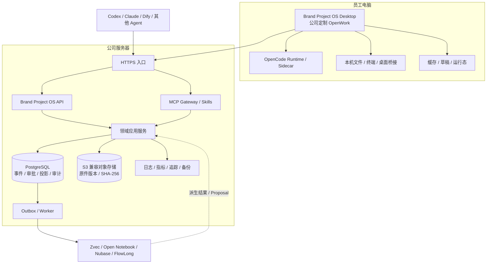

# 部署拓扑评估

## 当前结论

2026-07-22，Fox 批准“公司定制 OpenWork 唯一员工客户端 + 公司服务器权威服务”。Brand Project OS 是当前项目名，最终发行名可以调整，但员工不能面对两个软件。

| 部分 | 当前决定 |
|:---|:---|
| 员工客户端 | 基于 OpenWork 的公司发行版；最终发行名待定 |
| 本机运行 | OpenCode Runtime、Sidecar、文件/终端/桌面桥接随安装包 |
| 业务后端 | Brand Project OS Service，部署在公司服务器 |
| 正式状态 | Phase 1 SQLite；Phase 3 切换后 PostgreSQL 唯一写入权威 |
| 原始证据 | Phase 1 本地内容寻址快照；切换后 S3 兼容对象存储版本 |
| AI 接入 | MCP Gateway、Skills 和 CLI/API；其他 Agent 是辅助入口 |
| 工作流 | Dify 正式适配；FlowLong 等组件逐项评估、可禁用 |
| 第二客户端 | 不建设 Web/PWA 或另一个桌面客户端 |

## 为什么不能“只部署 MCP”

MCP 解决 Agent 如何调用工具，不负责保存权威事件、做事务、处理并发、校验人工身份或恢复数据。服务器至少包含以下部分：

- 领域应用服务和版本化 HTTP API；
- MCP Gateway 与 Skills 目录；
- PostgreSQL 事件、审批、投影和审计；
- 对象存储原件版本和 SHA-256；
- OIDC、RBAC/RLS、幂等、乐观锁和 Outbox；
- 备份、恢复、监控和告警。

MCP Gateway 调用应用服务。它不能直写 PostgreSQL，也不能通过服务账号执行人工批准。

## 目标拓扑



## 权威与运行态

| 数据 | 权威位置 | 删除后影响 |
|:---|:---|:---|
| 原始文件版本和哈希 | 对象存储 + PostgreSQL 元数据 | 不可删除；按保留策略恢复 |
| 人工批准事件和当前状态 | PostgreSQL | 必须从备份和事件恢复 |
| OpenWork/OpenCode Session | 员工设备或运行服务 | 可删除，不影响正式状态 |
| 客户端缓存和离线草稿 | 员工设备 | 可删除；未提交草稿可能丢失，但不能影响正式状态 |
| Zvec/FTS、摘要、Notebook、Memory | 派生层 | 可重建或停用 |
| Dify/FlowLong 流程实例 | 协调层 | 可对账、重试或回退内置流程，不能定义正式状态 |

## 数据一致性

正式写入只走一个方向：

```text
员工交互或 Agent Proposal
  -> 应用服务鉴权和 Schema
  -> idempotency_key + expected_version
  -> 单事务写入事件、审批、投影、审计、Outbox
  -> 返回新状态版本
```

- 并发版本冲突返回 409 和差异，不做最后写入覆盖。
- Agent、MCP、Skill、Dify 和服务账号只能创建 Proposal。
- 离线 Desktop 只保存草稿。恢复联网后以最新版本重新生成差异。
- SQLite 到 PostgreSQL 采用一次性迁移和写入冻结；服务器接受新写入后不允许回升本地旧库。

## 稳定性档位

| 档位 | 拓扑 | 用途 | 进入条件 |
|:---|:---|:---|:---|
| 开发/集成 | 单 API、PostgreSQL、对象存储；隔离测试数据 | CI、迁移、故障注入和恢复演练 | F2.1 后 |
| 小团队试点 | 应用节点、托管 PostgreSQL/对象存储、独立备份域 | 第一批内部成员 | F2.10 与 F3.13 通过 |
| 高可用 | 多应用节点、负载均衡、多可用区数据库和对象版本 | 试点负载达到升级门 | F4.7 测量后由 Fox 批准 |

高可用不是“多起一个数据库进程”。没有成熟故障转移、仲裁和恢复体系时，额外副本会增加脑裂风险。初期也不默认引入 Kubernetes。

Fox 已于 2026-07-23 批准“小团队托管部署”为当前档位。这里的批准不跳过 F3.13：Phase 3 联网产品门通过前，仍不向团队接入生产资料。

## 故障行为

| 故障 | Desktop 行为 | 服务端行为 |
|:---|:---|:---|
| API 不可达 | 显示最后水位，进入只读/草稿 | 告警并恢复；不返回伪成功 |
| PostgreSQL 不可达 | 禁止正式提交 | API 失去就绪，写入停止 |
| 对象存储不可达 | 已登记状态可读，新原件上传暂停 | 上传保持隔离状态，不形成 ACTIVE 证据 |
| OpenCode/Sidecar 故障 | 状态与证据仍可用，AI 工作暂停 | 不影响业务 API 就绪 |
| Zvec/Dify/Notebook 等故障 | 显示功能降级 | 回退 FTS/直接 Worker/内置流程，核心事务继续 |
| 客户端版本故障 | 回滚上一签名版本 | API 保持一个兼容窗口 |

## 初始内部目标

以下数值已由 Fox 批准为内部目标，不是已达成指标或外部承诺：

| 指标 | 初始目标 |
|:---|:---|
| 核心 API 月可用性 | 小团队档不低于 99.5% |
| 读取接口 P95 | 不高于 500 ms |
| 非 AI 写入 P95 | 不高于 1 s |
| Outbox 追平 P95 | 不高于 5 s |
| PostgreSQL RPO | 不高于 5 分钟 |
| 核心服务 RTO | 不高于 60 分钟 |

目标必须由 Phase 4 的真实部署、负载测试、监控和隔离恢复演练证明。AI 生成时延按模型单独统计，不混入核心 API SLO。

## 阶段判断

- Phase 1：不启动服务器也能完成本地纵切；这保证业务语义和客户端不被基础设施绑死。
- Phase 2：建立权威存储、身份权限、一致性、API、审计和恢复。
- Phase 3：完成一次性迁移、Desktop 联网、MCP/Skills/Dify 和外部适配。
- Phase 4：用真实成员、并发和故障数据决定小团队或高可用档位。

部署已进入批准路线，但每一阶段仍需独立通过。没有恢复、权限和一致性证据时，不能因为服务器能启动就宣称稳定。
