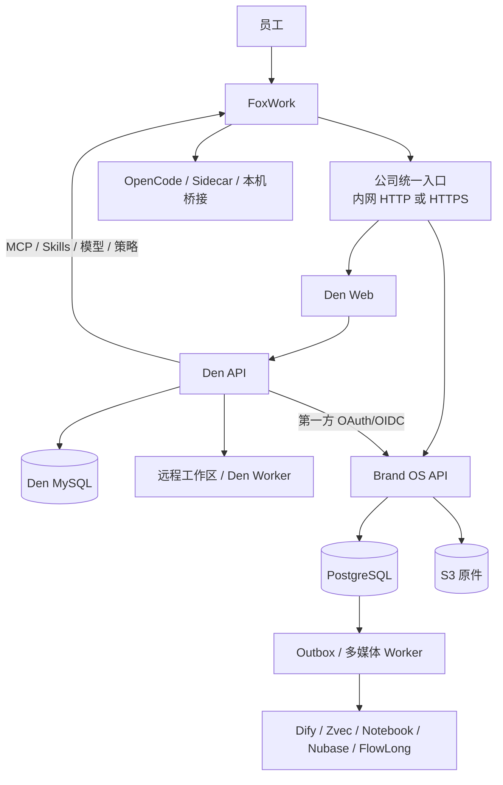

# 部署拓扑评估

> 评估结论：采用“小团队托管部署 + FoxWork 唯一客户端 + Den 控制面 + Brand OS 业务面”  
> 当前任务：F3.3  
> 内部目标：99.5% 月可用性、PostgreSQL RPO <= 5 分钟、核心 RTO <= 60 分钟，待 Phase 4 实测

## 方案比较

| 方案 | 优点 | 关键问题 | 结论 |
|:---|:---|:---|:---|
| 只在 Fox 本机运行 | 最快、成本低 | 团队不能稳定共享，单机故障和账号能力无法统一 | 只保留 Phase 1 验证成果 |
| 只部署 MCP | AI 接入简单 | 没有账号、事务、证据、审批、对象版本、恢复和员工业务 API | 拒绝 |
| 自建全部账号/MCP/Skills/模型控制面 | 许可完全自控 | 重复 OpenWork Den 已有功能，交付和运维成本高 | 第三次 rescope 后退出 |
| 只部署 Den | 登录即用、AI 能力完整 | 没有品牌业务权威、多媒体证据链和人工确认 | 不完整 |
| Den + Brand OS | 复用成熟控制面，保留业务权威和证据 | 需要身份联邦、双服务运维和一致撤权 | **当前采用** |
| 完整 Kubernetes/高可用集群 | 扩展和自动化能力强 | 对几人团队过重，增加故障与运维面 | 首发不采用 |

## 当前拓扑

只给 FoxWork 一个公司入口。Den API、Brand OS 内部服务、MySQL、PostgreSQL、S3 管理端、Worker 和可选组件留在私网。员工不填写内部地址或 Token。

## 为什么仍需要两个服务

Den 擅长“谁能登录、属于哪个组织、能用哪些 AI 能力”。Brand OS 擅长“项目现在是什么状态、资料是否可信、AI 提议了什么、谁批准了什么”。

把两者强行合并会产生两个问题：

1. 用 Den Session/Workspace 代替正式项目事件，清理会话就丢业务真相；
2. 为品牌业务改造 Den 内部 Schema，导致上游同步、许可和数据迁移全部耦合。

因此两者通过 OAuth/OIDC、版本化 API、MCP 和稳定映射协作，不共享业务表。

## 数据位置

| 数据 | 位置 | 是否权威 |
|:---|:---|:---:|
| Den 用户、组织、团队、远程工作区和能力授权 | MySQL | 仅控制面权威 |
| Brand OS 员工绑定、项目角色和映射审计 | PostgreSQL | 是 |
| 正式事件、审批和投影 | PostgreSQL | 是 |
| 原件版本、SHA-256 和 VersionId | PostgreSQL + S3 | 是 |
| OpenWork/Den/OpenCode Session | 客户端或 Den 自有存储 | 否 |
| OCR、转写、摘要、索引和 Memory | 派生存储 | 否 |
| FoxWork 缓存和草稿 | 员工设备 | 否 |

## 内网 HTTP 选择

用户已明确公司内网可以不使用 HTTPS。技术方案允许管理员为私网/VPN/覆盖网络配置 HTTP 公司入口，FoxWork 不再硬性拒绝 `http://`。

这不是全局降级：入口不能公开到互联网，仍保留 PKCE、state/nonce、来源与回调校验、短期令牌、撤权、系统钥匙串和日志脱敏。公网或不可信网络必须 HTTPS，禁止以 `--ignore-certificate-errors` 或任意来源白名单替代正确配置。

## 部署档位

| 档位 | 服务形态 | 用途 | 状态 |
|:---|:---|:---|:---|
| 隔离开发/验收 | 单机 Den/远程 Worker/Brand OS/临时数据库，合成数据 | 构建、契约和故障注入 | F3.2 已使用 Den，远程 Worker 待 F3.3 |
| 小团队托管 | 统一入口、Den Web/API、受管 MySQL、可替换远程 Worker、Brand OS API/Worker、托管 PostgreSQL/S3、独立备份域 | 第一批内部员工 | 已批准，F3.3-F4.10 验证 |
| 高可用 | 多应用节点、多可用区数据库、冗余入口和 Worker 池 | 活跃人数/负载/SLO 触发后 | 待试点决定 |

首发不使用 Kubernetes，不自建不成熟的数据库集群。托管数据库与对象存储降低小团队运维风险，但不能替代恢复演练。

## 故障分析

| 故障 | 员工看到 | 系统行为 |
|:---|:---|:---|
| Den 不可用 | 无法新登录或更新公司能力 | 已有 Brand OS 短期会话按过期策略运行，不能永久延长 |
| Brand OS API 不可用 | 显示最后同步时间，只读/草稿 | 正式提交停止，不返回伪成功 |
| MySQL 不可用 | Den 失去就绪 | 不从 PostgreSQL 猜测账号或权限 |
| PostgreSQL 不可用 | 项目正式写入停止 | API 失去核心就绪，等待恢复 |
| S3 不可用 | 上传/回源失败可见 | 不创建缺失对象的 ACTIVE 证据 |
| Worker 停止 | 资料显示排队或延迟 | 正式状态仍可读写，恢复后追平 |
| Den 远程 Worker 停止 | 远程 Agent 任务停止或排队 | FoxWork 显示真实状态，不回退为未授权本机执行，不损坏业务权威 |
| OpenCode/Sidecar 停止 | AI 工作暂停 | 状态、证据和 Proposal 仍可使用 |
| 可选组件停止 | 相应能力降级 | 回退 FTS/直接 Worker/内置待办或 NoOp |

## 稳定性与恢复

- Den MySQL、PostgreSQL 和 S3 分别备份、分别恢复，再对账稳定身份和项目映射。
- PostgreSQL 使用连续 WAL 与空库恢复；S3 按明确 VersionId 和 SHA-256 核对。
- F2.10 的逻辑备份证明恢复契约，不等于生产 PITR 已完成。
- Den MySQL 与远程 Worker 的恢复/运行目标在 F3.3 测量，F4.8 由 Fox 批准。
- 发布先扩展服务端契约，再升级 Den/Brand OS，最后灰度 FoxWork；破坏性收缩延迟一个周期。
- 单节点允许明确维护窗口，但必须能回滚应用、恢复数据并给员工可理解状态。

## 扩容条件

满足任一条件再评估高可用：活跃员工超过 5 人、连续 30 天正式使用、月可用性接近 99.5% 下限、CPU/连接池连续超过 70%、核心 P95 超标、处理队列持续积压、恢复演练超过目标。

扩容只改变运行拓扑，不改变 Den/Brand OS 数据职责或人工批准边界。

## 阶段判断

- F3.3：先把 Den Web/API/MySQL 与远程 Worker 从“局部能跑”变成“可部署、可恢复、可升级”。
- F3.4-F3.6：完成自助注册、单账号、员工端/管理员后台全中文、身份联邦和远程工作区/项目映射。
- F3.7-F3.19：完成资料、业务、AI 能力和端到端联网产品门。
- F4.1-F4.10：用真实成员、并发、故障、容量和更新证据决定生产 Go/No-Go；每个大阶段只在阶段门通过后同步 Wiki。

服务器能启动不等于稳定，登录能跳回 FoxWork也不等于公司连接完成。必须以账号状态、项目权限、能力授权、资料处理、恢复和撤权的端到端结果验收。
