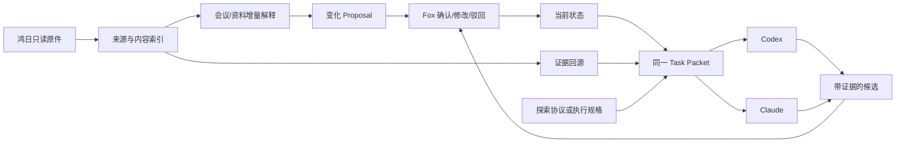

# Phase 1 鸿日本地单用户纵切边界

> 本文只记录已完成的 Phase 1 迁移前边界，不代表整个产品最终拓扑。F1.10 已通过，当前按 [ADR-0005](../adr/0005-single-client-server-authority.md) 建设服务器权威服务；本文中的服务器候选标签只解释为何它没有成为 Phase 1 运行前置。

## 当前目标

| 项 | 已确认内容 |
|:---|:---|
| 状态 | **CURRENT** |
| 第一用户 | Fox |
| 第一项目 | 鸿日 |
| 工作空间 | `/Users/fox/work` 中独立、干净的品牌营销工作空间 |
| 运行形态 | 本地单用户、轻量结构化存储、公司定制 OpenWork 唯一客户端 |
| 核心目的 | 证明 AI 能正确理解长期品牌项目，减少 Fox 重复解释与状态混乱，并提升策略和语言产出质量 |
| 非目标 | 本阶段不运行生产服务器；团队文件平台、通用项目管理和全量第三方平台仍不属于本阶段 |

## MVP 要解决的六个场景

1. **会议解释**：不把观点、偏好、选项、倾向或暂定日期自动升级为决定、约束或 Deadline。
2. **当前有效版本**：先读当前状态和本轮任务，再查相关证据；过期方案不会因相似度高而回到主线。
3. **策略探索**：探索模式保留矛盾，形成真正不同的战略选择和代价，不直接跳到口号或唯一答案。
4. **增量会议**：新会议只产生变化提案、冲突和原话证据，不重写项目历史。
5. **多模型一致**：Codex、Claude 或其他模型读取同一版本 Task Packet，不依赖各自聊天记忆保存项目事实。
6. **真实个人提效**：Fox 在鸿日真实工作中少解释、少纠错、能快速回源，并认可策略与文案质量。

## 当前包含

- 鸿日真实资料范围与只读原件索引；
- 文件来源、时间、版本、有效性和稳定 ID；
- 会议模式、发言人、原话和时间点；
- 事实、观点、假设、选项、方向倾向、决定、约束、开放问题和行动分类；
- 当前项目状态和状态变更 Proposal；
- 增量摄取、去重、冲突检测、替代关系和变更历史；
- 探索协议、执行规格、品牌角色宪法和项目级规则；
- 同一 Task Packet 的本地 API、MCP 或 CLI 读取入口；
- Codex 与 Claude 的最小双模型验证；
- 公司定制 OpenWork：当前状态、待确认、证据回源、模式和本轮任务；
- 10-20 个鸿日黄金用例、BrandBench 评分和 Fox 匿名人评。

## 当前不包含

以下不属于 Phase 1 运行依赖，其中服务器能力已安排在 Phase 2-4：

- 团队账户、邀请、角色、企业权限和多租户；
- 生产服务器和公网服务；
- PostgreSQL、S3/MinIO 和完整对象存储协议；
- OIDC、MFA、RLS、服务账号和组织级审计；
- 多人并发写、分布式锁、Outbox 和消息系统；
- 高可用、负载均衡、PITR、RPO/RTO 和灾备演练；
- 完整 PWA、移动端和外部审批门户；
- OpenWork Den/`ee/` 和远程 OpenWork Server；
- Zvec、Nubase、Open Notebook、FlowLong、Dify 的正式集成；
- FoxWork NAS、文件同步、个人工作区、PPT 合版和团队远程协作。

这些内容可以保留研究文档，但不得进入 CURRENT MVP 的依赖链和完成标准。

## 最小工作流

只有 Fox 的确认动作可以改变当前状态。模型输出、OpenWork/OpenCode Session、检索结果和摘要都只是候选或运行态。

## Task Packet 最小契约

同一任务的所有模型必须读取同一个不可变版本，至少包含：

| 字段 | 说明 |
|:---|:---|
| `project_id` / `project_state_version` | 鸿日项目与当前状态版本 |
| `task_id` / `task_goal` | 本轮任务和完成目标 |
| `work_mode` | `EXPLORE` 或 `EXECUTE`，不可由模型自行切换 |
| `role` | 本轮品牌角色及可验证行为 |
| `approved_facts` | 当前有效事实及证据引用 |
| `approved_decisions` | 已确认决定、适用范围、决定人和证据 |
| `open_questions` | 仍待探索或确认的问题 |
| `relevant_evidence` | 最小相关证据、来源、版本和回源定位 |
| `superseded_items` | 本轮需要防止误用的过期项 |
| `constraints` | 已批准约束，不含观点或暂定日期 |
| `output_contract` | 输出形式、证据要求和质量标准 |
| `packet_version` | Task Packet 版本、生成时间和内容摘要 |

模型能力和表达可以不同，但项目事实、状态版本、工作模式和证据集合必须一致。对比模型时只允许模型与输出不同，不能悄悄改变 Task Packet。

## 探索与执行的切换门

| 当前模式 | 允许输出 | 进入下一模式的条件 |
|:---|:---|:---|
| `EXPLORE` | 矛盾、假设、战略领地、不同选项、代价、证据缺口 | Fox 明确选择方向并确认适用范围 |
| `EXECUTE` | 基于批准方向的命名、文案、PPT、物料和校验 | 新证据造成实质冲突时暂停并提请 Fox 决定是否返回探索 |

禁止把“内容足够完整”“模型置信度高”或“多数模型一致”当作切换依据。

## 增量会议规则

每次新增会议只输出：

- 新事实候选；
- 新观点、假设、选项和方向倾向；
- 与当前决定或证据的冲突；
- 信息完整的行动候选；
- 建议变更的状态字段和旧新差异；
- 每项变化的原话、发言人、时间点和会议来源；
- 需要 Fox 确认的原因。

系统不得重新总结并覆盖全部历史，不得从个人意见推导正式决定，不得把目标日期变成外部硬截止。

## 黄金验收

| 用例 | 通过标准 |
|:---|:---|
| 冷启动 | 新 AI 能说明鸿日当前阶段、目标、决定、开放问题和本轮任务，并回到来源 |
| 会议解释 | VIEW、OPTION、HYPOTHESIS、PREFERENCE、TARGET DATE 不被非法升级 |
| 证据回查 | 返回决定人、原话、会议、时间和适用范围；不足时明确未确认 |
| 增量更新 | 只提出变化，不静默覆盖旧状态；冲突单列 |
| 策略探索 | 给出真正不同的战略选择和代价，不跳到命名口号 |
| 执行落地 | 严格服从已批准方向，不重新发明战略或带回废案 |
| 模型切换 | Codex 与 Claude 读取同一 Task Packet，事实和证据一致 |
| 品牌质量 | Fox 匿名评审达到战略锋利度、自然中文、消费者真实、记忆性和产品咬合基线 |

一票否决：虚构事实、讨论升级成决定、暂定日期写成死线、废案当当前方向、重要结论无法回源、未经确认改变状态、探索模式强行制造唯一答案。

## 完成与后续门

Phase 1 已在 Fox 通过唯一客户端黄金旅程后完成，没有用打包成功或测试数字替代业务验收。F1.10 通过后按批准计划进入：

- Phase 2：PostgreSQL、对象存储、OIDC、并发一致性、审计和恢复；
- Phase 3：Desktop 联网、MCP/Skills、Dify 和四个外部组件逐项适配；
- Phase 4：真实团队工作、稳定性、安全和生产准入；
- FoxWork 团队文件协作是否合并仍需独立评审。
