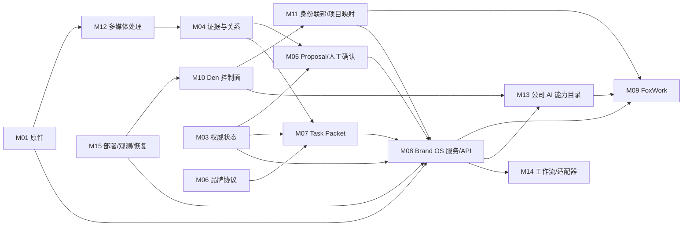

# 模块清单与 S.U.P.E.R 评估

> 基线：2026-07-24  
> 当前活动方案：5 阶段 56 项，29 项完成  
> 评分：绿=已满足，黄=部分满足/仍在实施，红=当前缺口

## 总览

| ID | 模块 | 责任 | 当前依赖 | 复杂度 | S.U.P.E.R |
|:---|:---|:---|:---|:---:|:---|
| M00 | 黄金测试与 BrandBench | 定义理解正确和品牌质量 | 真实 Fixture、人工评分 | 中 | `S绿 U绿 P绿 E绿 R绿` |
| M01 | 来源与原件 | 文件版本、哈希、准入和回源 | SQLite/S3、文件解析 | 高 | `S绿 U绿 P绿 E绿 R绿` |
| M02 | 会议与语义解释 | 模式、分类、增量变化和冲突 | M01、M03、规则版本 | 高 | `S黄 U绿 P绿 E绿 R绿` |
| M03 | 权威状态 | 事件、审批、投影和版本 | SQLite/PostgreSQL | 高 | `S绿 U绿 P绿 E绿 R绿` |
| M04 | 证据与关系 | 支持、冲突、替代和定位 | M01、M03 | 中 | `S绿 U绿 P绿 E绿 R绿` |
| M05 | Proposal 与人工确认 | 候选、差异、确认和冲突 | M03、M04、身份授权 | 高 | `S绿 U绿 P绿 E绿 R绿` |
| M06 | 品牌协议与模式 | 探索/执行规则和切换门 | 版本化规则 | 中 | `S绿 U绿 P绿 E绿 R绿` |
| M07 | Task Packet | 最小、当前、不可变上下文 | M03、M04、M06 | 高 | `S绿 U绿 P绿 E绿 R绿` |
| M08 | Brand OS 服务与 API | 身份、授权、业务用例、MCP | M03-M07、PostgreSQL/S3 | 高 | `S绿 U绿 P绿 E绿 R绿` |
| M09 | FoxWork | 唯一员工界面和本机桥接 | OpenWork、Den、M08 | 极高 | `S黄 U黄 P黄 E黄 R黄` |
| M10 | OpenWork Den | 账号、组织、远程工作区和 AI 控制面 | Den Web/API/MySQL/Worker | 极高 | `S黄 U黄 P黄 E黄 R黄` |
| M11 | 身份联邦与项目映射 | Den 单登录和远程工作区到 Brand OS 项目 | M10、M08 | 极高 | `S绿 U黄 P黄 E黄 R绿` |
| M12 | 多媒体处理 | 上传、OCR/转写/解析和 Artifact | M01、Outbox/Worker | 极高 | `S绿 U绿 P黄 E黄 R绿` |
| M13 | 公司 AI 能力目录 | MCP、Skills、模型、桌面策略 | M10、M08 | 高 | `S黄 U黄 P黄 E黄 R黄` |
| M14 | 工作流与可选适配器 | Dify、Zvec、Notebook、Nubase、FlowLong | M08、Outbox | 高 | `S绿 U绿 P绿 E黄 R绿` |
| M15 | 部署、观测与恢复 | Den/Brand OS 生产运行 | 全部服务器模块 | 极高 | `S黄 U绿 P绿 E黄 R黄` |

## 依赖方向

禁止反向依赖：Den 和 FoxWork 不能进入 Brand OS 领域核心；工作流/索引/Memory 不能修改权威状态；模型输出只能进入 Proposal。

## 模块说明

### M00 黄金测试与 BrandBench

- **责任**：冻结会议分类、证据回源、状态升级、模式切换、多模型一致和自然中文质量基线。
- **公共产物**：固定输入、期望行为、反例、一票否决、匿名评分与版本。
- **风险**：功能测试通过但真实品牌产出仍无价值。
- **当前状态**：Phase 0 已完成，后续真实错误必须追加永久 Fixture。

### M01 来源与原件

- **责任**：知道资料是什么、来自哪里、哪个版本、能否作为证据以及如何打开。
- **接口**：`EvidenceStorePort`、对象准入与对账。
- **实现**：Phase 1 本地内容寻址快照；团队阶段 PostgreSQL 元数据 + S3 VersionId。
- **边界**：同名不覆盖；转写、OCR 和摘要不替代原件。

### M02 会议与语义解释

- **责任**：从会议原话提出增量变化，而不是给出确定性全量摘要。
- **输出**：模式、片段、发言人、时间、类型候选、冲突和 Proposal。
- **边界**：`VIEW/PREFERENCE/HYPOTHESIS/OPTION/TENDENCY/TARGET_DATE` 不自动正式化。
- **黄色原因**：多媒体转写与服务器处理链尚未接入。

### M03 权威状态

- **责任**：保存事件、人工动作、当前投影、项目版本和幂等结果。
- **实现**：Phase 1 SQLite 已只读；PostgreSQL v1-v11 为团队唯一写入面。
- **边界**：只有应用用例写入；投影可从事件重建；不能长期双写。

### M04 证据与关系

- **责任**：表达来源、支持、反对、冲突、替代、适用范围和有效性。
- **输出**：稳定 EvidenceRef 和原文定位。
- **边界**：检索相似度和文件时间不能单独决定当前有效性。

### M05 Proposal 与人工确认

- **责任**：让 AI、工作流和员工提出变化，由有权限员工最终决定。
- **接口**：创建、比较、批准、修改后批准、驳回、替代。
- **边界**：Tool Permission、Den 管理动作和 MCP 服务身份不能调用人工处理器。

### M06 品牌协议与模式

- **责任**：把品牌角色、探索/评估/决策/执行模式变成可验证规则。
- **边界**：AI 只能建议切换；执行不能重开战略，探索不能强行收口。

### M07 Task Packet

- **责任**：生成最小、相关、当前、可回源和不可变的任务上下文。
- **接口**：L0-L4 分层、哈希、状态/协议/任务版本和运行登记。
- **边界**：不把聊天记忆或所有历史塞入上下文。

### M08 Brand OS 服务与 API

- **责任**：把身份、项目权限、业务用例、HTTP、MCP、Outbox 和审计组合为服务器能力。
- **实现**：F2.1-F2.10 已完成基础，F3 继续接 Den 和多媒体。
- **边界**：领域核心不依赖 Starlette、Den、Electron、Dify 或具体 SDK。

### M09 FoxWork

- **责任**：员工自助注册登录、进入工作区、查看项目/资料/证据、运行 AI 和处理 Proposal。
- **基础**：OpenWork `v0.17.36@ddf3e482` 的 Electron/React/App/Server/Orchestrator。
- **必须新建或改造**：公司工作区、项目业务页面、员工端与管理员后台中文资源、Brand OS API、系统钥匙串和撤权处理。
- **边界**：删除 OpenWork Session/SQLite 后业务状态仍完整。
- **黄色原因**：F3.4-F3.13 尚未完成，且上游 OpenCode 类型和运行态耦合较深。

### M10 OpenWork Den

- **责任**：单组织自助注册、成员/团队、远程工作区/Worker、桌面交接、MCP、Skills、共享模型和策略。
- **许可**：`ee/**` 为 FSL-1.1-MIT，只按公司内部用途采用和修改。
- **已证明**：源码可构建、自托管、单组织、共享 Skill/模型/MCP 和撤权。
- **边界**：不保存品牌原件、项目状态或人工审批。
- **黄色原因**：F3.3 生产部署、远程 Worker、员工端/管理员后台中文化和 Brand OS OAuth 资源仍未完成。

### M11 身份联邦与项目映射

- **责任**：让 Den 单登录获得 Brand OS 短期资源令牌，并把组织/团队/远程工作区映射到项目权限。
- **接口**：OIDC/OAuth Discovery、PKCE、audience、组织声明、稳定绑定和映射事件。
- **边界**：不复用 Den Session Token，不按邮箱自动建号，不把组织管理员当项目审批人。
- **黄色/红色热点**：跨系统撤权和映射对账尚待 F3.5-F3.6。

### M12 多媒体处理

- **责任**：图片、视频、录音、PPT、Office、PDF 的上传、准入、处理、Artifact 和来源定位。
- **基线**：Brand OS Outbox/Worker；Open Notebook 仅作 F3.16 可选解析适配器。
- **边界**：处理失败不改变原件；结果只形成 Artifact/Proposal。
- **黄色原因**：`ContentProcessingPort`、长任务和客户端状态仍待 F3.7-F3.8。

### M13 公司 AI 能力目录

- **责任**：通过 Den 按成员或团队下发 MCP、Skills、Provider、模型和桌面策略。
- **边界**：MCP 执行时再次鉴权；Skill 不存事实；模型密钥只在 Den。
- **黄色原因**：Brand OS MCP 注册、版本/签名、撤权和客户端同步待 F3.12-F3.13。

### M14 工作流与可选适配器

| 组件 | 端口 | 任务 | 基线/退出 |
|:---|:---|:---|:---|
| Dify | `AIWorkflowPort` | F3.14 | 直接 Worker/NoOp |
| Zvec | `SearchIndexPort` | F3.15 | PostgreSQL FTS |
| Open Notebook | `ContentProcessingPort` | F3.16 | Brand OS 直接解析 |
| Nubase | `MemoryPort` | F3.17 | 当前状态 + Task Packet |
| FlowLong | `ApprovalWorkflowPort` | F3.18 | Brand OS 待确认队列 |

每项独立通过收益、许可、外发、故障和退出门，可以书面拒绝采用。

### M15 部署、观测与恢复

- **责任**：公司入口、Den/Brand OS 发布、MySQL/PostgreSQL/S3 备份恢复、监控告警和客户端更新。
- **已完成**：Brand OS F2.9-F2.10 基线和内部 SLO 目标。
- **待完成**：Den 生产基线、真实 PITR、联合故障演练、FoxWork 签名更新和生产准入。
- **黄色原因**：99.5%、RPO/RTO 均为待实测目标；Den MySQL 目标尚未批准。

## S.U.P.E.R 结论

| 原则 | 当前判断 | 主要缺口 |
|:---|:---|:---|
| S 单一职责 | 黄 | FoxWork/Den 上游模块面较大，业务与控制面必须继续隔离 |
| U 单向流 | 黄 | Den 撤权、项目映射和能力同步尚未冻结完整事件方向 |
| P 接口优先 | 黄 | F3 的 federation、processing、remote AI contracts 待冻结 |
| E 环境无关 | 黄 | Den/远程 Worker 生产部署、内网 HTTP、公司入口和真实恢复未验证 |
| R 可替换 | 黄 | 业务核心可替换性已好，但客户端绑定 OpenWork、控制面绑定 Den 是已接受产品选择 |

当前最优先热点是 M10/M11/M09：先把 Den/远程 Worker 部署、单登录、员工端/管理员后台中文和项目映射做实，再进入多媒体和外部组件。远程 Worker 是主线，不得用 Dify、Zvec 等可选组件分散 F3.3-F3.6。
