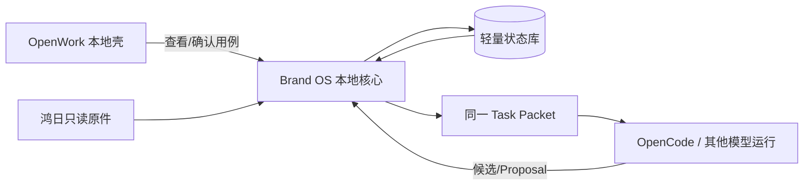

# OpenWork 唯一员工客户端评估

核验基线：OpenWork 稳定发布 [`v0.17.36@ddf3e482`](https://github.com/different-ai/openwork/tree/ddf3e482d2fdf3a374d0fbf4e23e01467a3014fc)（2026-07-20）。2026-07-22 核验时 `dev` 已前进到 `636bf2d`，不作为采用基线。

## 当前结论

Fox 已明确选择 OpenWork 作为公司唯一的员工桌面客户端。员工安装的是公司定制版 OpenWork，不再安装第二个 Brand Project OS 客户端；Brand Project OS 作为业务能力层集成在 OpenWork 内或由 OpenWork 调用。完整决策见 [ADR-0004](../adr/0004-openwork-single-client.md)。

`OW-L0` 已有条件通过：固定稳定版可以完成社区依赖安装、桌面与 sidecar 构建，不要求 `ee/**` 或 Den 编译依赖。上游默认包含的遥测、Den/Cloud、模型目录、更新源和宽松网络权限已由 F1.9 收口；当前从 F1.10 起按授权清单接入真实鸿日资料。完整证据见 [OW-L0 技术选型记录](../phase1/openwork-ow-l0-evaluation.md)。

| 项 | CURRENT 判断 |
|:---|:---|
| 当前实现 | 以 React/Electron 壳、Session、Skills/MCP、模型、终端和文件体验承载 Fox 的最小闭环 |
| 不可替代 | 鸿日原件、当前状态、证据关系、Proposal、模式切换、Task Packet 和 Fox 确认 |
| OpenWork Server/OpenCode | 只属 Agent 运行态，不是业务真相源 |
| 服务器 MCP/Skills | 已进入 Phase 2-3；正式数据权威、身份和恢复由 ADR-0005 约束 |
| 客户端决策 | 公司定制版 OpenWork 是唯一员工客户端 |

当前不再比较第二套简单界面。离线、安全、真相边界和鸿日纵向旅程不通过时，阻断 OpenWork 发布并修复，不能改用第二个客户端掩盖问题。

## 可复用能力

- React 19 + Vite 应用和 Electron 35 桌面壳；
- Workspace、Session、流式消息、Permission、终端、文件和产物界面；
- Skills、MCP、模型提供商和命令配置；
- 本地/远程 Workspace 和 OpenCode 运行集成；
- 诊断、导入导出、浏览器面板和更新框架；
- `packages/types` 跨进程线协议和 UI 分层约束。

证据：

| 事实 | 固定提交证据 |
|:---|:---|
| React/Vite 分层与共用 UI | [应用架构说明](https://github.com/different-ai/openwork/blob/ddf3e482d2fdf3a374d0fbf4e23e01467a3014fc/apps/app/src/react-app/ARCHITECTURE.md) |
| App 直接依赖 `@opencode-ai/sdk` | [`apps/app/package.json`](https://github.com/different-ai/openwork/blob/ddf3e482d2fdf3a374d0fbf4e23e01467a3014fc/apps/app/package.json) |
| Electron、SQLite、PTY、Updater | [`apps/desktop/package.json`](https://github.com/different-ai/openwork/blob/ddf3e482d2fdf3a374d0fbf4e23e01467a3014fc/apps/desktop/package.json) |
| Token 可从 Renderer `localStorage` 读取 | [`server-provider.tsx`](https://github.com/different-ai/openwork/blob/ddf3e482d2fdf3a374d0fbf4e23e01467a3014fc/apps/app/src/react-app/kernel/server-provider.tsx) |
| 主窗口隔离但 `sandbox=false` | [`main.mjs`](https://github.com/different-ai/openwork/blob/ddf3e482d2fdf3a374d0fbf4e23e01467a3014fc/apps/desktop/electron/main.mjs#L2186-L2197) |
| 更新源默认指向上游 Release | [`updater.mjs`](https://github.com/different-ai/openwork/blob/ddf3e482d2fdf3a374d0fbf4e23e01467a3014fc/apps/desktop/electron/updater.mjs#L32-L69) |
| Server Token 是本地 JSON + 三档 Scope | [`tokens.ts`](https://github.com/different-ai/openwork/blob/ddf3e482d2fdf3a374d0fbf4e23e01467a3014fc/apps/server/src/tokens.ts) |
| 运行配置进入本地 SQLite | [`openwork-workspace-config-store.ts`](https://github.com/different-ai/openwork/blob/ddf3e482d2fdf3a374d0fbf4e23e01467a3014fc/apps/server/src/openwork-workspace-config-store.ts) |

## 与六个场景的映射

| 鸿日场景 | OpenWork 能提供 | 必须由 Brand Project OS 领域/服务器能力提供 |
|:---|:---|:---|
| 会议语义 | 文件/Session/模型运行界面 | 会议模式、分类 Schema、原话证据、Proposal 和 Fox 确认 |
| 当前有效版本 | 文件浏览、搜索交互 | 当前状态、有效性、替代/冲突关系和证据优先级 |
| 策略探索 | 多轮对话和多模型入口 | 品牌 Agent 宪法、探索协议、执行规格和显式切换门 |
| 增量会议 | Session 运行和文件导入 | 增量差异、去重、冲突、基础状态版本和不可覆盖历史 |
| 多模型一致 | Provider/模型选择 | 同一版本 Task Packet、统一证据和输出契约 |
| Fox 本人提效 | 桌面工作区体验 | CURRENT 成功指标、BrandBench、匿名人评和真实错误闭环 |

OpenWork 主要解决交互和 Agent 运行，不解决项目认知语义。直接换 Logo 或新增几个页面不会自动得到目标产品。

## 推荐的最小适配

CURRENT 先做公司定制版 OpenWork 的最小垂直切片：

1. 在 OpenWork 本地壳中加入“当前状态、待确认、证据、本轮任务/模式”最小入口；
2. 页面只调用本地 Brand OS 用例，不读取 OpenCode Session 推导业务状态；
3. 创建 Agent 任务时生成固定 Task Packet，并把 `packet_version` 绑定到 Session；
4. Codex/Claude/OpenCode 输出只回到 Proposal；
5. OpenCode Tool Permission 使用明确的“允许本次工具执行”文案，不显示为“批准项目变化”；
6. 删除 OpenWork 本地运行数据后，鸿日状态、证据和确认历史仍完整；
7. 后台 Runtime、Sidecar 和本机桥接随同一个安装包分发，不要求员工安装第二个软件。

## Phase 1 本地边界

永久约束：OpenWork Server、OpenCode Session、Permission、SQLite、Token 和 JSONL/内存事件都不能成为鸿日业务真相源。

## 两类批准必须分开

| 类型 | 含义 | 能否改变鸿日当前状态 |
|:---|:---|:---|
| OpenCode Tool Permission | 是否允许本次 Agent 使用文件、终端、浏览器或工具 | 否 |
| Fox 业务确认 | 是否接受、修改或驳回某项状态变化 Proposal | 是 |

两类动作不得共用按钮文案、Schema、路由、日志或自动通过设置。允许工具执行不表示认可其结论；多数模型一致也不表示 Proposal 获批。

## OpenCode 耦合

OpenWork UI、Server 和 Desktop Runtime 深度依赖 OpenCode SDK/协议，因此“保留 UI、立即替换所有底层引擎”不是 CURRENT 目标。

CURRENT 策略：

- 可以继续使用 OpenCode 做本地运行；
- Brand OS 业务对象不导入 OpenCode SDK 类型；
- Session 只绑定 `task_id`、`packet_version` 和运行引用；
- 运行断开或 Session 丢失不影响当前状态；
- 未来如需替换 Runner，再定义 `AgentRuntimePort`，不提前建设远程 Gateway。

## 许可证与品牌

- 根目录及 `ee/` 外社区代码为 MIT，修改和内部分发需保留版权与许可声明；
- `ee/` 为 FSL-1.1-MIT，内部使用虽被允许，但竞争性商业服务、再分发和商标条款会限制未来选择；
- CURRENT 不构建、复制或依赖 Den/`ee/`；
- 当前原型无需立即完成公司三平台生产品牌、签名和自动更新；若进入正式分发，必须从稳定 Tag 的审核 SHA 起步并重新做 SBOM、许可、安全和签名审查；
- 不使用 OpenWork 商标暗示官方关系。

本文是工程边界，不替代正式法律意见。

## CURRENT 安全要求

即使只是本地候选，也不能忽略：

- 不把长期 Token 放在 Renderer、`localStorage`、URL 或日志；
- 缩小 preload/IPC、导航、文件目录、PTY 和插件允许列表；
- 默认不开放远程 Server 和局域网端口；
- 外部模型只接收本轮最小 Task Packet/证据；
- 自动更新在原型期关闭或受控，不能从上游静默改变运行版本；
- OpenWork 运行数据可清除，且清除不损坏鸿日核心数据。

OIDC、企业 RBAC、服务器 API、公司更新和恢复已进入 Phase 2-4。它们不是 Phase 1 完成条件，也不能反向成为本地纵切前置。

## S.U.P.E.R 评估

| 模块 | S | U | P | E | R | CURRENT 判断 |
|:---|:---:|:---:|:---:|:---:|:---:|:---|
| React 应用 | 绿 | 绿 | 黄 | 绿 | 黄 | 分层基础较好，但 OpenCode 类型穿透关键状态层 |
| Electron 壳 | 黄 | 黄 | 黄 | 黄 | 黄 | 能力完整，IPC/PTY/文件/更新面较大 |
| OpenWork Server | 红 | 黄 | 黄 | 黄 | 红 | 适合 Agent 运行控制，不适合业务核心 |
| OpenCode 集成 | 黄 | 绿 | 红 | 黄 | 红 | CURRENT 可沿用，但新增业务不得扩大直接耦合 |
| Brand OS 应用适配层 | 目标绿 | 目标绿 | 目标绿 | 目标绿 | 目标绿 | 必须独立于 OpenWork Session 保存并迁移当前状态 |

是否采用 OpenWork 的关键指标不是上游模块健康分，而是它能否在不污染本地业务核心的前提下缩短鸿日闭环时间。

## 故障与替换边界

OpenWork 是唯一员工客户端，但业务数据和领域协议仍不能被客户端锁死：

1. 同一状态、Proposal 和证据可以通过版本化应用服务恢复和校验；
2. 本地或服务器 API/MCP/CLI 不以 OpenWork Session 为真相源；
3. 当前状态不存入 OpenCode Session、Runtime SQLite 或 OpenWork 配置；
4. 必要运行产物以开放文件或 Schema 导出；
5. 停用 OpenCode 后仍可切换 Codex、Claude 或直接模型调用；
6. 上游停止维护时，不需要迁移鸿日业务数据。

## 决策门

| 门 | 通过条件 | 未通过 |
|:---|:---|:---|
| OW-L0 技术门 | 稳定版本可构建，不硬依赖 `ee/**`/Den，默认外联可在真实资料接入前关闭 | 停止 OpenWork 适配 |
| OW-L1 真相门 | OpenWork/Session/SQLite 清空后鸿日状态完整 | 拒绝深度适配 |
| OW-L2 模式门 | 探索/执行、Task Packet 和业务确认不被 OpenCode 状态替代 | 只把 OpenWork 当外部 Agent 客户端 |
| OW-L3 安全门 | 本地 Token、IPC、文件/PTY、更新和外发风险可控 | 仅隔离演示，不读取真实鸿日资料 |
| OW-L4 使用门 | Fox 连续真实使用认可其效率和信息架构 | 阻断发布并修正 OpenWork 信息架构 |
| OW-L5 分发门 | 单一安装、签名、更新、服务器地址和恢复流程通过内部验收 | 不向其他员工分发 |

## 最终判断

- **现在要做**：从固定稳定版维护公司 OpenWork fork，先完成默认离线和安全补丁，再接入鸿日业务纵向切片。
- **现在必须自有**：鸿日原件索引、项目状态、证据关系、增量 Proposal、品牌模式、Task Packet 和 Fox 确认。
- **当前客户端结论**：公司定制版 OpenWork 是唯一员工客户端，Brand Project OS 不另做前端软件。
- **服务器结论**：正式数据权威、身份、MCP/Skills、企业更新和恢复已进入活动计划；仍需逐阶段测试和验收，不能因架构已批准就虚报完成。
