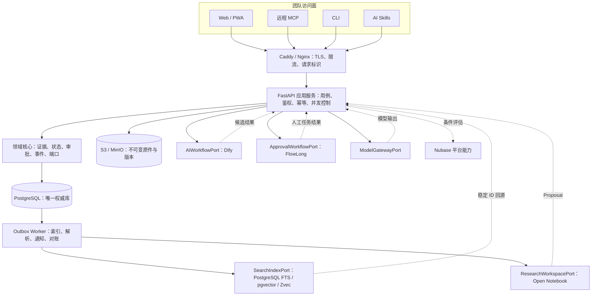

# 项目概览

## 初步方向

开发一个由团队控制、自托管优先、跨模型的 Brand Project OS：服务器持续汇集项目资料和工作变化，AI 主动读取状态、准备任务、检索证据并提出变更；具名团队成员保留品牌判断、外部承诺和正式批准权。

## 已确认任务定义

用户于 2026-07-13 将目标从“个人电脑上的本地程序”调整为“团队共同使用的服务器产品”，并允许把 Dify 纳入工作流候选。新的架构基线是：

- 生产环境只有一个权威服务端，标准 PostgreSQL 是唯一业务写入真相源；
- 原始文件进入 S3 兼容对象存储，按 SHA-256 内容寻址并保留版本；
- Web/PWA 是主客户端，HTTPS API、远程 MCP、CLI 和 Skills 连接同一应用服务；
- SQLite 只用于开发、测试、单机演示或服务器导出的只读快照，不参与团队生产写入；
- Zvec、Open Notebook、Nubase、FlowLong 和 Dify 均通过版本化端口接入，只能保存派生数据或协调状态，不得成为第二真相源。

纳入规划不等于首版同时部署所有候选组件。首版先建立权威数据、并发控制、权限、审计、备份恢复和降级能力，再逐项通过 POC 决策门。

## 当前仓库基线

- 当前目录不是 Git 仓库，追踪模式为 `LOCAL_ONLY`。
- 现有业务资产只有 1 份 1812 行需求说明。
- `.codegraph/` 已初始化，但没有源码可索引。
- 没有应用代码、依赖、数据库迁移、测试、构建脚本或运行入口。
- 本文档描述目标架构，不是现有代码审计结果。

## 架构原则

1. **单一权威写入**：正式对象、审批事件、权限和任务状态只写 PostgreSQL。
2. **原件不可变**：原始文件按内容哈希写入对象存储；数据库记录对象键、哈希、大小、版本和来源。
3. **事务内留痕**：业务变更、审计事件和 Outbox 消息在同一 PostgreSQL 事务提交。
4. **并发可检测**：可编辑聚合携带 `version`；写请求携带幂等键；冲突返回当前版本，不静默覆盖。
5. **派生层可重建**：全文、向量、Notebook、Memory、工作流实例和模型摘要均可禁用、丢弃或重建。
6. **统一访问面**：Web/PWA、远程 MCP、CLI 和 Skills 不直连数据库或第三方组件，只调用应用服务。
7. **人工批准闭环**：AI 和外部工作流只能提出候选；正式批准由应用核心重新校验身份、版本和权限后落账。

## 目标架构

### 一致性边界

| 数据 | 一致性要求 | 写入方式 | 故障时行为 |
|:---|:---|:---|:---|
| 正式状态、审批、权限、负责人、截止时间、提交版本 | 强一致 | PostgreSQL ACID 事务、乐观锁或行锁 | 写入失败即整体回滚 |
| 权威事件、审计、Outbox | 与业务写入原子一致 | 与领域表同一事务 | 不允许“业务成功但无事件” |
| 原始文件与元数据 | 内容不可变、可对账 | 临时上传后校验 SHA-256，再提交元数据 | 孤立对象由清理任务回收，缺失对象阻断回源 |
| 当前状态投影 | 可从事件和正式表重建 | 同事务更新或异步重放 | 显示重建状态，不伪装为最新 |
| 全文、向量、Zvec 索引 | 最终一致 | Outbox Worker 异步更新 | 显示索引水位，回源后再回答 |
| Notebook、Memory、Dify、FlowLong 状态 | 派生或协调一致 | 版本化适配器、幂等回调、定期对账 | 可禁用，不能阻断权威状态读取 |

## 技术栈

| 层 | 当前 | 团队生产基线 | 可替换候选 |
|:---|:---|:---|:---|
| 语言 | 无 | Python 3.12、TypeScript | Java 仅用于隔离的 FlowLong/Nubase 服务 |
| 后端 | 无 | FastAPI、Pydantic、SQLAlchemy、Alembic | 保持 OpenAPI 和领域端口不变后可替换 |
| 前端 | 无 | React、TypeScript、Vite、PWA | 桌面壳后置，不作为首发前提 |
| 权威数据库 | 无 | PostgreSQL | SQLite 仅开发、测试、演示和只读快照 |
| 对象存储 | 无 | S3 兼容存储；生产开启版本控制 | 自托管 MinIO 或托管 S3 服务 |
| 检索 | 无 | PostgreSQL FTS 基线，可选 pgvector | Zvec 独立单写 Worker |
| 异步任务 | 无 | PostgreSQL Outbox + Worker | 负载证明需要后再引入专用消息系统 |
| 内容处理 | 无 | V5 导入器、`content-core` 适配器 | Open Notebook REST sidecar |
| AI 流程 | 无 | 核心应用用例 + `AIWorkflowPort` | Dify 用于可视化 AI 流程，不处理正式审批 |
| 人工审批 | 无 | 核心有限状态机 | FlowLong 用于复杂会签、转办和组织流程 |
| AI 接入 | 无 | HTTPS API、远程 MCP、CLI、Skills、OpenAI-compatible ModelPort | Dify 或 Nubase Gateway 仅作适配器 |
| 包管理 | 无 | `uv`、`pnpm`、固定版本和锁文件 | 外部镜像固定摘要 |
| 部署 | 无 | Docker Compose 起步，反向代理统一 TLS | 负载均衡与多实例；规模证明前不上 Kubernetes |

## 访问入口

- Web/PWA：团队日常操作、待我确认、回源、会议、任务与系统健康。
- HTTPS API：所有客户端和适配器共享的版本化应用接口。
- 远程 MCP：只暴露查询和“提出变更”工具；不暴露批准、密钥或数据库能力。
- CLI：导入、诊断、验证、运维和经确认的管理动作；默认连接服务器。
- Skills：保存可复用的 AI 工作方法，通过远程 MCP/API 获取实时项目状态，不直接携带业务真相。
- Worker：消费 Outbox，负责解析、索引、通知、外部流程调用和对账。

规划中的命令入口：

- `uv run brand-os api`
- `uv run brand-os worker`
- `uv run brand-os mcp`
- `uv run brand-os doctor`
- `uv run brand-os verify hongri`
- `uv run brand-os snapshot export`
- `pnpm --dir apps/web build`

以上均为待实现接口，本轮不启动任何服务。

## 部署基线

详细比较见 [部署拓扑评估](deployment-topology-evaluation.md)。推荐从“团队生产版”起步：应用和 Worker 可先共用一台服务器，但 PostgreSQL 应启用连续归档和时间点恢复，对象备份必须位于独立故障域。首发建议目标为月度可用性 `99.5%`、`RPO <= 5 分钟`、`RTO <= 1 小时`；单服务器仍是明确单点，不应宣称高可用。

## 测试基线

当前没有测试。实施第一阶段必须先建立：

- Pytest 领域、权限、并发、幂等和适配器契约测试；
- PostgreSQL 迁移、事务、行锁、Outbox、备份和 PITR 恢复测试；
- S3 哈希、版本、孤立对象清理和跨项目隔离测试；
- V5 金标导入和回源测试；
- Vitest 前端组件测试；
- Playwright 团队登录、审批冲突、检索回源和降级旅程；
- 索引重建、第三方组件停用、断网、进程退出和服务器恢复演练。

## 项目治理基线

- `AGENTS.md`：共享行为规则；正式事实不得进入指令文件。
- `CLAUDE.md`：Claude 适配规则。
- `docs/progress/MASTER.md`：`LOCAL_ONLY` 规划进度入口。
- 仓库内 Memory：未获批准，不创建。
- 稳定架构决策：记录在 `docs/adr/`；当前服务器权威决策见 ADR-0001，不把模型对话当决策凭据。

## 外部集成

| 集成 | 角色 | 数据方向 | 权限边界 |
|:---|:---|:---|:---|
| Zvec | 可重建检索索引 | Outbox 到索引；结果按稳定 ID 回源 | 不保存权威原件、审批事件或正式状态 |
| Open Notebook | 研究和内容处理工作台 | 原始源副本进入；笔记、引用和摘要以候选返回 | 不得批准或覆盖项目状态；MCP 写工具需允许列表包装 |
| Nubase | Memory、模型网关和身份联邦的隔离 POC | 经版本化端口交换派生数据或外部身份映射 | early-stage 且缺 PITR/HA；不得替换标准 PostgreSQL、S3 或正式成员权限 |
| Dify | AI 工作流、Prompt、模型路由和运行观测 | 应用发起受限任务；结果只形成 Proposal | 不负责任工审批，不直写权威表；多租户和前端品牌受衍生许可限制 |
| FlowLong | 复杂人工审批协调 | 应用发起流程；回调经核心复核后落账 | 不保存正式决定正文；禁用 AI 审批和自动通过；先过许可门 |
