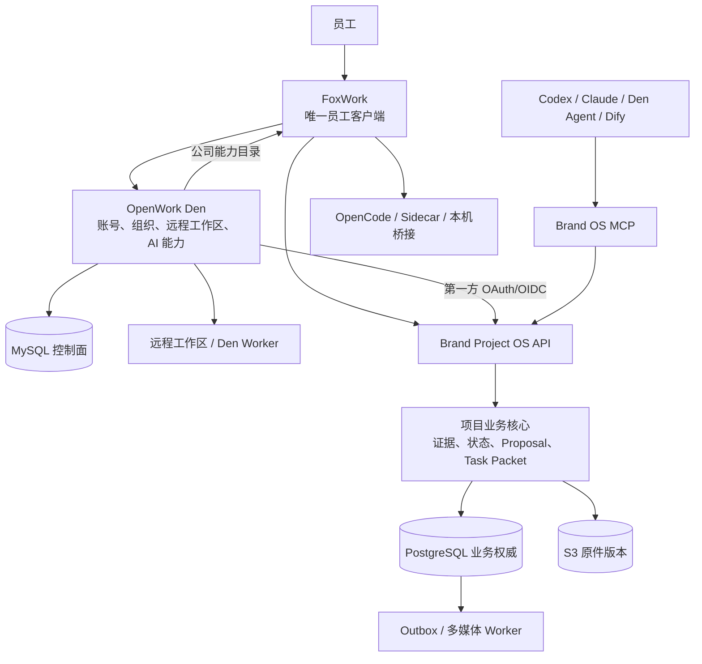

# 项目概览

> 分析基线：2026-07-24 第三次 rescope  
> 当前状态：29/56，F3.3 进行中  
> 活动路线：FoxWork + OpenWork Den + Brand Project OS Service

## 项目定义

FoxWork 是给公司内部员工使用的 AI 工作客户端。员工只安装这一个应用，在公司 Den 入口自助注册并登录一套账号，就能进入唯一公司组织、获授权远程工作区，使用公司下发的模型/MCP/Skills，并访问获授权的品牌项目工作区。首次访问 Brand OS 时由可信 Den 身份建立内部映射，不要求管理员再创建一套账号，也不自动授予项目权限。

Brand Project OS 是 FoxWork 背后的品牌项目业务能力。它让员工和不同 AI 共同知道：现在有效的事实、决定和约束是什么；结论来自哪份资料或哪句原话；新会议提出了什么变化；哪些变化仍需人确认。它不是第二个软件，也不建立第二套登录。

## 第一阶段用户与范围

| 项 | 当前结论 |
|:---|:---|
| 第一用户 | Fox |
| 第一验证项目 | 鸿日 |
| 第一批团队 | 公司内部数名员工，允许在公司 Den 入口自助注册 |
| 员工客户端 | FoxWork，公司定制版 OpenWork；员工界面和 Den 管理员后台全部使用简体中文 |
| 账号与 AI 控制面 | 公司自托管 OpenWork Den |
| 业务权威服务 | Brand Project OS Service |
| 当前部署档位 | 小团队托管部署，待 Phase 4 实测 |
| 当前任务 | F3.3 Den 与远程 Worker 生产部署基线 |

鸿喜达资料在 F3.19 安全与联网产品门通过前不进入正式系统。FoxWork 全量团队文件同步、NAS、个人工作区和 PPT 合版仍是独立需求线。

## 真实工作场景

| 场景 | 系统应做 | 系统不能做 |
|:---|:---|:---|
| 会议中的“不要”未必是红线 | 识别会议模式、时间性质和原话，生成待确认分类 | 自动写成永久约束或决定 |
| 文件都在但版本不一定对 | 先读当前状态，再按关系回源 | 仅按相似度采用过期方案 |
| 品牌策略不是直接计算答案 | 保留矛盾，给出真正不同的选择与代价 | 过早制造唯一答案或直接跳口号 |
| 新会议不应重写历史 | 只提取增量、冲突、替代和行动候选 | 全量重总结并静默覆盖 |
| 换模型不应重讲项目 | 所有模型读取同一不可变 Task Packet | 各自用聊天记忆维护项目事实 |
| 团队成员不懂 AI 工程 | 登录即得到项目、模型、MCP 和 Skills | 要员工填写 Token、Provider 或 API 地址 |
| 多媒体资料需要可追溯分析 | 上传原件、显示处理状态、按页码/时间码回源 | 把 OCR/摘要当原件或自动写正式状态 |

## 工作协议

### 探索协议

用于研究、洞察、策略和创意方向。AI 应保留矛盾、提出假设、形成实质不同的选择并说明取舍；不能自行收口、把倾向升级成决定，或用结构完整掩盖策略空洞。

### 执行规格

用于已批准方向后的命名、文案、PPT 和物料。AI 必须遵守批准事实、方向、格式、禁区和验收标准；不能重开战略或把废案带回主线。

工作模式由具名员工登记和切换。模型、工作流或多数意见不能替代该动作。

## 当前系统架构

## 当前完成情况

### 已完成

- Phase 0：品牌语义、会议模式、黄金用例、BrandBench 和一票否决；
- Phase 1：SQLite 权威纵切、原件/证据、增量会议、Proposal、Task Packet、CLI/stdio MCP、FoxWork 本地闭环；
- Phase 2：PostgreSQL/S3、OIDC 基线、项目授权/RLS、并发冲突、Outbox、HTTP API、观测和恢复；
- F3.1：SQLite 到 PostgreSQL/S3 一次性迁移与回滚演练；
- F3.2：Den 源码、许可、构建、自托管、单组织注册、Skills、模型和 MCP 技术门。

### 正在实施

- F3.3：Den Web/API/MySQL/远程 Worker 的可重复部署、密钥、迁移、健康、备份、升级和回滚。

### 尚未完成

- FoxWork、Den 员工页面和管理员后台全量中文、单账号登录与旧团队连接移除；
- Den 到 Brand OS 的第一方 OAuth/OIDC、组织/远程工作区/项目映射和撤权联动；
- 图片、视频、录音、PPT、Office、PDF 上传与分析；
- Brand OS MCP 在 Den 中的公司级分发；
- Den Skills、共享模型和桌面策略目录；
- Dify 与四个可选组件；
- 真实团队、恢复、容量、签名更新与生产准入。

## 技术基线

| 层 | 当前实现或选择 | 状态 |
|:---|:---|:---|
| 领域与服务 | Python 3.12、版本化 Schema、端口/适配器 | Phase 1-2 已实现 |
| 本地权威 | SQLite + 内容寻址证据区 | F3.1 后只读归档 |
| 团队权威 | PostgreSQL + S3 兼容对象存储 | 基线已实现，真实生产待部署 |
| 员工客户端 | OpenWork `v0.17.36@ddf3e482` 的公司 fork | FoxWork F1.9/F3.2 基线已验证 |
| 账号控制面 | OpenWork Den `ee/**`，FSL-1.1-MIT | F3.2 采用门已通过 |
| Agent Runtime | OpenCode/Sidecar 本机运行 + Den 管理远程 Worker | 本机已可用；远程 Worker 待 F3.3 真实验证 |
| AI 接口 | CLI、stdio MCP、版本化 HTTP；远程 MCP 待 F3.12 | 部分完成 |
| 工作流 | 直接 Worker 基线，Dify 待 F3.14 | 未完成 |
| 检索 | PostgreSQL FTS 基线，Zvec 待 F3.15 评估 | 可替换 |

## 入口

- CLI：`uv run brand-os ...`
- 本地 stdio MCP：与 CLI 复用 `LocalAIService`
- HTTP API：`/api/v1/employee/**` 与 `/api/v1/agent/**`
- 健康：`/livez`、`/readyz`
- 员工界面：FoxWork
- 账号/能力/远程工作区管理：全中文 Den Web 管理面
- AI 能力：Brand OS MCP 注册到 Den 后由成员/团队授权

## Task Packet

Task Packet 是模型开始工作前的不可变任务快照，而不是全项目历史摘要。它绑定项目/状态版本、任务、角色、工作模式、批准事实、决定、约束、开放问题、证据、数据外发范围、模型允许列表和输出 Schema。

Codex、Claude、Den Agent 或 Dify 对比时使用同一 Packet。模型差异可以体现在推理和表达，不能体现在项目事实、证据集合或工作模式。

## 权威边界

- 原件版本由 SHA-256、来源和 S3 VersionId 证明；
- 正式状态由具名员工批准事件形成；
- Den MySQL 只定义账号、组织和 AI 能力授权；
- PostgreSQL/S3 只定义品牌业务权威；
- OpenWork/Den/OpenCode Session、缓存、索引、Memory 和模型摘要可删除重建；
- AI、MCP、Skill、Dify、FlowLong 和服务账号只能读取或创建 Proposal。

## 成功标准

- 员工安装一个 FoxWork、登录一次即可开始工作；
- 不需要手工配置模型 API Key、MCP Token、Skills 或第二套账号；
- 新 AI 冷启动能准确说明当前阶段、决定、开放问题和任务；
- 非法状态升级为 0，重要结论回源率 100%；
- 多媒体分析可回到原件版本、页码、幻灯片或时间码；
- 模型切换后正式事实与证据一致；
- 账号/团队/项目/MCP/模型撤权在所有入口一致生效；
- 多客户端写入无静默覆盖，故障后能恢复和对账；
- Fox 品牌盲评与真实工作效率达到既定基线。

## 项目治理

- 活动进度以 `docs/progress/MASTER.md` 为入口，以 `docs/plan/task-breakdown.md` 为任务真源；
- 架构决定写入 `docs/adr/`，当前以 ADR-0007/0006/0005 为准；
- `AGENTS.md` 约束开发，运行时品牌行为由专门协议和 Task Packet 约束；
- 当前没有获准的仓库内 Memory 文件；
- 历史 49 项和“不部署 Den”方案保留追溯，不得混入当前完成度。
