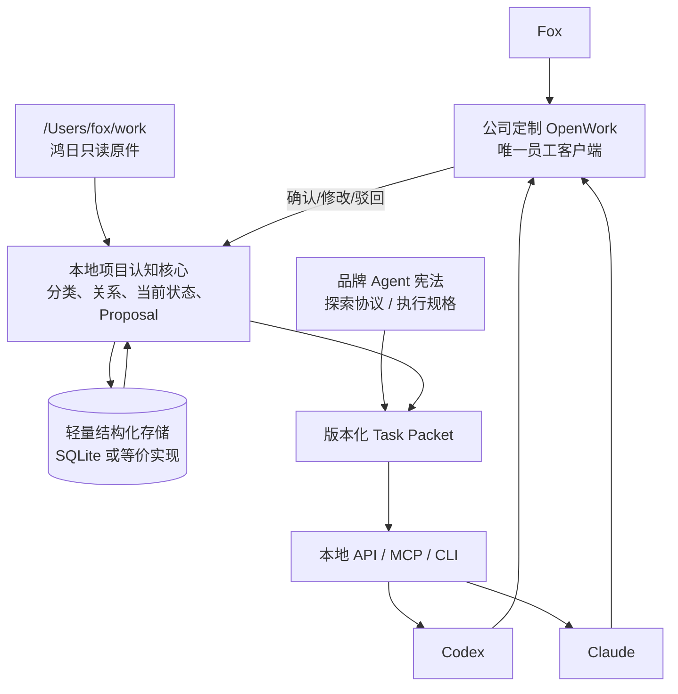

# 项目概览

> 状态：Phase 0-1 分析基线。2026-07-22 的产品拓扑已由 [ADR-0005](../adr/0005-single-client-server-authority.md) 更新为“公司定制 OpenWork 唯一员工客户端 + 公司服务器权威服务”。本文出现的 `future-candidate`、`not-approved-for-current-mvp` 和 `review-after-hongri-pilot` 只记录第一次 rescope，不再决定当前实施顺序。当前任务以[任务分解](../plan/task-breakdown.md)为准。

## 当前结论

Brand Project OS 是面向长期品牌项目的状态与品牌认知协作系统。员工使用基于 OpenWork 的唯一客户端，正式业务能力部署在公司服务器。

| 项 | 当前结论 |
|:---|:---|
| 当前状态 | **CURRENT** |
| 第一用户 | Fox |
| 第一验证项目 | 鸿日 |
| 当前工作空间 | `/Users/fox/work` |
| 当前形态 | 单一 OpenWork 客户端 + 公司服务器业务服务 + MCP/Skills |
| 当前目的 | 保留正确理解与人工确认规则，让团队和不同 AI 使用同一正式状态 |

以下旧标签已在 2026-07-22 失效，仅用于识别历史文案：

- `future-candidate`
- `not-approved-for-current-mvp`
- `review-after-hongri-pilot`

当前实施顺序见[任务分解](../plan/task-breakdown.md)和[里程碑](../plan/milestones.md)。Phase 1 的迁移前边界见[鸿日本地纵切边界](hongri-local-mvp-boundary.md)。

## 产品定义

产品要让 Fox 和不同 AI 共同知道：

- 什么是不可改写的原始证据；
- 什么是事实、观点、假设、选项、方向倾向、决定、约束和开放问题；
- 项目当前处于哪个阶段、本轮具体要做什么；
- 本轮处于探索协议还是执行规格；
- 当前有效内容为何有效，过期内容被什么替代；
- 重要结论来自哪份文件、哪场会议、谁的哪句原话；
- AI 提出了什么变化，Fox 最终确认、修改或驳回了什么。

产品不是通用项目管理软件、企业知识库、纯向量 RAG、团队文件同步平台，也不是一套先完成生产基础设施再寻找业务价值的系统。

## 六个真实场景

| 场景 | 正确行为 | 禁止行为 |
|:---|:---|:---|
| 会议中的“不要”未必是红线 | 识别会议模式和时间性质，保留原话，生成待确认分类 | 自动写成决定、永久约束或 Deadline |
| 文件都在但版本可能错误 | 先读当前状态和任务，再按关系查证据与原文 | 仅按相似度采用过期方案 |
| 品牌策略不是直接计算答案 | 保留矛盾，提出不同战略领地和代价 | 过早形成唯一结论或直接跳到口号 |
| 新会议不应重写历史 | 增量提取变化、冲突、行动和原话证据 | 全量重总结后静默覆盖当前状态 |
| 换模型不应重讲项目 | Codex、Claude 等读取同一 Task Packet | 各自用聊天记忆维护一套项目事实 |
| 服务器路线已批准但不能跳阶段 | 先通过 F1.9/F1.10，再按 Phase 2-4 建设和验收 | 把服务器部署当成客户端纵切已经通过 |

## 当前工作协议

### 探索协议

用于研究、洞察、策略和创意方向。AI 应保留矛盾、重构问题、提出假设、发展真正不同的选择并说明获得与放弃；不得自行收口、把倾向升级成决定或用完整交付掩盖策略缺口。

### 执行规格

用于 Fox 已批准方向后的命名、文案、PPT 和物料。AI 必须服从已批准事实、方向、格式、禁区和验收标准；不得重新发明战略或把废案带回主线。

模式切换必须由 Fox 显式确认。同一 Task Packet 必须记录 `work_mode`，模型不能因为信息充分或多数模型一致而自行切换。

## CURRENT 本地架构

CURRENT 约束：

- 原始文件只读，保存稳定路径、哈希、来源、时间和版本；
- SQLite 或等价轻量存储可以承载当前单用户状态，不因此承诺未来生产数据库；
- 新会议只产生增量 Proposal，Fox 确认后才改变当前状态；
- 每个关键结论能回到原件、会议、发言人和时间点；
- Codex 与 Claude 读取同一个不可变 Task Packet 版本；
- OpenWork 是唯一员工客户端基础，OpenCode 是 Agent 运行时；两者都不是业务真相源。

## 当前模块

1. 鸿日黄金测试集与 BrandBench；
2. 原始资料与来源索引；
3. 会议增量解释；
4. 当前项目状态；
5. 证据、决定与开放问题关系；
6. 状态变更 Proposal 和 Fox 确认队列；
7. 品牌 Agent 宪法与工作模式；
8. Task Packet 与 Codex/Claude 固定读取入口；
9. 公司定制 OpenWork 中的查看、确认和证据回源界面。

详细职责见[目标模块清单](module-inventory.md)。

## 当前技术基线

| 层 | CURRENT 建议 | 选择理由 | 升级条件 |
|:---|:---|:---|:---|
| 工作空间 | `/Users/fox/work` 的鸿日资料 | 直接验证真实工作，不复制出虚假样本世界 | Fox 确认需要可移植工作空间后再抽象 |
| 原件 | 本地文件只读 + SHA-256/元数据索引 | 最小成本保留证据和版本 | 出现跨设备或团队共享后评估对象存储 |
| 结构化状态 | SQLite 或同等轻量数据库 | 支持单用户关系、版本和增量变更 | 多人并发、远程或运维需求成立后评估 PostgreSQL |
| 检索 | 结构化过滤 + 本地全文基线 | 先验证当前有效性和关系，而非堆向量能力 | 金标证明召回不足后再评估向量/Zvec |
| AI 入口 | 本地 API、MCP 或 CLI | 让不同模型读取同一 Task Packet | 团队远程需求成立后再评估远程 API/OAuth |
| 界面 | 公司定制 OpenWork，单一安装包 | Fox 能查看、确认、驳回和打开证据 | F1.9 完成离线、安全、品牌和打包；F1.10 通过鸿日桌面旅程 |

## Task Packet

Task Packet 是多模型一致性的唯一任务入口，不是全项目历史摘要。它至少包含：

- 项目与当前状态版本；
- 本轮任务、目标和输出契约；
- `EXPLORE` 或 `EXECUTE` 工作模式；
- 本轮品牌角色和质量标准；
- 已批准事实、决定和约束；
- 开放问题和相关证据；
- 需要防止误用的过期项；
- 证据回源定位和 Packet 内容摘要。

同一对比任务中，Codex、Claude 或其他模型必须获得相同 Packet 版本。模型差异可以体现在推理和表达，不能体现在项目事实、工作模式或证据集合。

## 当前成功标准

- Fox 重复解释鸿日背景的次数下降；
- 新 AI 冷启动能准确说明当前阶段、决定、开放问题和任务；
- 会议分类没有非法状态升级；
- 重要结论回源率为 100%；
- 新会议只产生增量变化，不覆盖历史；
- 模型切换后项目事实与证据保持一致；
- 探索输出形成真实选择和代价，执行输出服从已批准方向；
- 策略和文案通过 Fox 的匿名品牌质量评审。

虚构事实、讨论升级成决定、暂定日期写成死线、过期方案当当前方向、关键结论无法回源、未经确认改变状态、探索模式强行唯一答案，任一发生即不通过。

## 后续实施模块

下列模块已按阶段进入活动计划：

| 模块 | 当前阶段 | 主要验收 |
|:---|:---|:---|
| PostgreSQL、对象存储、OIDC、RBAC/RLS | Phase 2 | 唯一权威、项目隔离、撤权和恢复 |
| 幂等、并发、Outbox、审计、PITR | Phase 2 | 无静默覆盖、可重放、可对账 |
| OpenWork 联网、远程 MCP、Skills、Dify | Phase 3 | 单一客户端、人工/Agent 权限分离、NoOp 回退 |
| Zvec、Open Notebook、Nubase、FlowLong | Phase 3 | 逐项许可、收益、故障和退出；可拒绝 |
| HA、容量、签名更新和灾备档位 | Phase 4 | 由真实负载、故障和恢复演练决定 |
| 完整 Web/PWA | 不采用 | 员工只使用公司定制 OpenWork |
| FoxWork 团队文件线 | 独立议题 | 不自动合入品牌项目资料和状态范围 |

当前设计详见[部署拓扑评估](deployment-topology-evaluation.md)。架构已批准不等于功能已完成，仍必须逐阶段过门。

## 项目治理

- 根目录需求源是本轮产品范围依据；
- `AGENTS.md` 只管理软件开发约束，不能替代运行时品牌 Agent 宪法；
- 品牌 Agent 宪法、工作模式协议、鸿日项目规则和 Task Packet 必须分层；
- 业务事实不进入开发 AGENTS、Skills 或模型对话记忆；
- 本轮已完成第二次 plan/progress rescope；旧任务只保留追溯，不再作为当前完成度来源。
