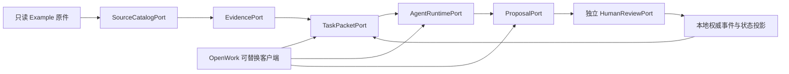

# Phase 0 技术实施就绪与 OpenWork 交接

## 当前判断

Phase 0 技术实施就绪门已经通过，可以开始 Phase 1。本结论只批准本地单用户纵切，不表示 OpenWork 已接入，也不批准团队服务器、外部工作流或数据外发。

## 本地纵向切片

## 权威与派生边界

| 层 | 当前实现基线 | 是否权威 | 删除后结果 |
|:---|:---|:---|:---|
| 原件 | 本地只读文件与 SHA-256 Manifest | 原始证据权威 | 必须报告证据缺失，不得静默补全 |
| 正式状态 | 人工确认事件与可重建投影 | 是 | 可由事件重建 |
| Proposal | 本地待确认增量 | 否 | 不影响已批准状态 |
| FTS/缓存/摘要 | SQLite FTS5 或进程内派生 | 否 | 可重建 |
| OpenWork/OpenCode 会话 | 可清除运行态 | 否 | 正式数据零迁移、零丢失 |
| 外部工作流 | 可选 `ExternalWorkflowPort` | 否 | 禁用后核心纵切仍可运行 |

## OpenWork 接入面

OpenWork 只承担三个职责：展示当前状态与证据、启动/观察 Agent Runtime、提交 Proposal。Fox 业务批准、状态写入和工作模式切换必须进入独立本地用例，不调用 OpenWork/OpenCode Tool Permission。

优先接入顺序：

1. `OW-L1`：通过本地 MCP/CLI 读取当前状态、Task Packet 和证据。
2. `OW-L2`：通过 `AgentRuntimePort` 发起可取消运行，展示流式事件和 Artifact。
3. `OW-L3`：展示会议增量 Proposal；业务确认进入独立 `HumanReviewPort`。
4. `OW-L4`：与薄客户端比较启动、可靠性、补丁量、实际用时和退出成本。

当前契约文件：

- `contracts/phase0/port-catalog.json`
- `contracts/phase0/openwork-adapter.json`
- `schemas/phase0/task-packet.schema.json`
- `schemas/phase0/state-proposal.schema.json`

## 明确禁止

- OpenWork Server、远程 Host、团队账号、OIDC 或 PostgreSQL 成为本地 MVP 前置。
- OpenWork/OpenCode SQLite、Session 或聊天摘要保存正式事实和批准。
- Agent、MCP、Skill、Dify 或 Tool Permission 调用批准、驳回、强制模式切换或直接 SQL。
- Renderer 获得数据库直连、任意文件系统或长期 Token。
- 未登记外发、遥测、自动更新或 `ee/**` 成为运行依赖。

## F0.7 最终审计

| 检查项 | 结果 |
|:---|:---|
| BrandBench | 第二轮采用候选 23/30，中位数 4.0，自然中文 4/5，三个维度较首轮普通版提高 |
| 一票否决 | Fox 明确确认本轮为 0 |
| 本地纵切 | 只读原件、人工确认事件、可重建投影、Proposal、Task Packet、CLI/MCP 和简单界面边界已冻结 |
| 端口与 Schema | 端口目录、会议解释、模式切换、Task Packet、State Proposal 等版本化契约通过静态检查 |
| 服务器依赖 | `required_server_components` 为空；Phase 1 不依赖 PostgreSQL、S3、OIDC、Docker 或外部组件 |
| OpenWork 边界 | 可替换、无业务批准权、不保存正式状态；`OW-L0` 已有条件通过，F1.9 默认离线补丁与安全门已完成 |

本交接后的 F1.1-F1.10 已完成本地工作空间、SQLite 权威事件、来源版本、会议增量、Proposal、证据回源、Task Packet、CLI/MCP，以及 OpenWork 离线、安全、品牌、单安装包和鸿日桌面业务旅程。F2.1 服务器边界、F2.2 PostgreSQL 权威存储、F2.3 S3 原件准入、F2.4 OIDC 员工会话、F2.5 项目 RBAC/RLS 和 F2.6 写一致性已经通过，当前进入 F2.7 审计、Outbox/Inbox 和后台任务边界。
