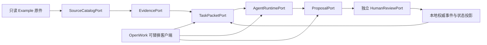

# Phase 0 技术实施就绪与 OpenWork 交接

## 当前判断

技术纵切已经可以冻结到“实施准备完成”，但 Phase 0 阶段门尚未通过：F0.6 仍等待 Fox 的 BrandBench 匿名评分。因此当前可以完善契约、测试和 OpenWork 适配面，不能开始 Phase 1 产品实现或宣称 OpenWork 已完成业务接入。

## 本地纵向切片

## 权威与派生边界

| 层 | 当前实现基线 | 是否权威 | 删除后结果 |
|:---|:---|:---|:---|
| 原件 | 本地只读文件与 SHA-256 Manifest | 原始证据权威 | 必须报告证据缺失，不得静默补全 |
| 正式状态 | 人工确认事件与可重建投影 | 是 | 可由事件重建 |
| Proposal | 本地待确认增量 | 否 | 不影响已批准状态 |
| FTS/缓存/摘要 | SQLite FTS5 或进程内派生 | 否 | 可重建 |
| OpenWork/OpenCode 会话 | 可清除运行态 | 否 | 正式数据零迁移、零丢失 |
| 外部工作流 | 可选 `ExternalWorkflowPort` | 否 | 禁用后核心纵切仍可运行 |

## OpenWork 接入面

OpenWork 只承担三个职责：展示当前状态与证据、启动/观察 Agent Runtime、提交 Proposal。Fox 业务批准、状态写入和工作模式切换必须进入独立本地用例，不调用 OpenWork/OpenCode Tool Permission。

优先接入顺序：

1. `OW-L1`：通过本地 MCP/CLI 读取当前状态、Task Packet 和证据。
2. `OW-L2`：通过 `AgentRuntimePort` 发起可取消运行，展示流式事件和 Artifact。
3. `OW-L3`：展示会议增量 Proposal；业务确认进入独立 `HumanReviewPort`。
4. `OW-L4`：与薄客户端比较启动、可靠性、补丁量、实际用时和退出成本。

当前契约文件：

- `contracts/phase0/port-catalog.json`
- `contracts/phase0/openwork-adapter.json`
- `schemas/phase0/task-packet.schema.json`
- `schemas/phase0/state-proposal.schema.json`

## 明确禁止

- OpenWork Server、远程 Host、团队账号、OIDC 或 PostgreSQL 成为本地 MVP 前置。
- OpenWork/OpenCode SQLite、Session 或聊天摘要保存正式事实和批准。
- Agent、MCP、Skill、Dify 或 Tool Permission 调用批准、驳回、强制模式切换或直接 SQL。
- Renderer 获得数据库直连、任意文件系统或长期 Token。
- 未登记外发、遥测、自动更新或 `ee/**` 成为运行依赖。

## F0.7 最终通过前还缺什么

1. Fox 完成 BrandBench 人工评分，使 F0.6 有真实基线。
2. 对本文件、端口目录和四个核心 Schema 完成最终静态审计。
3. 明确记录 Phase 1 第一批实现任务与 OpenWork `OW-L0` 固定评估 SHA；只有届时才允许拉取或修改 OpenWork 产品代码。
