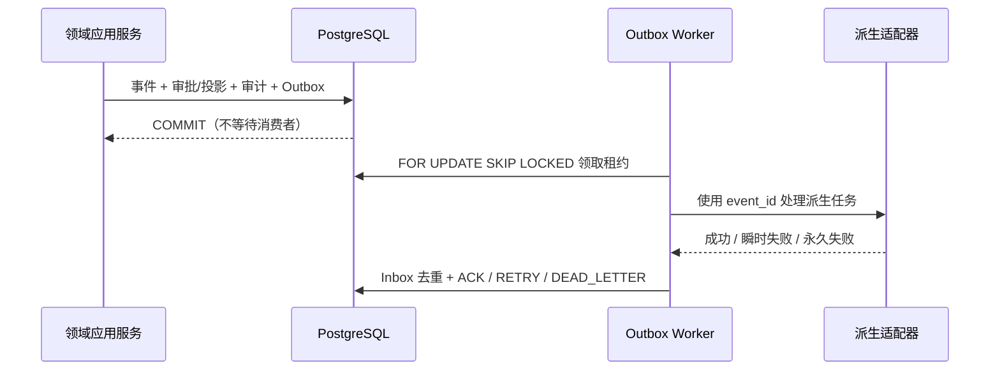

# F2.7 审计、Outbox/Inbox 和后台任务边界

> 状态：已完成
> 机器契约：`audit-outbox.v1`
> PostgreSQL Schema：v10
> 当前范围：一次性本地 PostgreSQL 集成验证；没有启动生产 Worker，也没有迁移鸿日或鸿喜达资料

## 这次交付的边界

F2.7 只解决“正式写入已经提交后，派生任务怎样可靠地离开核心事务”这一层，不实现 HTTP API、OpenAPI、远程 MCP、Dify/FlowLong/BISHENG 适配或常驻部署。

领域事件、人工动作、正式投影、审计和 Outbox 在同一 PostgreSQL 事务中提交。事务提交不等待搜索、通知、工作流或 AI 派生消费者；消费者故障只能造成积压或死信，不能让正式状态查询和人工确认变成伪成功。

## PostgreSQL v10 表

| 表 | 作用 | 是否正式业务状态 |
|:---|:---|:---:|
| `audit_records` | 记录事件、投递、重试、重放和死信的主体、项目、版本、摘要和结果 | 否，追加式审计 |
| `outbox_consumers` | 消费者注册、暂停和退役 | 否 |
| `outbox_messages` | 每个事件按消费者建立的独立投递行、租约、尝试次数和状态 | 否，派生任务 |
| `inbox_messages` | `(consumer_name, event_id)` 去重和处理结果 | 否，派生任务 |
| `dead_letter_messages` | 不可重试或超过上限的失败留痕 | 否，派生任务 |
| `background_worker_leases` | Worker 心跳和租约 | 否，运行态 |

正式表仍是 `projects`、`events`、`proposals`、`human_actions` 和 `state_items`。消费者数据库角色只获得上述运行表的最小权限，并显式撤销正式表写权限。

## 事务与投递流程

同一聚合的较新事件在较早事件未 `ACKED` 时不会被领取；死信也会阻塞该聚合的后续事件，直到人工或受控任务重放。租约过期后可以再次领取，因此语义是至少一次，不承诺跨外部系统的 exactly-once。

## Inbox、重试和死信

- 领取使用 `FOR UPDATE SKIP LOCKED`，不会让一个慢消费者阻塞其他消费者。
- 处理前写入 `IN_PROGRESS`；成功时在同一事务写 `PROCESSED` 并确认 Outbox。
- 已处理过的 `(consumer_name, event_id)` 再次投递直接返回 `REPLAYED`，不再次调用外部处理器。
- 瞬时错误进入 `RETRY`，记录尝试次数、最后错误和下一次时间。
- Schema、权限、数据等不可恢复错误，或超过尝试上限，进入 `DEAD_LETTER`；死信包含原消息、原因、错误和尝试次数，并产生审计记录。
- `replay_dead_letter` 只把消息重新排队，保留原死信和重放审计；不会改变项目版本、审批结果或正式投影。

外部副作用仍必须使用 `event_id` 或其自身幂等键。Worker 在外部写成功、确认前崩溃时，下一次投递可能再次调用适配器，但 Inbox 和外部幂等键必须保证最终不重复产生副作用。

## 组件权限边界

`grant_outbox_worker_role` 只授予 `audit_records`、`outbox_*`、`inbox_messages`、`dead_letter_messages` 和 `background_worker_leases` 的运行权限，并撤销 `projects`、`events`、`proposals`、`human_actions`、`state_items` 等正式表的权限。它不能批准 Proposal，也不能推进项目版本。

运行时角色、MCP、工作流和 BISHENG/Dify 等服务账号仍不能冒充人工主体。BISHENG 继续只是当前 49 项之后的候选工作流适配器；它未来若获 Fox 单独批准，也只能消费受控 Outbox/应用 API，不能直连正式表或定义正式状态。

## 验证结果

专项测试 7 项通过，Phase 2 当前累计 101 项及 14 组子测试，完整回归 260 项及 19 组子测试；测试结束后临时 PostgreSQL 已退出。

专项测试覆盖：

- 事件、审批、投影、审计和 Outbox 原子提交，以及 Outbox 写失败整笔回滚；
- 重复投递、Inbox 去重和重放；
- 同一聚合的乱序阻断与版本顺序；
- 重试、死信、人工重放和失败审计；
- 正式状态在消费者不运行或消费者失败时仍可查询；
- 独立 Worker 角色没有正式表 `INSERT` 权限。

没有启动生产 Web、数据库常驻服务、Docker、桌面应用或 Worker；临时 PostgreSQL 仅由测试按模块启动并在结束后清理。

## 后续边界

- F2.8：把这些应用服务能力发布为版本化 HTTP API/OpenAPI，加入请求关联 ID、分页和限流。
- F2.9：把 Outbox 积压、最老消息年龄、租约和死信接入指标、日志、追踪和告警。
- F2.10：做数据库、对象版本、投影和派生任务的联合恢复演练。
- Phase 3：再逐项接入 Zvec、Open Notebook、Nubase、FlowLong、Dify 和可能的 BISHENG；任何适配器都必须可禁用、可重建并回退到 NoOp。
