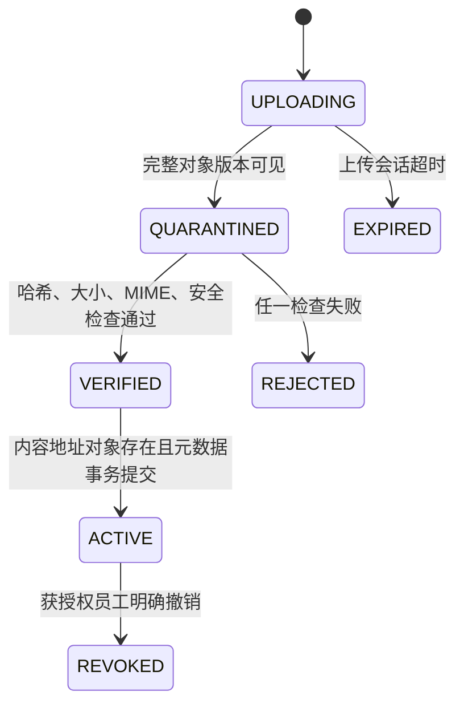

# F2.3 S3 兼容原件版本、哈希和准入状态机

## 当前结果

服务器已经具备可运行的对象原件准入链。`EvidenceAdmissionService` 通过 `ObjectStorePort` 和 `EvidenceMetadataPort` 协调 S3 兼容对象存储与 PostgreSQL v7 元数据，不让领域核心直接依赖 boto3，也不使用 PostgreSQL/S3 分布式事务。

本轮只使用测试项目、临时 PostgreSQL 17 和临时 Moto S3 HTTP 服务。没有读取、上传或迁移鸿日、鸿喜达正式资料；F3.1 切换前，Phase 1 SQLite 和本地证据副本仍是迁移基线。

机器契约为 `contracts/phase2/object-evidence.json`。主要实现：

- `src/brand_os/object_evidence.py`：状态、请求、版本、对账结果和可恢复编排。
- `src/brand_os/postgresql_evidence.py`：上传会话、状态迁移、对象版本、墓碑和对账记录。
- `src/brand_os/s3_store.py`：boto3 S3 兼容适配器。
- `src/brand_os/postgresql_migrations.py`：PostgreSQL v7 对象元数据迁移。

## 准入状态

- 临时键使用 `quarantine/<upload_id>`，任何状态下都不能作为正式证据引用。
- 正式键使用 `evidence/sha256/<前两位>/<完整 SHA-256>`，文件名不参与内容地址。
- 只有 `ACTIVE` 版本能通过正式回源接口读取。
- `REJECTED`、`EXPIRED`、`REVOKED` 和未完成状态均不能进入证据链。
- 同名不同内容生成不同 SHA-256 键和递增版本号，不覆盖旧版本。
- 相同内容复用同一明确 S3 VersionId，不重复复制正文。

## 一致性与恢复

准入采用应用级可恢复顺序：

1. PostgreSQL 幂等创建 `UPLOADING` 会话。
2. 客户端或后台任务把正文上传到隔离键；完整对象可见后登记 `QUARANTINED`。
3. 服务流式重算 SHA-256 和大小，并校验 MIME 与安全检查结果。
4. 通过后先登记 `VERIFIED`，再复制或复用内容地址对象。
5. PostgreSQL 事务创建不可变版本并推进为 `ACTIVE`。
6. 最后删除临时对象；清理失败由对账任务继续处理，不回滚已经提交的正式版本。

任一步中断都不会生成指向缺失对象的 `ACTIVE` 版本。复制成功但激活失败时，上传保持 `VERIFIED`，可在重试时继续完成；对象和数据库不需要伪装成一笔分布式事务。

## 对账与删除

对账同时检查：

- 到期 `UPLOADING` 会话和残留临时对象。
- 未完成 S3 分片上传，并在超过宽限期后显式中止。
- PostgreSQL 中 `ACTIVE`/保留中的版本是否存在、大小和 SHA-256 是否一致。
- 未被上传会话或明确对象版本引用的 S3 VersionId。
- 对账结果、清理数量和问题清单是否写回 PostgreSQL。

异常只生成对账问题，不会静默替换、撤销或重建 `ACTIVE` 状态。物理删除必须先由获授权员工把版本推进为 `REVOKED`，再创建带最早删除时间的墓碑。清理任务用 PostgreSQL 对象级认领锁阻止并发重新激活同一 S3 VersionId；仍有 `ACTIVE` 引用时不删除。

## 安全边界

- 桶必须开启版本控制，否则准入服务拒绝初始化。
- OpenWork、MCP、Skills 和工作流不能拿到对象存储凭据，也不能直连桶。
- AI、工作流和服务账号不能撤销 `ACTIVE` 版本。
- boto3 凭据只从服务器秘密配置进入适配器，不写入诊断结构或仓库文件。
- `S3ObjectStore.from_settings` 只校验对象存储所需字段，但生产环境仍执行 HTTPS 要求。
- 当前实现不注册业务来源、不批准事实，也不改变项目正式状态；后续由应用服务把 `ACTIVE` 对象与来源/事件关联。

## 验证

13 项 F2.3 测试通过真实 PostgreSQL 17 与临时 Moto S3 HTTP 往返，覆盖：

- PostgreSQL v7 迁移重跑和对象表完整性。
- 未开启桶版本控制时拒绝运行。
- 上传幂等和同键异义拒绝。
- 分片中断、会话过期和残留分片中止。
- 同名异内容的独立版本。
- SHA-256、大小、MIME 和安全检查失败。
- 非法状态转换和仅 `ACTIVE` 回源。
- 相同内容地址复用且不新增对象版本。
- 孤儿对象清理和对象/元数据对账。
- 缺失 `ACTIVE` 对象只报告异常，不静默改状态。
- 人工撤销、延迟墓碑、共享引用和删除/激活竞争。

Phase 2 共 43 项测试通过；完整回归为 `202 passed, 9 subtests passed`。测试结束后临时 PostgreSQL 和 Moto 服务均已退出。

## 后续边界

- F2.4 已增加 OIDC 登录、会话和员工身份绑定；当前 `allowed_revokers` 仍只是 F2.3 的领域权限基线。
- F2.5 用项目 RBAC/RLS 约束上传、读取和撤销范围。
- F2.7 已提供正式后台任务与审计边界；F2.9 已把对象对账、清理和共享依赖故障接入指标、日志与告警。
- F2.8 通过应用 API 提供上传和回源；客户端不得直连 S3。
- F2.10 验证数据库与对象版本的联合备份恢复。
- F3.1 才上传经授权的鸿日迁移副本并做全量哈希对账。
