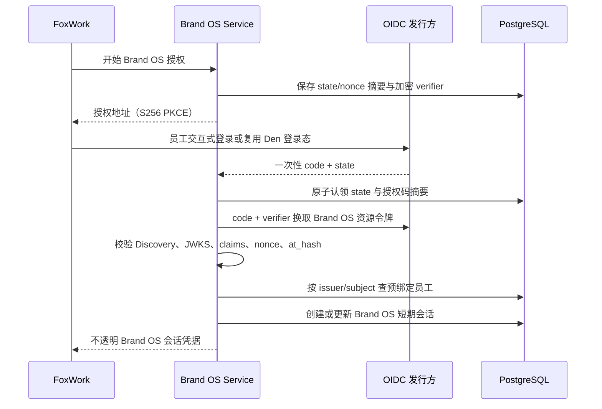

# F2.4 OIDC 员工身份与服务器会话

> 状态：F2.4 通用协议基线已完成  
> 当前适配：F3.5 将 OpenWork Den 配置为 Brand OS 第一方 OAuth/OIDC 发行方  
> 重要区别：员工只登录 Den 一次，但 Brand OS 使用独立 audience 的短期资源令牌

## 已完成结果

Brand OS 已具备通用 OIDC Authorization Code + S256 PKCE 链路：只允许预登记的 `(issuer, subject)` 建立员工会话，再由有效交互式会话生成 `HUMAN` 命令身份。邮箱、显示名、模型会话、服务账号和 OIDC 登录动作本身都不能自动创建员工或取得人工批准权。

本轮使用假的 OIDC 传输与签名密钥、临时 PostgreSQL 17 和测试员工验证。它证明 Brand OS 的协议、会话和身份绑定可用，但没有证明 Den 的 Brand OS 专用 audience、组织声明与撤权联动；这些属于 F3.5。

机器契约为 `contracts/phase2/oidc-identity.json`。主要实现：

- `src/brand_os/identity.py`：登录、认证、刷新、撤销和人工命令身份绑定；
- `src/brand_os/oidc_provider.py`：Discovery、授权码交换、JWKS 和 ID Token 校验；
- `src/brand_os/postgresql_identity.py`：员工、外部身份绑定、授权事务、会话和审计；
- `src/brand_os/secret_cipher.py`：verifier、访问令牌和刷新令牌认证加密；
- `src/brand_os/postgresql_migrations.py`：PostgreSQL v8 身份与会话迁移。

## 通用登录链路

- `state`、`nonce`、授权码和客户端会话秘密只保存 SHA-256 摘要。
- PKCE 只允许 S256；回调地址由服务端固定。
- 相同 `state` 或授权码只能成功一次，并发回调由数据库锁串行化。
- Discovery issuer 必须精确匹配，包括尾部斜杠语义。

## 令牌校验

ID Token 必须使用允许的非对称签名，并校验：

- `iss`、`sub`、Brand OS `aud`，多 audience 时的 `azp`；
- `exp`、`iat`、存在时的 `nbf` 和 `auth_time`；
- 首次授权的 `nonce`，以及存在时的 `at_hash`；
- OIDC 元数据声明的算法和 JWKS 中唯一匹配的密钥。

时钟偏差只能在 0 到 5 分钟之间。`none`、HMAC、错误 issuer/audience、过期、未来签发时间、签名键不唯一或组织声明不符合策略时全部拒绝。

## Den 适配（F3.5）

F3.2 已确认 Den 包含 OAuth Provider、OIDC Discovery 和 `openid/profile/email` 基础能力。F3.5 仍需修改或配置 Den：

1. 注册 Brand OS 第一方资源和独立 audience；
2. 使用 Authorization Code + S256 PKCE，不向 FoxWork 暴露 Client Secret；
3. 派发稳定 `issuer/subject`、Den 组织 ID、成员版本和必要角色声明；
4. 限制访问/刷新令牌寿命，支持登出、账号停用、成员变更和主动撤权；
5. 让 Brand OS 在撤权或角色变化后清空令牌密文并失效会话/授权缓存；
6. 保持 Den Session Token 与 Brand OS Token 完全分离；
7. 允许公司内网 HTTP 入口时仍保留 PKCE、state/nonce、Origin 与回调校验。

Den 管理员不能自动成为 Brand OS 项目审批人。Den 组织/团队通过 F3.6 显式映射项目，Brand OS 继续执行项目 RBAC、保密级别和 RLS。

## 员工绑定与权限

- 员工由身份管理员预登记，再显式绑定 `(issuer, subject)`。
- 邮箱只作人工核对参考，不参与自动建号、合并、恢复或重新绑定。
- 员工、Den 账号或绑定停用后，现有 Brand OS 活动会话撤销，新授权拒绝。
- 身份管理员动作只接受允许名单内的交互式 `HUMAN` Actor；AI、Workflow、System Actor 和 MCP 无权管理身份。
- 批量撤销他人会话必须验证管理员的新鲜登录，不能信任调用方传入 principal。
- OIDC 只证明员工身份；每个业务请求仍需项目、动作和保密级别授权。

## 会话生命周期

- FoxWork 持有 Den 会话和 Brand OS 不透明会话的系统钥匙串引用，不能交给 Renderer。
- Brand OS 服务端只保存会话 secret 摘要；verifier、访问/刷新令牌使用独立 Fernet key 认证加密。
- 会话有绝对过期，访问令牌单独过期；刷新使用令牌版本乐观锁。
- 刷新后的身份、issuer、subject、组织或成员版本异常时立即撤销。
- 撤销先提交本地状态，再尽力通知 Den；Den 不可用不能让已撤销会话重新有效。
- 撤销或绝对过期后清空可恢复令牌密文，只保留状态与审计。

每个会话记录 `CREATED`、`REFRESHED`、`IDENTITY_ASSERTED`、`REVOKED` 和 `EXPIRED`。人工命令上下文绑定项目、命令、幂等键、Den 主体和 Brand OS 会话，证明一次审批来自哪个已验证员工。

## 当前存储边界

- Den MySQL 保存 Den 账号、组织、团队、Den 会话和 AI 能力授权；
- Brand OS PostgreSQL v8 保存员工、稳定外部身份绑定、授权事务、Brand OS 会话和审计；
- v9 增加项目授权/RLS，v10 增加审计/Outbox，v11 增加共享限流；
- 两个数据库不共享表、不双写密码、不通过邮箱自动对齐；
- 模型 API Key 由 Den 管理，不进入 Brand OS 身份表或配置。

## F2.4 已验证

F2.4 当时通过 `74 passed, 11 subtests passed`，完整回归当时为 `233 passed, 16 subtests passed`，覆盖：

- Authorization Code、S256 PKCE、state/nonce 和回调重放；
- Discovery、JWKS、签名、`aud/azp/exp/iat/nbf/at_hash`；
- 未绑定身份、邮箱自动建号拒绝、员工/绑定停用；
- 敏感值不进入明文存储、repr、配置摘要或审计；
- 刷新、轮换、并发版本冲突、提供方失败和本地优先撤销；
- 绝对过期、重启恢复、会话审计和人工命令身份绑定；
- AI、Workflow、System Actor 冒充员工或管理身份全部拒绝。

这些是 F2.4 完成时的历史测试数字，不替代当前全量回归或 F3.5 Den 集成测试。

## 后续验收

- F3.4：FoxWork Den 注册/登录、桌面交接、系统钥匙串、登出、中文错误和旧团队连接移除。
- F3.5：Brand OS audience、组织声明、PKCE、短期令牌和撤权联动。
- F3.6：Den 组织/团队到 Brand OS 项目映射、角色变化和跨项目拒绝。
- F4.2：真实员工的注册、登录、重验、角色变化、离职撤权和账号恢复。
- F4.7：身份、权限、审计、令牌泄露和日志脱敏安全检查。

BISHENG 是 Phase 4 之后需另行 rescope 的候选，只能使用受控服务身份或 MCP/API，不能持有员工会话或取得人工批准权。
