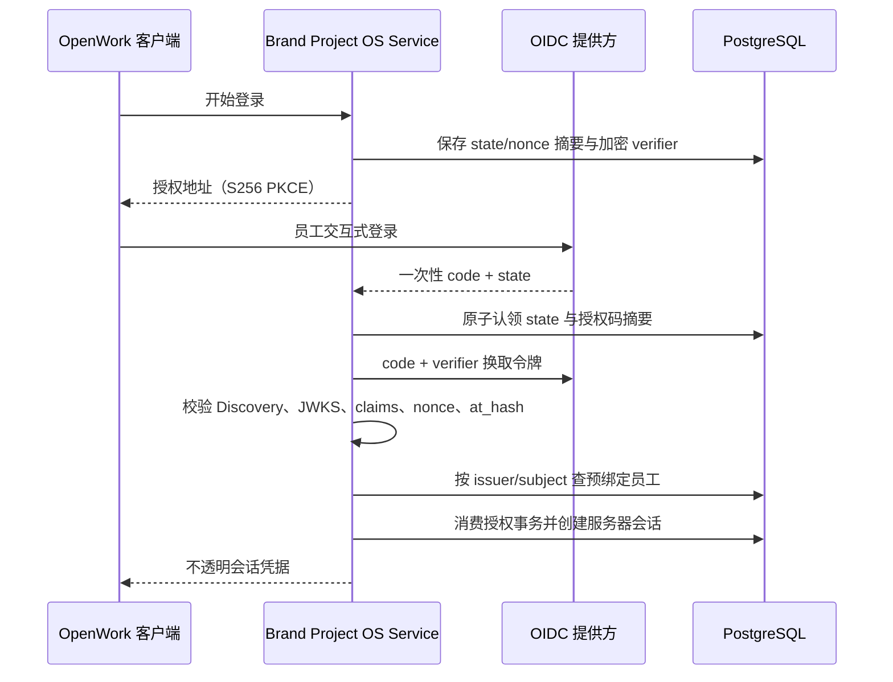

# F2.4 OIDC 员工身份与服务器会话

## 当前结果

服务器已经具备可运行的员工身份链路：使用 OIDC Authorization Code 与 S256 PKCE 登录，只允许预登记的 `(issuer, subject)` 绑定建立员工会话，再由有效会话生成 `HUMAN` 命令身份。邮箱、显示名和模型会话都不能自动创建员工或代替身份绑定。

本轮使用假的 OIDC 传输与签名密钥、临时 PostgreSQL 17 和测试员工完成验证。没有连接公司 OIDC，没有读取、上传或迁移鸿日、鸿喜达正式资料，也没有实现 F2.5 的项目 RBAC/RLS。

机器契约为 `contracts/phase2/oidc-identity.json`。主要实现：

- `src/brand_os/identity.py`：登录、认证、刷新、撤销和人工命令身份绑定用例。
- `src/brand_os/oidc_provider.py`：Discovery、授权码交换、JWKS 和 ID Token 校验。
- `src/brand_os/postgresql_identity.py`：员工、外部身份绑定、一次性授权事务、会话和审计事件。
- `src/brand_os/secret_cipher.py`：verifier、访问令牌和刷新令牌的 Fernet 认证加密。
- `src/brand_os/postgresql_migrations.py`：PostgreSQL v8 身份与会话迁移。

## 登录链路

- `state`、`nonce`、授权码和客户端会话秘密只保存 SHA-256 摘要。
- PKCE 只允许 S256；回调地址由服务端固定，不能由客户端临时改写。
- 相同 `state` 或授权码只能成功一次。不同回调并发使用同一授权码时，由 PostgreSQL advisory lock 串行化。
- Discovery 的 issuer 必须与配置精确一致，包括尾部斜杠语义。

## 令牌校验

ID Token 必须通过非对称签名，并校验：

- `iss`、`sub`、`aud`、多 audience 时的 `azp`。
- `exp`、`iat`、存在时的 `nbf` 和 `auth_time`。
- 首次登录的 `nonce`，以及存在时的 `at_hash`。
- OIDC 元数据声明的算法与 JWKS 中唯一匹配的签名密钥。

时钟偏差只能配置在 0 到 5 分钟之间。`none`、HMAC 算法、错误 issuer、错误 audience、过期令牌、未来签发时间和无法唯一匹配的签名密钥均拒绝。

## 员工绑定与权限边界

- 员工账号必须由身份管理员预登记，再显式绑定稳定的 `(issuer, subject)`。
- 邮箱只作为绑定时参考，不参与自动建号、合并或重新绑定。
- 员工或绑定停用后，现有活动会话在同一事务撤销，新登录被拒绝。
- 身份管理员操作只接受允许名单内的真实 `HUMAN` Actor；AI、Workflow 和 System Actor 不能登记员工或管理绑定。
- 批量撤销他人会话必须重新校验管理员自己的会话凭据，不能信任调用方传入的 principal。

OIDC 登录只证明员工身份，不等于项目权限或业务批准。F2.5 继续负责项目角色、保密级别和 RLS；任何 Agent、MCP、Skill 或工作流仍然没有人工批准权。

## 会话生命周期

- 客户端只持有 `session_id.secret` 形式的不透明随机凭据，服务端只保存 secret 摘要。
- verifier、访问令牌和刷新令牌使用独立服务器 Fernet key 认证加密；配置摘要只显示是否已配置。
- 会话有绝对过期时间，访问令牌单独过期。需要访问令牌时，过期会明确要求刷新。
- 刷新使用令牌版本乐观锁；提供方返回新 refresh token 时执行轮换。
- 刷新后的 ID Token 若改变 issuer/subject，或提供方明确拒绝刷新，本地会话立即撤销。
- 撤销先提交本地状态，再尽力通知提供方。提供方不可用不能让本地会话恢复有效。
- 撤销或绝对过期时清空可恢复的令牌密文，只保留状态与审计记录。

每个会话的 `CREATED`、`REFRESHED`、`IDENTITY_ASSERTED`、`REVOKED` 和 `EXPIRED` 事件使用严格递增序号。`bind_human_command_context` 在生成领域 `CommandContext` 时记录项目、命令和幂等键，后续可以证明某次人工命令来自哪一个已验证会话。

## 配置与存储

- PostgreSQL Schema 升级到 v8，新增员工、OIDC 绑定、授权事务、会话和会话事件表。
- 当前 `postgresql-authority.v4` 继续引用 `oidc-identity.v1`；OIDC 表仍由 v8 引入，v9 只增加项目授权。
- 当前 `server-boundary.v3` 继续把 OIDC 和身份会话存储列为必需组件，并新增项目授权前置边界。
- `service-config.v2` 新增 `BRAND_OS_SERVER_SESSION_ENCRYPTION_KEY`，必须是有效的 32 字节 URL-safe Base64 Fernet key。
- 模型提供商 API Key 仍由各模型运行时管理，不进入业务服务配置或身份表。

## 验证

Phase 2 共 `74 passed, 11 subtests passed`；完整回归为 `233 passed, 16 subtests passed`。覆盖：

- Authorization Code、S256 PKCE、state/nonce 和回调重放。
- Discovery issuer、JWKS、非对称算法、`aud/azp/exp/iat/nbf/at_hash`。
- 有界时钟偏差与错误签名密钥刷新。
- 未绑定身份、邮箱自动建号拒绝、员工和绑定停用。
- 敏感值不进入明文存储、repr、配置摘要或会话审计。
- 访问令牌刷新、轮换、并发版本冲突、提供方失败和本地优先撤销。
- 绝对过期、服务重启后会话恢复、单会话审计顺序和人工命令身份绑定。
- AI、Workflow、System Actor 冒充员工或管理身份均被拒绝。

## 后续边界

- F2.5 在当前交互式员工身份之上增加项目 RBAC、保密级别和 RLS。
- F2.8 才发布浏览器回调、登录、刷新和撤销的 HTTP/OpenAPI 路由。
- F3.2 才把 OpenWork 登录界面、系统钥匙串和项目选择接到服务器。
- F4.6 使用公司真实身份平台验证 MFA、离职撤权、跨项目越权和日志脱敏。
- BISHENG 仍是当前 49 项完成后的候选，只能复用受控服务身份或 MCP/API，不能持有员工会话或取得人工批准权。
