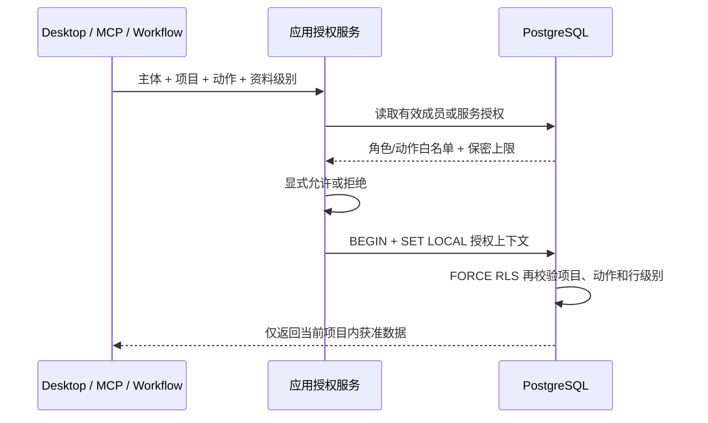

# F2.5 项目 RBAC、保密级别与 RLS

## 当前结果

服务器已经能在 OIDC 身份之上判断“这个主体在这个项目能做什么”。应用服务必须先校验项目、动作和资料保密级别，再进入存储；PostgreSQL RLS 使用同一份授权记录做第二道防线，不能代替应用判权。

本轮新增 `project-authorization.v1` 和 PostgreSQL v9；当前服务器 Schema 已由 F2.7 升至 v10。F2.5 当轮尚未接入 HTTP 路由或 OpenWork 登录界面；F2.8 已在其后发布版本化 HTTP/OpenAPI。没有读取、上传或迁移鸿日、鸿喜达正式资料。

主要实现：

- `src/brand_os/authorization.py`：员工角色、服务动作白名单、P0-P3 上限和应用授权用例。
- `src/brand_os/postgresql_authorization.py`：成员、服务身份、授权事件、运行时角色权限和事务级 RLS 上下文。
- `src/brand_os/postgresql_migrations.py`：PostgreSQL v9 授权表、辅助函数和强制 RLS 策略；v10 的派生表另见 F2.7 文档。
- `contracts/phase2/project-authorization.json`：稳定机器契约。

## 员工角色

| 动作 | OWNER | MANAGER | EDITOR | REVIEWER | VIEWER |
|:---|:---:|:---:|:---:|:---:|:---:|
| 查看项目 | 是 | 是 | 是 | 是 | 是 |
| 查看证据 | 是 | 是 | 是 | 是 | 是 |
| 登记证据 | 是 | 是 | 是 | 否 | 否 |
| 写工作层 | 是 | 是 | 是 | 否 | 否 |
| 创建 Proposal | 是 | 是 | 是 | 是 | 否 |
| 评审 Proposal | 是 | 是 | 否 | 是 | 否 |
| 查看 Task Packet | 是 | 是 | 是 | 是 | 是 |
| 启动运行 | 是 | 是 | 是 | 否 | 否 |
| 管理项目授权 | 是 | 否 | 否 | 否 | 否 |

首位 `OWNER` 只能由项目创建员工建立。最后一个有效 `OWNER` 不能被撤销或降级，避免项目失去负责人。

## 服务身份

员工、AI、MCP、Workflow 和 System 使用不同主体类型。服务 ID 不得复用员工 ID，也不能取得员工会话。

服务授权按项目保存动作白名单，不使用员工角色：

- AI/MCP：查看项目和证据、查看 Task Packet、创建 Proposal。
- Workflow：在上述能力上可启动已登记运行。
- System：可额外执行受控证据登记和工作层写入。
- 所有服务身份均禁止 `PROPOSAL_REVIEW` 和 `ACCESS_MANAGE`。

OpenCode Tool Permission、Dify 人工节点、FlowLong 流程节点或 BISHENG HITL 都不能映射成业务批准。

## 保密级别

`P0 < P1 < P2 < P3`。员工成员关系和服务授权都保存保密级别上限；请求资料级别高于上限时，应用服务直接拒绝。RLS 对带 `confidentiality` 字段的来源和证据行再次比较实际行级别，未知项目或缺少事务上下文时默认不可见。

保密级别不替代项目成员关系。即使两个项目都有 P1 资料，主体也只能访问明确授权的项目。

## 应用授权与 RLS

每个授权事务使用 `SET LOCAL` 注入：

- `brand_os.principal_kind`
- `brand_os.principal_id`
- `brand_os.project_id`
- `brand_os.action`
- `brand_os.confidentiality_ceiling`

事务结束后上下文自动消失，连接池复用不会沿用上一请求身份。运行时数据库角色必须是非所有者、`NOBYPASSRLS`；它只获得受 RLS 保护表和授权辅助函数的权限，不能读取成员表、服务授权表或授权事件表。

## PostgreSQL v9

新增表：

- `project_memberships`
- `service_principals`
- `project_service_grants`
- `project_authorization_events`

所有直接带 `project_id` 的业务表启用并强制 RLS。`proposal_evidence`、`evidence_state_transitions` 和 `evidence_object_tombstones` 通过父记录继承项目边界。授权表不暴露给运行时角色，由 `SECURITY DEFINER` 辅助函数只返回布尔授权结果。

## 验证

F2.5 新增 9 项测试。Phase 2 共 83 项测试通过；完整回归为 242 项测试和 16 组子测试通过。覆盖：

- 五种员工角色与九种动作的正反矩阵。
- P0-P3 上限和行级过滤。
- 未设置 RLS 上下文时不可见。
- 跨项目读取和写入拒绝。
- 成员撤权立即生效，最后一个负责人不可移除。
- AI/MCP/Workflow/System 与员工身份分离。
- 服务身份不能获授或伪造 Proposal 人工评审。
- 非所有者、`NOBYPASSRLS` 运行时角色下的真实 PostgreSQL 策略。

测试只启动一次性 PostgreSQL 17 临时集群，结束后已退出。Ruff 静态检查和迁移校验通过。

## 后续边界

- F2.6 已完成所有正式写请求的幂等、乐观锁和冲突差异；冲突结果由 [F2.8 HTTP API 与 OpenAPI](http-api-and-openapi.md) 统一映射为版本化 HTTP 409。
- F2.8 已把授权接到版本化 HTTP/OpenAPI，并分开 Employee、Agent 与后续 MCP/Workflow 服务身份边界。
- F3.2 才在唯一 OpenWork 客户端加入登录、项目选择和撤权反馈。
- F4.6 使用公司真实 OIDC 和试点成员复测离职撤权、跨项目、外发和日志脱敏。
- BISHENG 仍是当前 49 项完成后的候选，只能使用服务授权，不能得到员工角色或人工批准能力。
