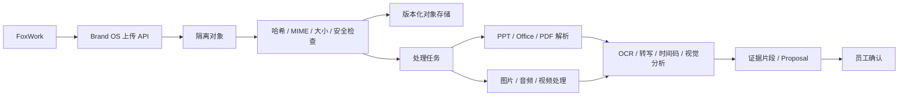

# F3.2 OpenWork Den 内部自托管技术门

> 核验日期：2026-07-24  
> 采用基线：OpenWork `v0.17.36@ddf3e482d2fdf3a374d0fbf4e23e01467a3014fc`  
> FoxWork 验收分支：`brand-os/f3.2-connected-client@e7ad696f5389a94f0ba5e5d0fba3d6763cfc4f60`  
> 结论：Den 控制面、单组织自助注册、Skills、共享模型和公司 MCP 通过；真实远程 Worker 与生产部署尚未通过，转入 F3.3/F3.19。

## 结论

FoxWork 可以采用 Den 达到“员工注册、登录后直接使用公司 AI 工作区”的效果。Den API、Den Web 和数据库源码在仓库中完整可见，能够构建、修改和内部部署；公司无需依赖上游托管云完成账号、组织、团队、Skills、共享模型和 MCP 管理。

这不是“采用一个开源 Den”。`ee/**` 使用 `FSL-1.1-MIT`，属于源码可见企业版。许可证明确允许内部使用、复制和修改，但禁止把它做成与 OpenWork 相同或近似的对外竞争服务。FoxWork 当前仅供公司内部几名员工使用，符合许可证列出的内部使用场景。公司分发修改版时必须保留许可证和版权声明；本文不替代正式法律意见。

## 已验证范围

### 源码、构建与数据库

- Den API、Den Web、Den DB、Helm Chart、Docker 配置和自托管文档均在固定版本仓库中。
- Den API 与 Den Web 完成生产构建，没有缺失的私有源码包。
- MySQL 空库通过 `@openwork-ee/den-db db:bootstrap` 初始化，记录 44 项迁移。
- 空库不能直接从 `db:migrate` 起步；该命令会从中间迁移开始并因 `worker` 表不存在而失败。首次建库必须使用 `db:bootstrap`。
- Den 功能源码从 `ddf3e482` 到 FoxWork 验收提交没有差异；当前验收不是依靠未提交的 Den 业务补丁伪造通过。

### 最小自托管栈

测试 Mac 上实际运行了以下隔离服务：

| 服务 | 地址 | 结果 |
|:---|:---|:---|
| Den API | `127.0.0.1:37506` | `/ready` 返回 200 |
| Den Web | `127.0.0.1:37505` | Web 到 API 的就绪检查返回 200 |
| Den MySQL | 隔离数据库 `openwork_den_single_org_gate` | 空库 bootstrap、注册和权限链通过 |

正式部署必须使用 Den Web 作为 FoxWork 的唯一公开基地址。FoxWork 通过 Den Web 的 `/api/den` 代理访问 API 和 MCP，不再要求员工分别配置 Web/API 地址。

### 单组织自助注册

隔离环境使用：

```text
DEN_ORG_MODE=single_org
DEN_SINGLE_ORG_NAME=FoxWork 测试团队
DEN_SINGLE_ORG_SLUG=foxwork-gate
DEN_SINGLE_ORG_ALLOW_PUBLIC_SIGNUP=true
DEN_REQUIRE_EMAIL_VERIFICATION=false
```

合成所有者和普通员工均完成自助注册，结果如下：

- 两人只看到一个组织，组织 ID 相同；
- 第一位注册者为 `owner`，第二位为 `member`；
- 普通员工创建第二组织被 `single_org_mode` 拒绝；
- Den Web 登录、一次性交接、`foxwork://den-auth` 深链、桌面令牌兑换和桌面 `/v1/me` 全部成功；
- 登出后，旧桌面 Session 和旧 MCP Token 均返回 401，错误为 `mcp_session_revoked`。

生产允许普通员工在公司 Den 入口自助注册。首位所有者仍须通过受控 bootstrap 建立，后续注册者只能加入唯一组织，不能因注册获得项目权限或业务审批权。公司入口至少应限制在内网、VPN 或受控覆盖网络，并配置速率限制、滥用防护和可审计账号策略；邮箱验证与允许域按公司实际账号条件配置，但不得关闭普通员工自助注册入口。

### Skills、共享模型和公司 MCP

2026-07-24 使用合成数据完成了端到端验证，脚本没有输出 Token 或模型密钥，结束后删除测试对象。

| 验收项 | 结果 |
|:---|:---|
| 所有者创建 `shared=org` Skill | 通过 |
| 普通员工通过 REST 读取完整 `SKILL.md` | 通过 |
| 普通员工通过 Den Agent MCP 搜索并执行 Skill | 通过 |
| 所有者创建 OpenAI-compatible 共享模型 Provider 并授权员工 | 通过 |
| 员工获得已授权 Provider、模型和连接凭据 | 通过 |
| 删除员工 Provider 授权后列表消失，连接返回 403 | 通过 |
| 所有者登记组织级无认证只读 MCP | 通过 |
| 员工读取 MCP 工具目录 | 通过 |
| 员工通过 `search_capabilities` 和 `execute_capability` 调用公司 MCP | 通过 |
| 撤销 MCP 授权后，REST、工具目录和 Agent MCP 搜索均立即失效 | 通过 |
| 敏感管理动作要求新鲜登录 | 通过；过期会话返回 `fresh_auth_required` |

Den Agent MCP 使用两个稳定入口：`search_capabilities` 和 `execute_capability`。公司 MCP 工具按成员或团队授权后，进入同一搜索与执行面；员工不需要手工维护每个 MCP 配置。

## 采用边界

### Den 负责

- 员工注册、登录、单一公司组织、成员、团队和角色；
- FoxWork 桌面登录交接；
- MCP 连接目录、成员/团队授权和撤权；
- Skills、Skill Hub 和客户端分发；
- 公司共享模型 Provider、模型、密钥和授权；
- FoxWork 品牌、桌面策略、允许版本，以及必验的远程工作区/Worker 控制面。

### Brand Project OS Service 负责

- 公司项目和项目工作区；
- 原件上传、SHA-256、版本、S3 VersionId 和准入状态机；
- 视频、录音、图片、PPT、Office 和 PDF 的处理任务及分析结果；
- 当前状态、证据关系、会议增量、Task Packet、Proposal 和人工确认；
- PostgreSQL/S3 权威数据、业务审计和 Brand OS MCP Gateway。

Brand OS MCP 作为公司 MCP 登记到 Den，由 Den 按成员或团队下发。Den MySQL、Den Worker 文件系统、OpenWork Session 和模型摘要都不是品牌项目正式状态源。

## 单点登录设计

员工只维护一套 Den 账号。FoxWork 登录 Den 后，通过 Den 自带的 OAuth/OIDC Provider 为 Brand OS 获取独立、短期、限定受众的令牌；Brand OS 校验可信 Den 发行者、唯一公司组织和有效成员关系后，按 `(issuer, subject)` 查找或首次建立内部身份映射，再按项目成员关系和保密级别授权。邮箱不参与自动合并或重新绑定。

不能把 Den Session Token 直接转发给 Brand OS，也不能把一个共享 MCP 服务令牌冒充所有员工。正式实现需要：

1. 为 Brand OS 注册第一方 OAuth 客户端和明确资源受众；
2. 使用 Authorization Code + PKCE；
3. 为 Brand OS 令牌加入组织上下文，但不复制密码；
4. Brand OS 校验 `issuer`、`audience`、`subject`、过期时间和撤销状态；
5. 角色变更、成员移除和绝对过期后同时撤销 Brand OS 与 MCP 会话；
6. FoxWork 可以保存不同服务的密文令牌，但员工只经历一次登录和一次公司授权，不再输入第二套账号密码。

固定版本已有 OAuth Provider 和 OIDC Discovery，但当前有效受众主要围绕 Den MCP。Brand OS 第一方资源受众和组织声明需要作为 FoxWork Den 补丁实现并测试，不能在文档中视为已完成。

## 多媒体资料链路

Den 不提供 Brand OS 所需的版本化多媒体证据链。员工在 FoxWork 中拖入文件后，实际链路必须是：



解析和模型结果是派生数据，只能生成带来源定位的候选；未经有权限员工确认，不得改变正式事实、决定、负责人或日期。

## 尚未通过的门

| 门 | 当前判断 | 进入生产前必须补齐 |
|:---|:---|:---|
| Den 控制面源码与构建 | 通过 | 固定镜像、SBOM、漏洞和许可证扫描 |
| 单组织账号和桌面交接 | 通过 | 自助注册策略、第二组织拒绝、员工端/管理员后台中文化、生产入口和证书 |
| Skills、模型、MCP | 通过 | 正式 Brand OS MCP、最小权限和审计 |
| Brand OS 单点登录 | 有条件 | 第一方受众、PKCE、组织声明、撤权联动 |
| 真实远程 Worker | 未通过 | 当前 provisioner 仅 `stub`、`render`、`daytona`；F3.3 必须选定或实现可替换公司路径并完成真实验收 |
| 多媒体资料分析 | 未实现 | 上传、异步处理、来源定位、失败恢复和 FoxWork 状态页 |
| 生产可用性 | 有条件 | Den MySQL 备份恢复、多副本、监控、升级回滚和 Phase 4 演练 |

FoxWork 本地 Agent 负责员工电脑上的受控能力，公司服务器上的 Brand OS Worker 负责资料处理；Den Worker 负责远程工作区和远程 Agent 运行。具体 provisioner 尚未确定，不能虚报完成，但远程 Worker 已是 F3.3/F3.19 的必验运行面，不再作为后续可选项。

## 最终决定

- 采用 Den 作为 FoxWork 的公司账号和 AI 能力控制面。
- 采用 `FSL-1.1-MIT` 内部自托管，不再称为“开源 Den”。
- 员工不再看到第二套 Brand OS 登录或“团队连接”账号体系。
- 保留 Brand OS PostgreSQL/S3 权威服务，不用 Den MySQL 代替。
- 先完成 Den/远程 Worker 生产基线、单点登录和 FoxWork/Den 员工端及管理员后台全中文，再接入真实公司资料。
