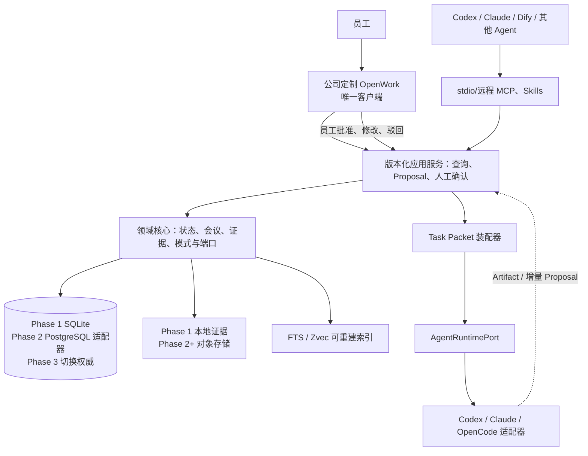

# 架构与接口契约计划

> 当前生效路线：公司定制 OpenWork 唯一员工客户端 + Brand Project OS Service<br>
> 权威决策：[ADR-0005](../adr/0005-single-client-server-authority.md)<br>
> Phase 1：本地 SQLite 纵切，已完成；F2.1-F2.4 已通过，当前 F2.5；Phase 2-4：服务器权威、联网客户端和团队试点

## 架构结论

Brand Project OS 是一个产品，包含基于 OpenWork 的唯一员工客户端和公司服务器上的业务服务。第一用户是 Fox，第一项目是鸿日。Phase 1 先完成本地纵切；随后把同一领域语义迁移到服务器权威层。

所有入口调用同一领域应用层。Phase 1 由 SQLite 和本地证据区承载；Phase 3 切换后由 PostgreSQL 和对象存储承载。OpenWork、OpenCode、Codex、Claude、Dify、检索和模型摘要都在端口之后，删除或替换它们不能改变正式状态。

### F2.1 服务器基线（已完成）

F2.1 已冻结 `Brand Project OS Service` 的服务器边界，但没有启动 HTTP、数据库、对象存储或常驻进程。实现位于 `src/brand_os/server_config.py` 和 `src/brand_os/server_baseline.py`，只提供可测试的配置、边界和健康报告模型。

服务器配置按以下顺序取值：显式参数 > 环境变量 > 非敏感 JSON 配置文件 > 默认值。配置文件禁止 DSN、Access Key、Secret Key 和 OIDC Client Secret；秘密只能由显式注入或环境变量提供，健康报告和 `repr` 只报告是否已配置。

| 配置面 | 环境变量 | 规则 |
|:---|:---|:---|
| 环境 | `BRAND_OS_SERVER_ENVIRONMENT` | `development`、`test`、`production` |
| 服务公开地址 | `BRAND_OS_SERVER_PUBLIC_BASE_URL` | 生产必须 HTTPS |
| PostgreSQL | `BRAND_OS_SERVER_DATABASE_DSN` | 生产必须是 PostgreSQL DSN，不能写入配置文件 |
| 对象存储 | `BRAND_OS_SERVER_OBJECT_STORE_ENDPOINT`、`BRAND_OS_SERVER_OBJECT_STORE_BUCKET` | 生产端点必须 HTTPS |
| 对象存储秘密 | `BRAND_OS_SERVER_OBJECT_STORE_ACCESS_KEY`、`BRAND_OS_SERVER_OBJECT_STORE_SECRET_KEY` | 只能环境变量/显式注入，禁止进入日志与序列化 |
| OIDC | `BRAND_OS_SERVER_OIDC_ISSUER_URL`、`BRAND_OS_SERVER_OIDC_CLIENT_ID` | 生产发行方必须 HTTPS |
| OIDC 秘密 | `BRAND_OS_SERVER_OIDC_CLIENT_SECRET` | 只能环境变量/显式注入，禁止进入日志与序列化 |
| 会话加密 | `BRAND_OS_SERVER_SESSION_ENCRYPTION_KEY` | 有效 Fernet key；只能环境变量/显式注入，禁止进入日志与序列化 |

健康语义也已冻结：`live` 只证明进程能响应；`ready` 检查必需配置、PostgreSQL、Schema、对象存储和 OIDC。OpenWork Runtime、Dify、Zvec、Open Notebook、Nubase 和 FlowLong 属于可选依赖，故障只记录为降级，不能让核心 API 失去就绪状态。F2.1 不实现 `/livez`、`/readyz` 路由，路由和真实探针留给 F2.8/F2.9。

机器契约当前为 `server-boundary.v2`、`service-config.v2`、`service-health.v1`。服务器边界明确只有应用服务可以推进正式状态；OIDC 只认证员工，不执行人工审批；Employee API、MCP Gateway、OpenWork Runtime 和工作流只能读取或创建 Proposal，存储适配器不得被客户端或 Agent 直连。

### F2.2 PostgreSQL 权威适配器（已完成）

F2.2 已实现 PostgreSQL v1-v6 迁移和 `PostgreSQLCanonicalStore`。事件、人工动作、Proposal 状态、当前投影、项目版本与幂等结果在同一事务提交；同一命令使用事务级幂等锁，项目版本使用行锁。状态投影和 Proposal 生命周期都能从经配置人工评审人产生的事件重建。

机器契约已随 F2.4 升级为 `postgresql-authority.v3`：v1-v6 仍是 F2.2 领域语义，v7 只增加对象准入元数据，v8 只增加员工身份与会话。完整实现和测试边界见 [F2.2 PostgreSQL 权威事件、审批和投影](../phase2/postgresql-authority-store.md)。当前没有迁移鸿日数据、没有双写，也没有提前实现 RBAC/RLS、Outbox 或 HTTP API。F3.1 正式切换前，鸿日仍以 Phase 1 SQLite 为权威。

### F2.3 对象原件准入（已完成）

F2.3 已实现 `object-evidence.v1`、`ObjectStorePort`、`EvidenceMetadataPort`、PostgreSQL v7 元数据和 boto3 S3 兼容适配器。临时对象按 `UPLOADING -> QUARANTINED -> VERIFIED -> ACTIVE` 进入证据层；校验失败进入 `REJECTED`，上传超时进入 `EXPIRED`，获授权员工可将 `ACTIVE` 显式撤销为 `REVOKED`。

只有 `ACTIVE` 可以回源。正式对象按 SHA-256 寻址并绑定明确 S3 VersionId；删除使用延迟墓碑和对象级认领锁，对账按对象键与 VersionId 检查缺失、哈希、孤儿和残留分片。PostgreSQL 与 S3 不做分布式事务，中断后由 `VERIFIED` 重试、到期清理和对账记录恢复。完整边界见 [F2.3 S3 兼容原件版本、哈希和准入状态机](../phase2/object-evidence-store.md)。

### F2.4 OIDC 员工身份与服务器会话（已完成）

F2.4 已实现 `oidc-identity.v1`、`OidcProviderPort` 和 `IdentityRepositoryPort`。登录使用 Authorization Code + S256 PKCE，一次性 state/nonce 和授权码只保存摘要；Discovery issuer、JWKS 非对称签名、`iss/aud/azp/exp/iat/nbf/nonce/at_hash` 与最多 5 分钟时钟偏差均显式校验。

PostgreSQL v8 保存预登记员工、稳定 `(issuer, subject)` 绑定、授权事务、加密令牌会话和严格递增的会话审计。有效会话可以生成 `HUMAN` 命令身份并记录 `IDENTITY_ASSERTED`；AI、Workflow、System Actor、OIDC 登录本身和 OpenCode Tool Permission 都不能获得人工批准权。撤销先落本地并清空令牌密文，提供方撤销只作尽力通知。完整边界见 [F2.4 OIDC 员工身份与服务器会话](../phase2/oidc-identity-and-sessions.md)。

完整边界见：

- [运行时品牌 Agent 与会议解释协议](runtime-brand-agent-and-meeting-protocol.md)
- [数据一致性与可靠性计划](data-consistency-and-reliability.md)
- [前端与 AI 访问规划](frontend-and-ai-access.md)
- [OpenWork 深度集成计划](openwork-deep-integration.md)
- [ADR-0003：Phase 0-1 本地验证](../adr/0003-local-first-hongri-validation.md)
- [ADR-0004：唯一员工客户端](../adr/0004-openwork-single-client.md)
- [ADR-0005：服务器权威服务](../adr/0005-single-client-server-authority.md)

## 决策优先级

发生冲突时按以下顺序解释：

1. ADR-0005 定义产品拓扑和团队权威边界。
2. ADR-0004 定义唯一员工客户端和单安装包边界。
3. ADR-0003 的会议、人工确认、证据和 Task Packet 规则继续生效；长期本地单用户拓扑不再生效。
4. 本文与运行时品牌协议定义接口和语义细节。

## 当前不可突破的不变量

1. 原始资料版本及 SHA-256 证明“原文是什么”；人工批准事件证明“当前正式状态如何形成”。
2. 图形界面、CLI、MCP、Skill、Agent 和导入器不能直接修改正式表或证据区，必须调用同一应用用例。
3. AI 只生成 Proposal。只有具备项目权限的员工在交互式客户端执行显式动作，才可以产生批准事件。
4. `VIEW`、`PREFERENCE`、`HYPOTHESIS`、`OPTION`、`TENDENCY`、`TARGET_DATE` 和 `OPEN` 不得自动升级为 `DECISION` 或 `CONSTRAINT`。
5. 目标日期必须区分外部硬截止、内部目标、评审节点、暂定日期和未知；未知不能按硬截止处理。
6. 探索协议与执行规格显式切换；AI 可以建议，不能自行切换。
7. 新会议只产生基于 `base_state_version` 的增量 Proposal，不重新总结并覆盖全部历史。
8. Task Packet 先给最小当前上下文，再按需回源；旧聊天和随机检索命中不是正式状态。
9. Phase 1 SQLite 是迁移前权威；Phase 3 切换后 PostgreSQL/S3 是团队权威，本地库只读，不得同时写入。
10. OpenWork/OpenCode 会话、Tool Permission、索引、摘要、模型运行和缓存均为运行态或派生态。
11. 开发仓库 `AGENTS.md` 约束软件开发；运行时品牌 Agent 只加载品牌宪法、工作模式、鸿日规则和本轮 Task Packet。
12. 领域核心只依赖版本化端口和可序列化 Schema，不导入 OpenWork、OpenCode、Electron 或具体模型 SDK。

## 逻辑架构



Phase 1 的 `APP` 可以是进程内服务或本机回环 API。Phase 2 起部署为公司服务器服务；无论在哪个阶段，只有应用层持有权威存储写权限。

## 规划目录

目录是实现建议，不要求当前空仓库一次性生成全部结构：

```text
fox/
├─ apps/
│  ├─ service/                  # Brand Project OS Service、HTTP API 与 MCP Gateway
│  ├─ desktop/                  # OpenWork 定制客户端中的业务页面与本机桥接
│  ├─ cli/                      # 状态、导入、会议、Task Packet 与诊断
│  └─ mcp/                      # stdio/远程 MCP；只读、回源、Proposal
├─ packages/
│  ├─ core/
│  │  ├─ domain/                # 陈述类型、会议模式、状态和关系
│  │  ├─ application/           # 导入、解释、装配、确认与重建用例
│  │  ├─ events/                # 只追加事件与审批记录
│  │  ├─ projections/           # 当前状态、决定、开放项和行动
│  │  └─ ports/                 # 存储、证据、检索、模型与运行时端口
│  ├─ adapters/
│  │  ├─ sqlite/                # Phase 1 实现和迁移只读归档
│  │  ├─ postgres/              # Phase 2+ 权威事件、审批和投影
│  │  ├─ local-evidence/        # Phase 1 内容寻址证据区
│  │  ├─ object-storage/        # Phase 2+ 原件版本与哈希
│  │  ├─ search/                # FTS5 与可选增强索引
│  │  ├─ model/                 # Codex、Claude、OpenCode 等适配器
│  │  └─ openwork/              # 唯一员工客户端与运行时适配器
│  ├─ ingestion/                # 文件清单、会议转写、分段与候选
│  └─ runtime-rules/            # 品牌宪法、工作模式和鸿日项目规则
├─ schemas/                     # JSON Schema 与版本兼容样本
└─ tests/
   ├─ golden/                   # 鸿日 10-20 个黄金用例
   ├─ contract/                 # 端口与 Schema 契约
   ├─ integration/              # SQLite、证据、增量 Proposal 和重建
   └─ e2e/                      # 冷启动、会议、回源、确认和模型切换

/Users/fox/work/
└─ .fox/
   ├─ state/
   │  └─ project.db             # SQLite 权威库
   ├─ evidence/sha256/          # 只读内容寻址快照
   ├─ backups/                  # 原子数据库与清单备份
   └─ runtime/                  # 可删除的会话、缓存和临时产物
```

`.fox/runtime/` 不得保存唯一的正式事实、批准记录或原始证据。

## 权威存储契约

### `CanonicalStorePort`

```text
execute(command, actor, idempotency_key, expected_version)
read_aggregate(project_id, aggregate_type, aggregate_id, at_version?)
read_projection(project_id, projection_type, at_event_id?)
read_event_stream(project_id, after_sequence?)
verify_event_chain(project_id)
rebuild_projection(project_id, projection_type)
backup(destination)
health()
```

Phase 1 本地实现为 SQLite；服务器 PostgreSQL 当前使用 v1-v8，其中 v1-v6 承载 F2.2 领域语义，v7 承载 F2.3 对象元数据，v8 承载 F2.4 员工身份与会话。F3.1 切换前两者不双写，鸿日仍以 SQLite 为正式权威。一次 `execute` 必须在一个事务内：

1. 验证调用来自本地应用层，并确认命令是否要求 Fox 人工动作。
2. 登记幂等键和请求摘要；同键不同摘要返回冲突。
3. 校验 `expected_version`；版本过期返回当前版本和差异。
4. 执行分类、模式和状态迁移规则。
5. 追加事件与人工动作，更新最小当前投影。
6. 返回新版本、事件序号和可回源引用。

SQLite 使用 WAL、外键、繁忙超时和单写入队列。PostgreSQL 使用事务级幂等锁、项目行锁和唯一约束保护事件顺序。多个 AI 只能并行读取或生成候选，不能获得人工批准权。

## 原始证据契约

### `EvidenceStorePort`

```text
inspect(path)
stage_snapshot(path, source_metadata)
verify_snapshot(staging_id, expected_hash?, expected_size?)
commit_content_addressed(staging_id, sha256)
open(evidence_ref)
locate(evidence_ref, locator)
verify(evidence_ref)
mark_superseded(evidence_ref, replacement_ref)
reconcile(project_id)
```

- 来源文件先只读检查，再复制为按 SHA-256 寻址的快照；只有提交成功的快照可支持正式结论。
- 清单保存来源路径、相对项目路径、哈希、大小、MIME、时间、版本、保密级别和当前可用性。
- 同名文件不能覆盖旧版本；新版本使用新哈希并通过 `supersedes` 关联。
- 文件移动或删除不能让既有批准结论失去证据。若快照损坏，相关结论标记证据异常并阻止新的批准。

## 会议解释契约

### `MeetingInterpretationPort`

```text
ingest(meeting_source_ref, transcript_ref?, idempotency_key)
segment(meeting_id, segmentation_policy)
classify_modes(meeting_id, protocol_version)
extract_statements(meeting_id, taxonomy_version)
compare_with_state(meeting_id, base_state_version)
build_incremental_proposals(meeting_id, base_state_version)
get_run(run_id)
```

输出每项必须绑定会议、片段、说话人、时间位置、原话、类型、状态、适用范围、置信度和分类理由。`DECISION_CANDIDATE` 至少需要决定人、明确决定动词、范围和证据；缺项必须降级。完整行为由[运行时协议](runtime-brand-agent-and-meeting-protocol.md)定义。

## Proposal 与人工确认契约

### `ProposalPort`

```text
create(proposal, base_state_version, idempotency_key)
list(project_id, status?, kind?)
get(proposal_id)
compare(proposal_id)
approve(proposal_id, human_action, expected_version)
modify_and_approve(proposal_id, patch, human_action, expected_version)
reject(proposal_id, human_action, expected_version)
supersede(proposal_id, replacement_id, human_action)
```

`approve`、`modify_and_approve` 和 `reject` 只供有项目权限的员工在交互式 Desktop 调用。MCP、Skill、AgentRuntime 和模型适配器的能力表不得包含这些方法。每次人工动作记录员工身份、时间、理由、旧值、新值、证据、作用范围和基础版本。

## Task Packet 契约

### `TaskPacketPort`

```text
register_runtime_task(project_id, actor, task, idempotency_key)
switch_work_mode(project_id, actor, switch, idempotency_key)
build_task_packet(project_id, task_id, actor, expected_state_version?)
get_task_packet(project_id, packet_id)
get_task_packet_layer(project_id, packet_id, layer)
validate_task_packet(project_id, packet_id)
record_agent_run(project_id, actor, request)
get_agent_run(project_id, run_id)
```

当前实现为 `task-packet.v2` 和 `task-packet-assembly.v1`。Task Packet 使用 L0-L4 分层：任务头、当前状态、相关证据、按需原文、历史/废案。默认只加载 L0-L2。包必须区分已批准层与工作层，携带状态版本、证据哈希、索引水位、缺口、工具范围、数据外发策略、输出 Schema、一票否决项和工作模式切换权限。任务角色和初始模式由 Fox 登记；AI 不能创建任务配置或执行模式切换。

## Agent Runtime 契约

### `AgentRuntimePort`

```text
list_runtimes(project_id)
create_run(task_packet_ref, runtime_policy, idempotency_key)
get_run(run_id)
stream_events(run_id, after_cursor?)
respond_tool_permission(request_id, decision, constraints)
cancel_run(run_id, reason)
list_artifacts(run_id)
publish_artifact(run_id, artifact_ref)
health(runtime_id)
```

Phase 1 可以通过本地 CLI/子进程调用 Codex、Claude 或 OpenCode。OpenWork 是唯一员工客户端及运行控制面，但仍通过 `AgentRuntimePort` 调用运行时。Tool Permission 控制文件、命令、网络和工具，不得复用 Proposal 人工确认 Schema。`publish_artifact` 只能登记产物或创建 `proposed` 状态的 Proposal。

F1.7 已实现 `runtime-run.v1` 的起始留痕：角色和模式从不可变 Task Packet 复制，记录 Packet 哈希、状态版本、任务版本、协议、运行时和模型版本。F1.8 已增加本地工具调用的超时和取消传播，以及 Codex/Claude 使用同一 Packet 的运行登记。模型流式事件、产物和运行完成状态尚未实现，不能把一次 `created` 留痕解释成模型已经完成任务。

## 检索与模型端口

### `SearchIndexPort`

```text
apply(records, source_version)
delete(record_ids)
search(query, filters, top_k)
rebuild(project_id)
watermark(project_id)
```

基线使用结构化关系查询；本地阶段可使用 SQLite FTS5。向量索引是可选增强，命中必须返回稳定 ID，再从当前权威存储与证据区复核状态、版本和哈希。检索相似度不能决定内容是否当前有效。

### `ModelGatewayPort`

```text
run(task_packet_ref, runtime_role, model_policy, output_schema)
compare(run_ids, rubric_id)
get_usage(run_id)
cancel(run_id)
```

每次运行记录模型、适配器、Task Packet 版本、工作模式、规则版本、输出哈希、证据引用、成本和人工采用结果。模型切换不携带私有聊天记忆，只交换稳定对象。

## 关键 Schema

| Schema | 作用 | 关键不变量 |
|:---|:---|:---|
| `source-manifest.v1` | 原始资料清单 | 稳定 ID、SHA-256、来源、版本、角色、位置和状态完整 |
| `evidence-ref.v1` | 可回源引用 | 来源版本、哈希、原文定位、作者/说话人、时间和引用目的完整 |
| `meeting-context.v1` | 会议与片段上下文 | 会议模式、参与者、片段、转写版本和不确定性明确 |
| `statement.v1` | 统一语义分类 | 类型、状态、原话、主体、范围、证据和分类理由完整 |
| `target-date.v1` | 时间性质 | 日期、`date_kind`、主体、依据和是否人工确认明确 |
| `state-proposal.v1` | 增量变化建议 | `proposed`、基础版本、单一变化、差异、影响、冲突和证据必填 |
| `human-action.v1` | Fox 人工动作 | 动作、理由、旧新值、证据、范围、时间和版本必填 |
| `domain-event.v1` | 只追加事件 | 项目序号、聚合版本、Schema 版本、因果链和操作者完整 |
| `task-packet.v2` | 分层任务上下文 | 角色、模式、L0-L4、批准/工作层、证据、禁区、状态版本和 Packet 哈希完整 |
| `runtime-run.v1` | 模型/Agent 运行 | Task Packet、运行时、模型、规则、工具决策、成本和结果哈希完整 |
| `local-ai-access.v1` | CLI/MCP 本地访问面 | 项目启动时固定、工具白名单、封闭输入 Schema、只允许读取和创建 Proposal |
| `proposal-create-input.v1` | AI 创建 Proposal 的输入 | 证据、预期版本和幂等键必填；不包含批准动作 |
| `runtime-adapter.v1` | Codex/Claude stdio MCP 配置 | 两个运行时指向同一 MCP；配置不包含模型提供商凭据 |
| `tool-permission.v1` | 运行时工具权限 | 运行、工具、参数摘要、路径/网络、时限和决定人完整；不能表达业务批准 |
| `server-boundary.v2` | 服务器组件职责 | 只有应用服务推进正式状态；OIDC 只认证员工；OpenWork Runtime 不是业务服务 |
| `service-config.v2` | 安全配置摘要 | OIDC、存储和会话加密秘密只报告 `configured`，不提供秘密值 |
| `service-health.v1` | 存活/就绪报告 | 必需依赖阻断就绪，可选组件只能降级 |
| `postgresql-authority.v3` | PostgreSQL v1-v8 权威、对象和身份元数据 | v1-v6 领域事务不变；v7 增加对象准入；v8 增加员工身份与会话 |
| `object-evidence.v1` | S3 兼容原件准入 | 桶版本控制、ACTIVE-only、SHA-256 内容地址、无分布式事务和延迟删除 |
| `oidc-identity.v1` | 员工身份与服务器会话 | S256 PKCE、预登记 issuer/subject、令牌加密、会话撤权和人工身份审计 |

## 本地 CLI 与 MCP 契约

当前由 `LocalAIService` 同时承接 CLI 和官方 Python MCP SDK 的 stdio Server。项目在进程启动时固定，工具参数不能覆盖项目；所有 MCP 输入 Schema 均拒绝未声明字段。机器契约为 `local-ai-access.v1`。

当前已实现的读取与 Proposal 工具：

- `project_get_state`
- `task_get_packet`
- `evidence_get`
- `decision_list`、`open_question_list`
- `proposal_create`、`proposal_get`
- `system_doctor`、`project_verify`

会议列表/解释、全文搜索和行动项仍待对应应用端口稳定后再加入，不能用任意 SQL 或文件读取临时替代。禁止向 AI 暴露批准、驳回、直接 SQL、证据硬删除、无边界文件访问和工作模式强制切换。CLI 中若以后提供人工批准，必须进入独立的交互式 Fox 确认流程，且不能被 Agent 非交互调用。

Codex 与 Claude 的 `runtime-adapter.v1` 配置只指向同一个本地 stdio MCP。提供商登录与凭据由各自运行时管理；Brand Project OS 不读取凭据，也不把凭据写入配置、日志或 Task Packet。模型切换必须复用既有 Packet，且 `model_id` 必须在 Packet 的允许列表中。

## 服务器实现配置

Phase 2-3 按以下映射替换端口实现：

| 当前本地实现 | 服务器目标实现 | 必须保持的契约 |
|:---|:---|:---|
| SQLite `CanonicalStorePort` | PostgreSQL v1-v8 已完成；RLS、Outbox 待后续任务 | 稳定 ID、事件顺序、人工批准和版本冲突语义 |
| 本地证据区 | S3 兼容内容寻址对象准入已完成；正式迁移待 F3.1 | SHA-256、来源版本、原文定位和不可变性 |
| 本地 OS 用户 | OIDC 身份会话已完成；应用层角色/Scope 由 F2.5 完成 | 人工与 AI 身份分离、AI 禁止批准 |
| 进程内派生 | Outbox/Inbox Worker | 至少一次投递、消费者幂等和权威事务不等待派生层 |
| 本地 MCP/CLI | OAuth 远程 MCP/HTTPS API | 同一读取与 Proposal Schema，不新增 AI 批准工具 |
| 本地 Agent 子进程 | 员工/托管 Worker | Task Packet、Tool Permission、Artifact 和 Proposal 边界 |

迁移必须先导出清单、事件、审批、投影校验值和证据哈希，导入服务器后全量对账，再冻结本地写入并一次性切换。禁止长期双写。

## 契约演进

1. Schema 显式版本化；新增可选字段保持兼容，删除或改义升主版本。
2. 未知类型、事件或模型输出进入可见错误，不做猜测性解析。
3. 存储、搜索、模型、AgentRuntime 和客户端适配器必须通过共享契约测试与鸿日金标。
4. 运行时分类规则、品牌宪法和工作模式均有独立版本，并写入 Task Packet 与运行记录。
5. OpenWork/OpenCode 或其他适配器退出时，不迁移正式业务数据，只清理运行态并切换端口实现。
6. 从本地到服务器的实现替换不得改变已批准内容的语义等级或证据引用。

## 分阶段验收

1. 一个未读旧聊天的 AI 通过本地入口获得正确、最小、可回源的鸿日 Task Packet。
2. 新会议生成增量 Proposal，不非法升级观点、偏好、选项、倾向或目标日期。
3. Fox 可以逐项查看差异与原话，批准后事件和投影在同一事务生效。
4. 两个模型读取同一版本时事实、决定、约束和证据一致。
5. 删除索引、缓存、模型会话和 OpenWork 状态后可重建读取面。
6. Phase 1 的 SQLite 备份恢复、事件重放、证据哈希和鸿日金标全部通过。
7. Phase 2 的 PostgreSQL/S3、身份权限、并发冲突、审计和恢复全部通过。
8. Phase 3 完成一次性迁移，本地库只读；唯一客户端、MCP/Skills 和工作流调用同一应用服务。
