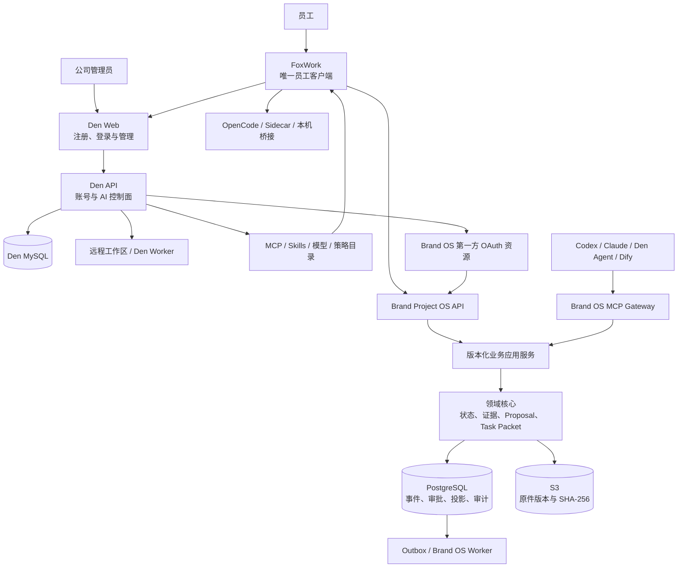
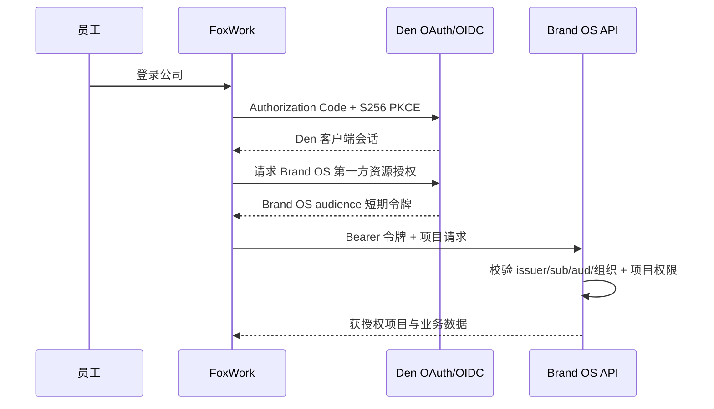

# 架构与接口契约 SPEC

> 当前路线：FoxWork 唯一员工客户端 + OpenWork Den 统一控制面 + Brand Project OS 权威业务服务  
> 当前进度：29/56，F3.3 进行中  
> 决策优先级：ADR-0008 -> ADR-0007 -> ADR-0006 -> ADR-0005 -> ADR-0004 -> ADR-0003

## 架构结论

FoxWork 是员工唯一安装的软件。公司服务器运行两组职责不同的服务：

- OpenWork Den 负责单组织自助注册、账号、组织、成员/团队、远程工作区/Worker、桌面交接、MCP、Skills、共享模型和桌面策略；
- Brand Project OS Service 负责项目、资料、多媒体处理、证据、Task Packet、Proposal、人工确认和正式状态。

员工只登录一套 Den 账号，但 Den 与 Brand OS 使用独立资源令牌、独立数据库和独立授权。单点体验不能通过共享数据库、复用 Den Session Token 或复制成员角色来实现。

## 决策解释顺序

1. ADR-0008 定义 Den 单组织自助注册、远程工作区/Worker、中文管理面和 Wiki 发布门。
2. ADR-0007 定义 Den 与 Brand OS 的分工、许可和单账号方向。
3. ADR-0006 定义 FoxWork 发行名及全量简体中文界面。
4. ADR-0005 定义单一员工客户端、公司服务器权威服务和团队阶段唯一写入面。
5. ADR-0004 定义 OpenWork 是唯一员工客户端，不再建设第二套前端。
6. ADR-0003 的证据、会议语义、人工确认、Task Packet 和探索/执行规则继续有效。

旧 ADR 或历史阶段文档中的“不部署 Den”“自建团队连接”只说明当时方案，不得覆盖本文。

## 系统上下文



## 组件所有权

| 组件 | 自有数据 | 允许写入 | 禁止事项 |
|:---|:---|:---|:---|
| FoxWork | UI 状态、带水位缓存、草稿、系统钥匙串引用、本机授权 | 调用 Den/Brand OS 接口；执行本机获准动作 | 保存唯一正式事实、直连数据库、绕过用户访问本机 |
| Den Web/API | 用户、组织、团队、会话、远程工作区、能力目录、共享模型和策略 | Den MySQL 中的控制面数据和 Worker 生命周期 | 保存项目原件、审批、负责人、正式截止或项目真相 |
| Brand OS API | 无独立业务事实；承载用例和协议 | 经身份、项目权限、幂等和版本校验调用应用服务 | 接受共享令牌冒充员工、直写存储绕过领域规则 |
| PostgreSQL | 项目、身份绑定、权限、事件、审批、投影、审计和 Outbox | 只经 Brand OS 应用服务 | 被 Den、MCP、Worker 或客户端直接修改 |
| S3 | 隔离对象、ACTIVE 原件版本、导出和备份对象 | 经准入状态机与明确 VersionId | 同名覆盖、把临时对象当证据、无墓碑硬删除 |
| OpenCode/Den Worker | Session、工具请求、运行配置和临时工作区 | 产生 Artifact 或 Proposal | 承担正式状态或人工确认 |
| Dify/可选适配器 | 工作流或派生数据 | 读取受控输入、回传 Artifact/Proposal | 直连正式表、取得人工批准权 |

## 权威与派生规则

1. 原件内容由 SHA-256、S3 VersionId 和来源元数据证明。
2. 当前正式状态只由具名员工批准事件形成，可从事件重建。
3. PostgreSQL 投影是权威事件的当前视图，不是第二真相源。
4. Den 组织和团队是控制面权威；Brand OS 保存可审计映射，不复制一套可独立编辑的组织系统。
5. OpenWork/Den Session、模型输出、检索、转写、OCR、摘要、Notebook 和 Memory 都可删除重建。
6. Phase 1 SQLite 已完成一次性迁移后保持只读，不能恢复为并行写入面。

## 身份与授权契约

### 一次登录，两种资源令牌



永久约束：

- 员工只维护 Den 账号和密码；
- Brand OS 按稳定 `(issuer, subject)` 绑定员工；可信 Den 成员首次访问时可建立内部身份映射，但邮箱不自动建号、合并或重新绑定，首次建档也不授予项目权限；
- Brand OS Token 必须有独立 audience、较短有效期和明确项目/动作权限；
- 原始 Den Session Token 不能直接访问 Brand OS；
- 组织、团队、项目、模型、MCP 或 Skill 撤权必须联动失效；
- 只有交互式员工会话可产生 `HUMAN` 命令身份；服务账号永远没有人工批准动作。

F2.4 已完成通用 OIDC/PKCE、会话和预登记 `(issuer, subject)` 绑定基线。F3.5 负责升级为可信 Den 成员首次登录建档，并完成第一方资源 audience、组织声明和撤权联动；未完成前不能宣称统一身份已闭环。

## 业务写入契约

### `CanonicalStorePort`

```text
execute(command, actor, idempotency_key, expected_version)
read_aggregate(project_id, aggregate_type, aggregate_id, at_version?)
read_projection(project_id, projection_type, at_event_id?)
read_event_stream(project_id, after_sequence?)
verify_event_chain(project_id)
rebuild_projection(project_id, projection_type)
backup(destination)
health()
```

一次正式写入必须在同一 PostgreSQL 事务中：

1. 校验交互式员工或受限服务身份、项目、动作和保密级别；
2. 登记幂等键和请求摘要；同键不同摘要拒绝；
3. 校验 `expected_version`；过期返回当前版本和正式差异；
4. 执行领域状态机；非人工主体只能创建 `proposed`；
5. 追加事件和必要人工动作；
6. 更新最小投影、审计与 Outbox；
7. 返回新版本、事件序号和证据引用。

冲突不做最后写入覆盖。投影漂移、数据库错误或身份异常不得伪装为普通 409。

## 原件与处理契约

### `EvidenceStorePort`

```text
begin_upload(project_id, file_metadata, idempotency_key)
upload_part(upload_id, part_number, bytes, checksum)
complete_upload(upload_id)
verify(upload_id, expected_hash?, expected_size?, expected_mime?)
activate(upload_id, object_key, version_id)
open(evidence_ref)
locate(evidence_ref, locator)
revoke(evidence_ref, actor, reason)
reconcile(project_id)
```

对象状态固定为 `UPLOADING -> QUARANTINED -> VERIFIED -> ACTIVE`；失败进入 `REJECTED/EXPIRED`，人工撤销进入 `REVOKED`。只有 `ACTIVE` 可用于正式证据。

### `ContentProcessingPort`

```text
submit(evidence_ref, processing_profile, idempotency_key)
get_job(job_id)
cancel(job_id, actor)
retry(job_id, actor)
list_artifacts(evidence_ref)
get_artifact(artifact_id)
health(adapter_id)
```

图片、视频、录音、PPT、Office 和 PDF 的 Artifact 必须绑定原件版本、处理器版本和可打开定位。图片区域、页码、幻灯片号、段落/表格或音视频时间码缺失时，不得把结果作为可回源结论。

## Proposal 与人工确认

### `ProposalPort`

```text
create(project_id, base_state_version, change, evidence, actor, idempotency_key)
compare(proposal_id)
approve(proposal_id, human_action, expected_version)
modify_and_approve(proposal_id, patch, human_action, expected_version)
reject(proposal_id, human_action, expected_version)
supersede(proposal_id, replacement_id, human_action)
```

`approve`、`modify_and_approve` 和 `reject` 只接受具备项目权限的交互式员工身份。MCP、Skill、Agent、Workflow、Den 管理动作和 OpenCode Tool Permission 的能力表都不能包含这些方法。

## Task Packet 与 Agent Runtime

### `TaskPacketPort`

```text
register_runtime_task(project_id, actor, task, idempotency_key)
switch_work_mode(project_id, actor, switch, idempotency_key)
build_task_packet(project_id, task_id, actor, expected_state_version?)
get_task_packet(project_id, packet_id)
get_task_packet_layer(project_id, packet_id, layer)
validate_task_packet(project_id, packet_id)
record_agent_run(project_id, actor, request)
```

Task Packet 使用 L0-L4 分层并保持不可变。每次 Agent 运行绑定 Packet 哈希、状态版本、任务版本、角色、工作模式、协议、运行时和模型版本。AI 可以建议模式切换，不能执行切换。

### `AgentRuntimePort`

```text
list_runtimes(project_id)
create_run(task_packet_ref, runtime_policy, idempotency_key)
get_run(run_id)
stream_events(run_id, after_cursor?)
respond_tool_permission(request_id, decision, constraints)
cancel_run(run_id, reason)
list_artifacts(run_id)
publish_artifact(run_id, artifact_ref)
health(runtime_id)
```

员工设备使用 FoxWork 本地 OpenCode/Sidecar；Den 管理服务器远程工作区/Worker；Brand OS Worker 负责资料处理。当前上游只有 `stub`、Render 和 Daytona provisioner，具体自托管方式尚未通过，F3.3 必须在测试环境完成真实运行与替换边界，不能把文档目标写成已实现。

## MCP、Skills 与模型契约

### `RemoteAIAccessPort`

```text
list_capabilities(actor, project_id)
issue_delegation(actor, project_id, capabilities, expires_at)
invoke(tool_id, input, delegation)
revoke_delegation(delegation_id, reason)
audit_invocation(invocation_id)
```

- Den 负责能力目录和成员/团队授权；Brand OS MCP 负责业务工具执行。
- MCP 工具使用封闭 JSON Schema，拒绝额外字段；项目在服务器端固定。
- Skill 只保存工作法，不保存实时事实或凭据。
- 模型密钥只在 Den 控制边界保存；Brand OS 记录模型 ID 和运行元数据。
- 撤权检查不能只发生在目录展示，实际调用也必须重新鉴权。

## 已完成的机器契约

| 契约 | 当前状态 | 核心不变量 |
|:---|:---|:---|
| `task-packet.v2` / `task-packet-assembly.v1` | 已完成 | 分层、不可变、角色/模式由人登记 |
| `local-ai-access.v1` | 已完成 | 项目固定、工具白名单、AI 无批准工具 |
| `server-boundary.v4` / `service-config.v2` | 已完成 | 只有应用服务推进正式状态，秘密不进入配置摘要 |
| `postgresql-authority.v6` | 已完成 | v1-v11 迁移承载领域、对象、身份、授权、审计和限流 |
| `object-evidence.v1` | 已完成 | 版本桶、ACTIVE-only、SHA-256、延迟删除 |
| `oidc-identity.v1` | 已完成通用基线 | PKCE、稳定身份、加密会话、撤权；Den 适配待 F3.5 |
| `project-authorization.v1` | 已完成 | 应用先判权、服务无批准权、RLS 纵深防御 |
| `write-consistency.v1` / `write-conflict.v1` | 已完成 | 幂等、乐观锁、可复核差异 |
| `audit-outbox.v1` | 已完成 | 至少一次、Inbox 去重、死信和可重放 |
| `http-api.v1` / `http-error.v1` | 已完成 | Employee/Agent 分路、稳定错误和兼容窗口 |
| `postgresql-backup.v1` / `server-recovery.v2` | 已完成基线 | 空库恢复、全表摘要、事件重建和明确 VersionId |

## F3 待冻结契约

| 契约 | 任务 | 必须回答 |
|:---|:---|:---|
| `den-deployment.v1` | F3.3 | Web/API/MySQL/远程 Worker 配置、密钥、迁移、健康、备份、升级和回滚 |
| `foxwork-company-session.v1` | F3.4 | 自助注册、登录、桌面交接、登出、离线、员工端/管理员后台中文和版本兼容 |
| `den-brand-os-federation.v1` | F3.5 | audience、组织声明、PKCE、令牌寿命和撤权 |
| `organization-project-map.v1` | F3.6 | 组织/团队/远程工作区与项目映射、首次登录、角色变化和审计 |
| `den-remote-workspace.v1` | F3.3、F3.11 | Worker 创建、分配、连接、撤权、隔离、清理和本机权限边界 |
| `artifact-processing.v1` | F3.7-F3.8 | 上传、处理任务、Artifact、来源定位、取消和重试 |
| `remote-ai-access.v1` | F3.12 | OAuth、项目 Scope、能力白名单、调用审计和撤权 |
| `company-capability-catalog.v1` | F3.13 | Skills、模型、策略版本、授权、回滚和客户端同步 |

## 配置边界

- FoxWork 只需要公司 Den Web 入口和公司发行配置；不内置数据库、对象存储或内部 API 地址。
- Den API、Brand OS API 和 OAuth 路由通过同一公司入口发现或反向代理。
- 内网/受控覆盖网络可以由管理员显式允许 HTTP；公网或不可信网络必须 HTTPS。
- 允许 HTTP 不得关闭 PKCE、state/nonce、来源校验、短期令牌、撤权或系统钥匙串。
- MySQL、PostgreSQL、S3、队列和管理端只在私网可达；秘密只由密钥服务或环境注入。

## 契约演进

1. Schema 显式版本化；删除字段、改义或收紧语义升主版本。
2. Den 与 Brand OS 只通过 OAuth/OIDC、版本化 API、MCP 和映射事件交互，不共享表。
3. 客户端与服务器至少保留一个发布周期兼容窗口。
4. 未知事件、声明、文件类型或模型输出进入可见错误，不猜测解析。
5. 所有可选组件都提供 NoOp 或基线实现，停用不迁移正式数据。
6. 从本地到服务器、从一个模型到另一个模型、从一个解析器到另一个解析器，都不能改变已批准内容的语义等级和证据引用。

## 阶段验收

1. F3.3：Den Web/API/MySQL 与远程 Worker 可重复部署、迁移、备份、恢复、升级和回滚，秘密与内网入口边界明确。
2. F3.4-F3.6：员工可自助注册并只登录一次，进入唯一公司组织、获授权远程工作区和项目；撤权联动；员工端和管理员后台全中文。
3. F3.7-F3.10：多媒体资料形成不可变原件、可定位 Artifact、Proposal 和人工确认闭环。
4. F3.11-F3.13：本机权限不可被远程 Worker 或服务器绕过；MCP/Skills/模型按成员或团队下发并可撤销。
5. F3.14-F3.18：工作流和可选适配器逐项通过许可、外发、故障和退出门。
6. F3.19：Den 远程工作区/Worker 必须真实通过；其他可选组件关闭时核心业务仍可完成；安全门前不接真实资料，通过后再同步 Wiki。
