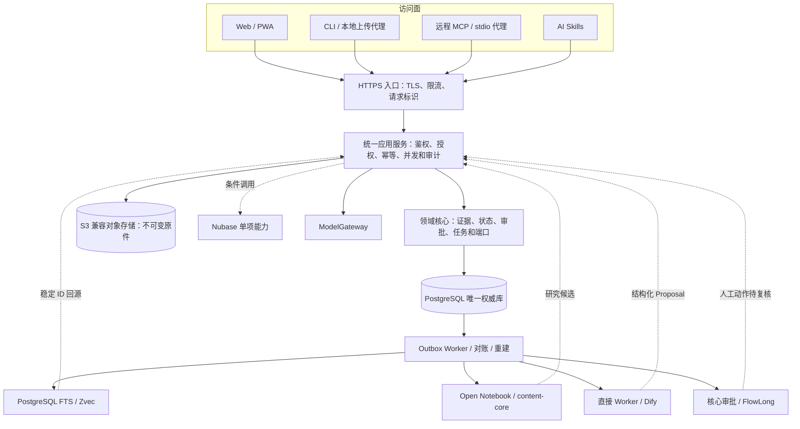
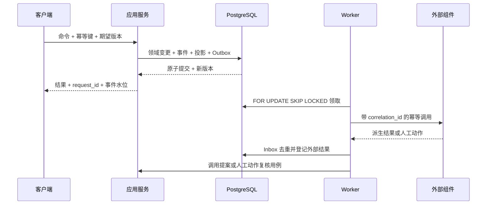

# 架构与接口契约计划

## 架构结论

Brand Project OS 是团队服务器产品，不是以某位成员电脑为中心的同步工具。生产环境只有一个权威应用服务和一个 PostgreSQL 正式写入面；原始文件由团队控制的 S3 兼容对象存储保存。Web/PWA、远程 MCP、CLI、Skills、Dify 和其他自动化都必须经同一版本化应用 API 工作。

完整部署、事务与客户端方案分别见：

- [团队服务器架构](team-server-architecture.md)
- [数据一致性与可靠性计划](data-consistency-and-reliability.md)
- [前端与 AI 访问规划](frontend-and-ai-access.md)
- [ADR-0001：团队服务器作为唯一权威运行面](../adr/0001-team-server-authority.md)

## 不可突破的不变量

1. S3 中的不可变原件证明“说过什么”；PostgreSQL 中的具名人工批准事件证明“现在正式是什么”。
2. PostgreSQL 是正式对象、权限、审批、领域事件、最小投影、审计与 Outbox 的唯一可写数据库。
3. SQLite 只用于开发、测试、单机演示和签名只读快照；离线客户端只能保存草稿/Proposal，不得形成正式写入。
4. `VIEW`、`HYPOTHESIS`、`OPTION`、`OPEN` 不得自动升级为 `DECISION` 或 `CONSTRAINT`。
5. AI、MCP、Skill、Dify、Open Notebook、Nubase Memory 和 FlowLong 只能读最小上下文或提出候选，不能批准。
6. 搜索、向量、Notebook、Memory、工作流实例、摘要、通知和缓存均为派生层，可删除、禁用、替换或从权威数据重建。
7. 领域核心只依赖版本化端口和可序列化 Schema，不导入基础设施或模型 SDK。

## 逻辑架构



## 规划目录

```text
apps/
├─ api/                         # FastAPI、OpenAPI、OIDC 回调和统一错误模型
├─ worker/                      # Outbox、Inbox、重试、死信、索引世代和对账
├─ mcp/                         # Streamable HTTP MCP 与本地 stdio 代理
├─ cli/                         # 登录、导入、诊断、Proposal 和受控管理动作
└─ web/                         # React、TypeScript、Vite、PWA 团队工作台
packages/
├─ core/
│  ├─ domain/                   # 领域对象、状态和不变量
│  ├─ application/              # 用例编排，不含协议细节
│  ├─ events/                   # 只追加权威事件
│  ├─ projections/              # 最小同步投影和可重建派生投影
│  ├─ auth/                     # RBAC、Scope、保密和审批策略
│  └─ ports/                    # 版本化外部端口
├─ adapters/
│  ├─ postgres/                 # 权威存储、RLS、Alembic 和 Outbox
│  ├─ object_store/             # S3/MinIO 与开发文件系统实现
│  ├─ identity/                 # OIDC 提供商适配器
│  ├─ search/                   # PostgreSQL FTS、pgvector、Zvec 和 NoOp
│  ├─ content/                  # 内置解析、content-core、Open Notebook
│  ├─ ai_workflow/              # 直接 Worker、Dify 和 NoOp
│  ├─ approval_workflow/        # 核心审批、FlowLong 和 NoOp
│  └─ nubase/                   # 单项能力 POC，不含权威库替换
├─ ingestion/
│  ├─ v5/                       # V5 预检、映射、对账和幂等导入
│  └─ meetings/                 # 会议分段和候选抽取
└─ operations/                  # doctor、verify、PITR、重建、对账和快照
schemas/                        # JSON Schema、OpenAPI、MCP 和事件契约
deploy/                         # 容器、反向代理、监控、备份和恢复
tests/
├─ unit/
├─ contract/
├─ integration/
├─ golden/
├─ security/
└─ e2e/
```

## 权威存储契约

### `CanonicalStorePort`

```text
execute(command, identity_context, idempotency_key, expected_version)
read_aggregate(workspace_id, aggregate_type, aggregate_id, at_version?)
read_projection(workspace_id, project_id, projection_type, at_position?)
read_event_stream(workspace_id, project_id, after_position?)
verify_event_chain(workspace_id, project_id)
rebuild_projection(workspace_id, project_id, projection_type)
health()
```

生产实现是标准 PostgreSQL。一次 `execute` 必须在同一事务完成：

1. 注入并校验 OIDC/服务身份、工作空间、项目、动作 Scope 和保密策略。
2. 登记幂等键及请求摘要；同键不同摘要返回冲突。
3. 读取并校验聚合版本；版本不匹配返回 `409 Conflict` 和最新版本。
4. 执行领域状态机；需要最终化时取得行锁并重新校验审批策略。
5. 追加领域事件，更新最小正式投影，写入审计关联和 Outbox。
6. 提交后返回新版本、事件位置、`request_id` 和派生层可能延迟的提示。

SQLite 只能实现 `DevelopmentStorePort` 或 `ReadonlySnapshotPort`；生产配置校验必须拒绝可写 SQLite。

### `ObjectStorePort`

```text
stage_upload(workspace_id, project_id, metadata)
put_part(upload_id, bytes)
verify_staged(upload_id, expected_hash?, expected_size?, expected_mime?)
commit_content_addressed(upload_id, sha256)
open_version(source_id, version_id)
verify_object(source_id, version_id)
revoke_version(source_id, version_id, reason)
reconcile(workspace_id, project_id)
health()
```

临时对象键不能进入证据链。校验通过后复制为按 SHA-256 寻址的不可变对象，再由 PostgreSQL 事务登记 Source、谱系和事件。只有 ACTIVE 版本可作正式证据；删除使用墓碑和延迟清理。对象版本保留时间不得短于数据库 PITR 窗口。

## 身份与授权契约

### `IdentityPort`

```text
start_authorization(client_type, redirect_uri, scopes)
exchange_code(code, verifier)
refresh_session(refresh_reference)
verify_access_token(token, audience)
revoke_subject(subject_id, reason)
issue_service_credential(service_account_id, scopes, ttl)
health()
```

- Web 使用 OIDC 授权码+PKCE和服务端安全 Cookie；高风险动作支持 MFA/重新认证。
- CLI 使用设备授权或 PKCE 本机回调，刷新凭据进入系统钥匙串。
- 远程 MCP 优先 OAuth；受控试点 Bearer Token 只能来自环境变量和最小权限服务账号。
- 身份提供商只证明主体身份；工作空间/项目成员关系、角色和动作 Scope 由 Brand Project OS 权威库定义。

### `AuthorizationContext`

每个请求至少包含 `actor_type`、`actor_id`、`workspace_id`、`project_id`、`scopes`、`confidentiality_clearance`、`session_id` 和 `request_id`。数据库事务必须用 `SET LOCAL` 注入上下文，避免连接池复用串租户。RLS 是第二道防线，不能替代应用层状态机和授权。

## 检索与内容处理端口

### `SearchIndexPort`

```text
apply(records, indexed_event_position)
delete(record_ids, indexed_event_position)
search(query, filters, top_k, authorization_context)
watermark(workspace_id, project_id)
build_generation(workspace_id, project_id, until_position)
activate_generation(generation_id)
health()
```

首发实现为 PostgreSQL FTS+`pg_trgm`，可选 pgvector。Zvec 仅作为独立单活动写 Worker 的可重建增强索引。索引记录至少含稳定来源 ID、内容哈希、领域版本、权限过滤字段和事件水位。任何命中都必须回 PostgreSQL 重新校验 RLS、版本与撤销状态。

### `ContentProcessingPort`

```text
extract(source_ref, processing_policy)
transcribe(source_ref, processing_policy)
normalize(extraction, schema_version)
get_run(run_id)
cancel(run_id)
health()
```

基线实现为直接 Worker；可选实现为 `content-core` 或 Open Notebook sidecar。输入只使用批准范围内的对象副本，返回解析文本、分段、引用和候选；不得直接更改 Source 权威角色、事实或审批。

### `ResearchWorkspacePort`

```text
register_source(source_manifest, idempotency_key)
get_research_result(external_id)
list_citations(external_id)
delete_derived_copy(external_id)
reconcile(correlation_id)
health()
```

研究结果统一标记 `DERIVED`，进入核心后只能生成 Proposal。Open Notebook 的任意创建、更新和删除 MCP 不直接暴露给主控 AI，必须经过允许列表包装器。

## 人工审批与 AI 工作流端口

### `ApprovalWorkflowPort`

```text
start(proposal_id, policy_snapshot, idempotency_key)
get_status(correlation_id)
receive_human_action(signed_action)
cancel(correlation_id, reason)
reconcile(correlation_id)
health()
```

默认实现是核心状态机。FlowLong 只协调会签、或签、转办、提醒等复杂人工任务；回调必须重新验证主体映射、项目、流程版本、Proposal 版本、幂等键和签名，再调用核心用例。FlowLong 无权直接追加批准事件，AI 审批和超时自动通过必须关闭。

### `AIWorkflowPort`

```text
run(workflow_key, workflow_version, task_packet, data_policy, idempotency_key)
get_run(run_id)
cancel(run_id)
validate_output(run_id, output_schema)
get_usage(run_id)
health()
```

基线实现是直接 Worker，可选实现为 Dify。每次调用必须固定工作流导出版本、输入/输出 Schema、模型、插件、超时、重试、数据级别和退出方案。Dify 只返回结构化候选；后端校验后保存为 Proposal。Dify API Key 只由后端持有。首个 POC 限单内部 Workspace 和后端 API；源码多租户、白标或分发必须先取得书面许可结论。

### `ModelGatewayPort`

```text
run(task_packet, model_policy, data_policy)
compare(run_ids, rubric_id)
get_usage(run_id)
cancel(run_id)
health()
```

运行记录保存 Task Packet/Schema/模型/Prompt/参数/数据级别/授权/成本/时间/结果哈希和最终 Proposal。P2/P3 默认只允许批准的本地处理或脱敏副本，外发需任务级人工授权。

## Outbox、Inbox 与外部回调



Worker 采用至少一次投递；每个消费者通过 Inbox 或外部唯一键去重。Schema、权限或数据错误直接进入可见死信。外部写成功但确认前崩溃时，重放不能创建重复索引、通知、工作流或 Proposal。

## 关键 Schema

| Schema | 作用 | 关键不变量 |
|:---|:---|:---|
| `tenant-context.v1` | 跨入口身份与租户上下文 | 主体、工作空间、项目、Scope、保密许可、会话和请求 ID 完整 |
| `source-manifest.v1` | 原件准入与版本 | SHA-256、对象版本、来源、角色、保密级别和状态必填 |
| `domain-command.v1` | 正式写命令 | 幂等键、期望版本、操作者和请求摘要必填 |
| `domain-event.v1` | 只追加权威事件 | 聚合版本唯一；Schema 版本、因果链、操作者和提交时间完整 |
| `state-proposal.v1` | AI/导入/外部候选 | 只能是 proposed；基础版本、影响范围、证据 ID 和生成来源必填 |
| `approval-event.v1` | 具名人工动作 | 人、时间、理由、Scope、策略快照、旧新版本和幂等键必填 |
| `task-packet.v1` | AI 最小上下文 | 工作模式、目标、批准状态、开放项、证据、禁区和事件水位必填 |
| `search-record.v1` | 可重建检索记录 | 稳定 ID、哈希、领域版本、权限字段和索引水位必填 |
| `outbox-message.v1` | 事务后派生任务 | 事件位置、消费者、重试策略、关联 ID 和载荷版本必填 |
| `adapter-callback.v1` | 外部回调 | 适配器、版本、签名、重试号、外部动作人和目标版本必填 |
| `ai-workflow-run.v1` | Dify/直接 Worker 留痕 | 工作流、模型/插件、Task Packet、数据级别、成本和输出哈希必填 |
| `audit-record.v1` | 安全与管理审计 | 请求、会话、主体、资源、动作、结果、理由和时间必填；不保存密钥 |

## HTTP 与 MCP 契约

### HTTP 写入规则

- `Idempotency-Key`：所有业务命令必填；同键不同摘要返回 409。
- `If-Match` 或请求体 `expected_version`：所有可编辑聚合必填；版本冲突返回最新版本与差异链接。
- `X-Request-Id`：入口可传，服务端校验或生成；响应和所有日志/事件保留。
- 正式写入成功响应返回 `resource_version`、`event_position` 和 `derived_watermark`。
- `401` 表示未认证，`403` 表示身份有效但 Scope 不足，`409` 表示幂等/版本冲突，`422` 表示 Schema/领域规则失败，`503` 只用于权威依赖不可用。

### 首批远程 MCP 工具

- `project_get_state`
- `task_get_packet`
- `meeting_list`、`meeting_get`
- `evidence_search`、`evidence_get`
- `decision_list`、`open_question_list`、`action_list`
- `proposal_create`

禁止暴露 `approve`、`reject`、任意 SQL、成员管理、生产密钥、原件硬删除、Dify 任意工作流编辑、Open Notebook 任意写删或 FlowLong 自动批准。MCP、HTTP、CLI 和 Web 必须返回相同的正式状态版本和证据链。

## 契约演进规则

1. Schema 和端口使用显式主版本；新增可选字段保持向后兼容，删除/改义必须升主版本。
2. 生产迁移采用 expand-migrate-contract；破坏性 contract 至少延迟一个发布周期。
3. 消费者必须声明支持的版本范围；未知事件/回调版本进入死信，不做猜测性解析。
4. 外部适配器通过共享 contract test、金标和故障注入后才能替换基线实现。
5. 所有上游版本和镜像固定到版本/摘要；升级先通过 V5 金标、权限、恢复和 BrandBench。
6. 每个端口保留 NoOp 或基线实现，关闭外部组件不改变权威读取与人工审批。

## 任务映射

| 契约域 | 实施任务 |
|:---|:---|
| 权威、Schema、租户与身份契约 | F1.2-F1.5、F2.1 |
| PostgreSQL 事务、事件、Outbox 与恢复 | F2.2、F2.6、F2.7 |
| 对象存储、导入、检索与回源 | F2.3-F2.5 |
| 身份、授权、审批与 Task Packet | F3.1-F3.5 |
| HTTP、远程 MCP、CLI 与 Skills | F3.6-F3.8 |
| Web/PWA、离线和服务器验收 | F4.2-F4.8 |
| 五个外部适配器门 | F5.1-F5.7 |
| 选择性生产集成与回归 | F6.1-F6.6 |
