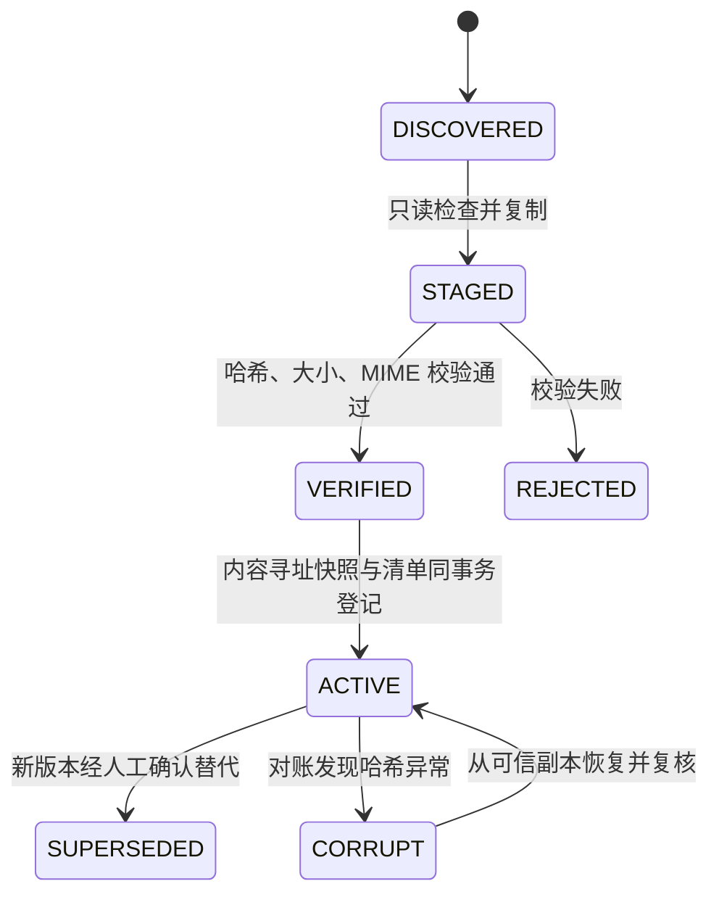

# 数据一致性与可靠性计划

> 当前生效范围：Phase 1 本地验证 + Phase 2-4 团队服务器 
> 权威切换：Phase 1 SQLite -> Phase 3 一次性迁移 -> PostgreSQL/S3；禁止长期双写
> 当前权威决策：[ADR-0005](../adr/0005-single-client-server-authority.md)

## 分阶段一致性分层

| 数据类别 | 当前要求 | 真相来源 |
|:---|:---|:---|
| 原始文件内容与版本 | 内容不可被 AI 改写，可按哈希复核 | 本地内容寻址证据快照及 SHA-256 |
| 人工批准的事实、决定、约束、行动和时间性质 | 强一致、只追加形成历史 | Phase 1 SQLite；切换后 PostgreSQL 事件与人工动作 |
| 当前项目状态 | 与批准事件同事务更新 | Phase 1 SQLite 投影；切换后 PostgreSQL 投影，均可从事件重建 |
| 会议分类、观点、偏好、假设、选项、倾向和 Proposal | 工作层，可撤回/替代，不自动正式化 | SQLite 工作层记录及其证据引用 |
| 文件清单、稳定 ID 和证据关系 | 与准入/确认事务一致 | Phase 1 SQLite + 本地证据；切换后 PostgreSQL + 对象存储 |
| FTS/向量索引、摘要、Task Packet、模型运行和会话 | 派生或运行态 | 可删除重建，不定义正式状态 |
| OpenWork/OpenCode 本地 SQLite/JSON | 客户端或 Agent 运行态 | 删除后不得影响鸿日正式状态 |

Phase 1 只有本地权威写入面。F3.1 使用一次性单向迁移、全量对账和写入冻结完成切换；切换后本地库只读，禁止长期双主。

## Phase 1：单写入者与 SQLite 纪律

- 只有本地领域应用层持有可写 SQLite 连接。UI、CLI、MCP、Skill、模型适配器和 OpenWork 通过应用用例工作，不直接执行正式 SQL。
- 进程内使用一个串行写队列；多个模型可以并行读取、检索和生成候选，但 Proposal 最终化按 `expected_version` 串行提交。
- 打开 `PRAGMA foreign_keys=ON`、`journal_mode=WAL`、适当的 `busy_timeout`；正式写事务使用 `BEGIN IMMEDIATE` 尽早暴露竞争。
- `synchronous` 默认使用 `FULL`；只有经过断电/崩溃测试且用户接受数据窗口后才能降低。
- 每次启动运行 `quick_check`，异常时停止正式写入并引导从备份恢复，不能带病自动修复事件历史。
- 数据库 Schema 使用显式迁移版本；应用启动可以拒绝不兼容版本，但不能在无备份时执行破坏性迁移。

## Phase 1：本地事务

每个正式写命令按以下顺序在一个 SQLite 事务完成：

1. 校验命令来源、操作者类型和是否包含 Fox 的显式人工动作。
2. 登记 `idempotency_key`、命令类型和请求摘要；同键不同摘要返回冲突。
3. 读取聚合与 `state_version`，校验 `expected_version`。
4. 执行会议分类、工作模式和状态迁移规则；AI 命令只能产生 `proposed`。
5. 追加领域事件；人工批准时同时保存理由、旧值、新值、证据、范围和协议版本。
6. 同事务更新最小当前投影和证据/关系引用。
7. 提交后返回新状态版本、事件序号和需要重建的派生水位。

必须建立以下唯一约束：

- `project_id + aggregate_type + aggregate_id + aggregate_version` 唯一。
- `project_id + actor_type + operation + idempotency_key` 唯一。
- 一个 Proposal 在同一基础版本只能有一个最终人工动作。
- 来源版本由 `source_id + sha256` 唯一；同名文件不能覆盖旧证据。

若 `expected_version` 过期，应用返回当前版本与差异，保留用户草稿并要求重新确认。不能采用最后写入者覆盖。

## Phase 1：本地证据准入

本地工作目录中的文件可能被移动、覆盖或删除，因此仅保存路径不足以支撑证据链。准入采用可恢复状态机：

- 原始来源路径和内容寻址快照都记录；正式证据引用只指向已验证快照及其稳定 ID。
- 证据区按 SHA-256 保存，不用文件名决定版本；快照设为只读，删除走显式墓碑与备份保留。
- PDF/录音等引用保存页码、时间区间、说话人/作者和转写版本；转写文本不能替代原始音频。
- 定期对账 SQLite 清单、文件大小和哈希。异常使相关新批准操作失败，但不静默换成同名文件。
- 资料含敏感信息时，本地证据区和备份继承 macOS 磁盘加密与最小目录权限；外发模型仍需任务级授权。

## 全阶段：增量状态与检索一致性

- 新会议绑定 `base_state_version`，只产生新增、修改、冲突和替代建议；不重写全部当前状态。
- `VIEW/PREFERENCE/HYPOTHESIS/OPTION/TENDENCY/TARGET_DATE/OPEN` 可进入工作层，但不能通过模型任务自动变为正式决定或约束。
- 当前投影与批准事件同事务更新；模型摘要和 Task Packet 在提交后失效，并按新版本重建。
- 基线检索采用 SQLite FTS5 和结构化关系。索引项保存稳定来源 ID、内容哈希、状态版本和索引水位。
- 检索命中返回后必须读取 SQLite 当前状态并打开证据快照；相似度不能判断内容是否仍有效。
- 历史废案默认不进入普通 Task Packet，只在复盘、排重、冲突或风险检查时按需读取。

## Phase 1：本地备份与恢复

- 每次破坏性迁移、批量导入或真实会议确认前，使用 SQLite 在线备份 API 生成一致快照，不直接复制正在写入的数据库文件。
- 备份单元包含 `project.db`、Schema 版本、证据清单、内容寻址证据区校验清单、运行时协议版本和应用版本。
- 至少保留每日与最近关键操作前快照；MVP 不承诺服务器级 RPO/RTO，但任何通过验收的数据都必须能在另一目录恢复。
- 恢复顺序：冻结写入 -> 恢复数据库快照 -> 校验事件序列 -> 校验证据哈希 -> 重建投影与 FTS -> 运行鸿日金标 -> 切换工作目录。
- 模型会话、OpenWork 状态、向量索引和临时 Artifact 不作为必要备份；删除它们后核心仍应完整。

## Phase 1 强制验证场景

1. 同一导入或 Proposal 创建命令重试 100 次，只产生一份记录。
2. 两个模型基于同一版本产生 Proposal；Fox 批准其一后，另一项最终化得到可处理的版本冲突。
3. AI、MCP、Skill、OpenCode 或 Tool Permission 无法生成批准事件。
4. “可以再试”“不要太像”“安全还是要讲”“月底前最好”分别保持 OPTION、PREFERENCE、TENDENCY 和暂定 TARGET_DATE。
5. 新会议重复旧原话时不新增正式事实；与旧决定冲突时单列，不覆盖。
6. 来源文件被改名或删除后，已登记证据仍可由内容寻址快照打开并校验。
7. 模型在输出后、Proposal 保存前崩溃，重跑不形成重复候选。
8. 删除当前投影和 FTS 后，可从事件、人工动作和证据清单完整重建。
9. 在线备份恢复到新目录后，事件数量、状态版本、证据哈希和 10-20 个鸿日金标一致。
10. 删除 OpenWork/OpenCode 会话、缓存和运行目录，鸿日当前状态与证据链保持完整。

## Phase 3 权威切换

1. 在迁移前锁定应用版本、SQLite Schema、事件水位、来源清单和证据哈希。
2. 先恢复一份本地备份并运行全量回归，证明导出源可用。
3. 原件按 SHA-256 上传隔离区，校验后转为 ACTIVE；再导入稳定 ID、事件、审批、关系和投影。
4. 对账项目数、来源版本、事件序号、审批、当前投影、关系和对象哈希；任一不一致则废弃本次导入。
5. 冻结 SQLite 正式写入，记录最终水位，执行最终增量导入并再次对账。
6. 切换 Desktop/API 入口。SQLite 保留只读归档；回滚只允许在服务器尚未接受新正式写入时恢复本地权威。
7. 服务器接受首个新正式写入后，回退只能恢复服务器备份或向前修复，不允许把本地旧库重新升为权威。

客户端离线时只能读取带版本水位的缓存并编辑草稿。恢复联网后，草稿作为新 Proposal 提交并重新校验 `expected_version`；离线缓存不能产生批准事件。

## Phase 2+：PostgreSQL 一致性分层

以下各节是 Phase 2-4 的实施约束。具体任务、测试和门见 `docs/plan/task-breakdown.md`；没有通过阶段门的组件不能进入正式资料范围。

| 数据类别 | 一致性要求 | 真相来源 |
|:---|:---|:---|
| 成员、权限、提案、审批、正式状态、任务、事件 | 强一致 | PostgreSQL 主库 |
| 当前正式状态投影 | 与领域事件同事务同步 | PostgreSQL 主库，可从事件重建 |
| 原始文件有效状态 | 可恢复的应用级一致 | PostgreSQL 元数据 + 对象存储不可变对象 |
| 搜索索引、摘要、通知、AI 运行结果 | 最终一致 | Outbox 派生，可删除重建 |
| Dify、Open Notebook、FlowLong 实例 | 外部协调状态 | 组件自身，仅供对账，不定义正式状态 |
| 缓存和只读快照 | 非权威 | 删除后不得影响业务事实 |

审批后读取、权限校验和任何读后写逻辑始终访问 PostgreSQL 主库。未来增加只读副本时，副本只服务明确允许陈旧的报表或导出。

## Phase 2+：PostgreSQL 业务命令事务

每个正式写请求必须按以下顺序执行：

1. 验证真实用户或服务账号身份、项目成员关系、保密级别和操作 Scope。
2. 开启 PostgreSQL 事务，并使用 SET LOCAL 写入当前工作空间、项目和用户上下文。
3. 登记 idempotency_key、操作名和请求摘要；相同键不同摘要返回冲突。
4. 读取聚合版本并校验 expected_version。
5. 执行领域状态机和审批规则。
6. 追加不可修改的领域事件。
7. 同事务更新最小正式状态投影。
8. 同事务写入 Outbox 和安全审计关联信息。
9. 提交后返回新版本、事件位置、请求 ID 和索引可能延迟的提示。

事件至少保存 event_id、global_position、workspace_id、project_id、聚合类型与 ID、聚合版本、事件类型、Schema 版本、操作者类型与 ID、correlation_id、causation_id、幂等键、载荷和提交时间。

必须建立以下唯一约束：

- 工作空间、聚合类型、聚合 ID 和聚合版本的组合唯一，防止同一版本出现两个事件。
- 工作空间、操作者、操作和幂等键的组合唯一，防止命令重复执行。
- 审批动作的“提案、审批步骤、审批人、动作序号”组合唯一，防止重复回调或重复点击。

## Phase 2+：并发与锁

- 普通编辑使用乐观并发控制；版本不匹配返回 409 Conflict 和最新资源版本，不允许最后写入者静默覆盖。
- 审批最终化使用 SELECT FOR UPDATE 锁定提案，并在锁内重新验证策略快照、证据和权限。
- 少量跨多行不变量使用 SERIALIZABLE，仅对可证明幂等的事务最多自动重试 3 次。
- 大批量导入、投影重建和迁移使用项目级或任务级 advisory lock，不使用全局长事务。
- 审批策略在提案创建时保存快照；流程进行中修改规则不追溯改变既有提案。

F2.6 已完成当前并发实现：命令级 advisory lock 和项目行锁串行化正式版本推进；冲突报告从批准事件重建正式状态，并核对当前投影。当前没有自动合并冲突，也不会把数据库或投影异常转换成 409。HTTP 路由留给 F2.8，Outbox/Inbox 留给 F2.7。详见 [F2.6 幂等、乐观锁和冲突差异](../phase2/write-consistency-and-conflicts.md)。

## Phase 2+：Outbox 与消费者

Worker 使用 FOR UPDATE SKIP LOCKED 领取 Outbox，采用至少一次投递：

- 每个消费者用 Inbox 或外部唯一键去重。
- 消费状态记录尝试次数、下次重试时间、最后错误、死信原因和处理版本。
- 指数退避只用于瞬时错误；Schema、权限和数据错误直接进入人工可见死信队列。
- 消息低于目标对象当前版本时忽略；发现事件版本缺口时暂停该聚合并补放。
- Worker 在外部写成功、确认前崩溃时，重放不得创建重复索引、重复通知或重复工作流。
- Outbox 积压、最老消息年龄和失败率进入监控；核心事务不等待 Zvec、Dify、Notebook 或 FlowLong。

## Phase 2+：S3 文件与对象存储

PostgreSQL 与对象存储不做分布式事务，采用可恢复状态机：

~~~mermaid
stateDiagram-v2
    [*] --> UPLOADING
    UPLOADING --> QUARANTINED: 上传完成
    QUARANTINED --> VERIFIED: 哈希、大小、MIME、安全检查通过
    QUARANTINED --> REJECTED: 校验失败
    VERIFIED --> ACTIVE: 内容寻址对象存在且数据库事务提交
    ACTIVE --> REVOKED: 人工撤销或版本替代
    UPLOADING --> EXPIRED: 超时清理
~~~

- 临时对象键不可参与证据链。
- 验证通过后复制为按 SHA-256 寻址的不可变对象，再在数据库事务中登记 Source、谱系、事件和 Outbox。
- 只有 ACTIVE 文件可成为正式证据；删除使用墓碑和延迟清理。
- 对象版本保留时间不得短于数据库 PITR 窗口，否则恢复到旧时间点后会得到缺失文件。
- 定时对账数据库元数据、对象版本、大小和哈希；异常对象隔离并告警，不自动用同名文件替换。

## Phase 2+：服务器检索一致性

- 首发检索使用 PostgreSQL 权限过滤和基础全文/模糊匹配；Zvec 只作为可重建增强索引。
- Zvec 由一个活动写进程维护，不放在共享 NFS 上，不允许 API 直接写入。
- 索引项保存稳定来源 ID、内容哈希、领域版本和 indexed_event_position。
- 重建时生成新索引世代，完成数量、哈希、权限和金标校验后原子切换。
- 搜索命中必须回 PostgreSQL 重新做 RLS、版本和撤销状态检查，不能把索引文档直接当最终答案。
- 前端和 AI 工具显示索引更新时间；要求读己之写的路径直接查询权威库。

## Phase 2+：RLS 与服务角色

- 所有业务表包含 workspace_id；项目资源同时包含 project_id，并用复合外键阻止跨工作空间引用。
- 生产表启用并强制 RLS，运行时角色不具有 BYPASSRLS 或表所有者旁路能力。
- 每个事务通过 SET LOCAL 注入身份上下文，避免连接池复用导致身份泄漏。
- 迁移角色、API 角色、Outbox Worker、索引 Worker、备份角色和只读审计角色分离。
- AI 服务账号只能读取最小 Task Packet、检索获批证据和创建 Proposal，数据库与应用层均无批准权限。
- RLS 是第二道防线，不能替代领域状态机和应用层授权。

## Phase 2+：PITR、对象版本与恢复

- PostgreSQL 开启连续 WAL 归档和 PITR，建议保留 14-30 天；pg_dump 不能替代 PITR。
- 每日快照保留 30 天，每周加密逻辑导出进入不同账号或不同服务商的备份域。
- 对象存储开启版本控制、服务端加密和删除保护；重要原始资料启用对象锁。
- 不备份可重建的 Zvec、Notebook 和 Dify 派生索引，但备份其版本化配置、工作流定义和引用映射。
- 每月在隔离环境完成一次数据库、对象和配置联合恢复；每季度完成故障切换演练。
- 恢复顺序为：冻结写入、选择恢复点、新实例 PITR、校验事件链与对象哈希、重建投影和索引、运行金标与权限烟测、切换入口。

参考：[PostgreSQL 连续归档与 PITR](https://www.postgresql.org/docs/current/continuous-archiving.html)、[PostgreSQL 事务隔离](https://www.postgresql.org/docs/current/transaction-iso.html)。

## Phase 2-4 团队服务器强制验证场景

1. 相同命令并发重试 100 次，只产生一个领域事件。
2. 两人基于相同版本编辑，只有一人成功，另一人得到可处理冲突。
3. 20 个并发审批请求只形成一个满足策略的最终状态。
4. API 在提交后、发布 Outbox 前崩溃，重启后派生任务仍会完成。
5. Worker 在外部写成功、确认前崩溃，重放不产生重复结果。
6. Zvec 停止 30 分钟，正式状态仍可用，恢复后自动追平。
7. 上传在任一阶段中断，不能出现指向缺失对象的 ACTIVE Source。
8. 普通用户通过 API 和直接数据库连接都不能读取其他工作空间数据。
9. 从独立恢复环境核对事件数量、正式投影、对象哈希和关键查询。
10. 删除全部投影和检索派生数据后，可从事件和原始对象完整重建。
11. 新旧应用版本混跑期间，expand-contract 迁移不造成停机或错误写入。
12. AI 委托令牌经 HTTP、MCP、CLI 或 Dify 均无法批准正式状态。
