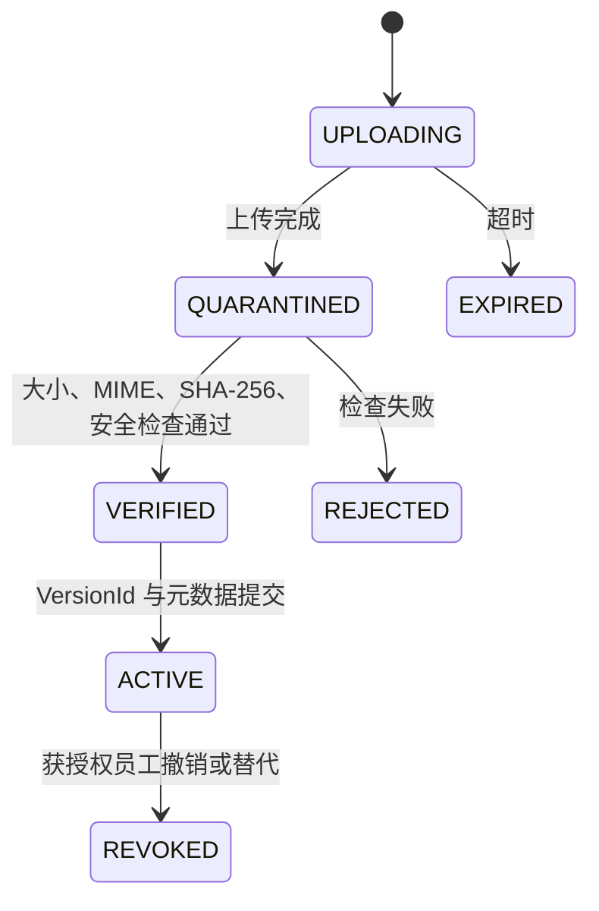

# 数据一致性与可靠性 SPEC

> 当前权威切换：Phase 1 SQLite 已经 F3.1 一次性迁移，团队阶段以 PostgreSQL/S3 为唯一业务权威  
> 控制面：Den MySQL 对账号、组织和 AI 能力配置负责，不是品牌业务权威  
> 目标：无双主、无静默覆盖、可恢复、可对账、可审计

## 一致性分层

| 数据类别 | 一致性要求 | 权威来源 |
|:---|:---|:---|
| Den 账号、组织、团队、远程工作区、MCP/Skills/模型授权 | Den 控制面内强一致 | Den MySQL |
| Den 与 Brand OS 员工绑定 | 稳定身份 + 可审计映射 | Den `issuer/subject` + Brand OS PostgreSQL 绑定 |
| Brand OS 项目、角色和保密级别 | 强一致 | PostgreSQL |
| 正式事实、决定、约束、行动和审批 | 强一致、只追加历史 | PostgreSQL 事件与人工动作 |
| 当前正式状态 | 与事件同事务更新，可重建 | PostgreSQL 投影 |
| 原件内容与版本 | 应用级可恢复一致 | PostgreSQL 元数据 + S3 VersionId/SHA-256 |
| 多媒体处理任务和 Artifact | 最终一致、可重试 | PostgreSQL 任务/引用 + 对象存储派生对象 |
| 搜索、摘要、转写、Notebook、Memory | 最终一致、可删除重建 | Outbox 派生数据 |
| Den 远程工作区、Worker 文件和 OpenWork/OpenCode Session | 运行态 | Den/OpenWork 自有存储，不定义业务事实 |
| FoxWork 缓存和草稿 | 非权威 | 员工设备，带状态版本和同步时间 |

Den MySQL 和 Brand OS PostgreSQL 没有跨库事务，也不需要双写相同业务对象。跨边界通过 OAuth 声明、稳定映射、幂等同步事件和对账完成。

## 单账号一致性

1. Den 自助注册或更新用户、组织、团队和远程工作区，生成稳定 `issuer`、`subject`、组织 ID 和成员版本；第二组织创建必须拒绝。
2. FoxWork 请求面向 Brand OS audience 的短期令牌。
3. Brand OS 校验可信 Den 发行者、受众、唯一公司组织和成员状态后，按 `(issuer, subject)` 找到或首次建立内部员工映射，再核对项目映射；首次建档不授予项目权限或审批权。
4. 组织/团队变化只改变能力或项目授权，不复制为可独立编辑的第二套成员表。
5. 撤权事件通过短令牌寿命、主动吊销、成员版本和服务端重新鉴权收敛。
6. 同步失败时 fail closed：不因为 Brand OS 尚未收到更新而继续授予新权限。

不得按邮箱自动建号、合并或迁移身份。不得用共享 MCP 服务令牌替代员工身份。Den 管理员权限也不能自动映射为 Brand OS 项目审批权。

## 正式业务事务

每个写请求必须：

1. 校验令牌、稳定员工绑定、项目、动作和保密级别；
2. 事务内使用 `SET LOCAL` 注入主体、项目和动作；
3. 登记 `idempotency_key` 和请求摘要；
4. 校验 `expected_version`；
5. 执行领域状态机，非人工主体只能生成 Proposal；
6. 追加领域事件和必要人工动作；
7. 同事务更新最小投影、审计和 Outbox；
8. 返回新版本、事件位置和可回源引用。

普通编辑采用乐观并发。版本不匹配返回 409、当前版本和可复核差异，不做最后写入覆盖。审批最终化锁定 Proposal 并在锁内重新校验身份、权限、状态和证据。

## Den 控制面事务

Den 的注册、组织、团队、MCP、Skill 和模型管理沿用其自有事务与 `fresh_auth_required` 安全门。Brand OS 不复制这些写入，也不直连 Den MySQL。

需要跨系统生效的操作使用以下方式：

- 登录和调用：实时验证短期 OAuth/OIDC 令牌；
- 撤权：Den 主动吊销 + 短令牌过期 + Brand OS 会话/授权缓存失效；
- 项目映射：由 Brand OS 保存带 Den 组织/团队/远程工作区版本的映射事件；
- 能力目录：FoxWork 从 Den 获取，Brand OS MCP 在每次执行时重新验证；
- 对账：定期比较 Den 成员版本、Brand OS 映射和未解决差异。

不使用两阶段提交，也不在一个数据库故障时把另一个数据库提升为其替代权威。

## 原件状态机

- 临时对象不能进入证据链。
- 同名异内容按 SHA-256 和版本号保存，不静默覆盖。
- PostgreSQL 与 S3 不做分布式事务；`VERIFIED` 重试、孤儿扫描、延迟墓碑和对账负责恢复。
- 只有 `ACTIVE` 可被正式状态引用；打开时按明确 VersionId 和哈希复核。
- 转写、OCR、缩略图、幻灯片渲染和摘要不能替代原件。

## 多媒体任务一致性

- 原件激活与“待处理”Outbox 同事务登记。
- Worker 以租约领取，Inbox 或外部唯一键去重；同一原件和处理配置只形成一个有效任务。
- 处理配置、模型、解析器和 Schema 版本写入任务；重试不能无声更换版本。
- Worker 成功写出派生对象后、确认前崩溃，重放不得生成重复 Artifact。
- 取消只停止未完成处理，不撤销原件；重试形成新尝试记录，不覆盖失败证据。
- Artifact 保存原件版本、处理器版本、页码/幻灯片/时间码等定位；创建 Proposal 时固定 Artifact 版本。
- 解析器或外部模型不可用时任务进入可见失败/重试，不阻塞项目正式读写。

## Outbox、Inbox 与可选组件

- Outbox 使用 `FOR UPDATE SKIP LOCKED`、租约、心跳和至少一次投递。
- 每个消费者独立记录尝试、下次重试、错误、死信和处理版本。
- Schema、权限和数据错误直接进入人工可见死信；瞬时错误指数退避。
- 消息低于目标当前版本时忽略；发现版本缺口时暂停该聚合并补放。
- 核心事务不等待 Dify、Zvec、Open Notebook、Nubase 或 FlowLong。
- 外部回调必须带幂等键和来源签名，并由 Brand OS 重新鉴权、校验 Schema。
- 所有外部组件只能回传 Artifact、Proposal 或流程状态，不能写正式表。

## 检索与缓存

- 首发使用 PostgreSQL FTS 和结构化过滤；Zvec 只有在金标上有可测收益时采用。
- 索引项保存稳定 ID、内容哈希、项目、状态版本和 `indexed_event_position`。
- 搜索命中必须回 PostgreSQL 重新做项目权限、RLS、撤销和版本检查。
- FoxWork 缓存显示状态版本、服务器水位和同步时间；离线只读和草稿不能产生批准事件。
- 恢复联网后先刷新 Den/Brand OS 权限和当前版本，再把草稿生成为新 Proposal。
- 删除缓存、索引、模型会话和 Memory 后，权威状态与证据不受影响。

## RLS 与运行角色

- 每张项目业务表包含项目边界字段，并用复合外键阻止跨边界引用。
- 生产表启用并强制 RLS；运行时角色不拥有表、没有 `BYPASSRLS`。
- 每个事务只用 `SET LOCAL` 注入当前主体、项目和动作，防止连接池身份泄漏。
- 迁移、API、Worker、备份、只读审计角色分开。
- 应用层授权是第一道门，RLS 只作纵深防御。
- Den 的组织/团队授权不能替代 Brand OS 项目授权和 RLS。

## 备份与恢复

### PostgreSQL / S3

- 已完成的 F2.10 逻辑备份只证明一致快照、空库恢复、全表摘要、事件重建和明确 S3 VersionId，不得写成生产 PITR 已完成。
- 生产使用托管 PostgreSQL 连续 WAL，目标 RPO <= 5 分钟；恢复只进入新空库。
- S3 开启版本控制、服务端加密和删除保护；原件 VersionId 的保留期覆盖数据库恢复窗口。
- 恢复后核对全表摘要、事件序列、重建投影、项目权限和每个 ACTIVE 对象的 VersionId/SHA-256。
- 生产恢复点和切换必须由获授权员工确认，并在独立备份域验证。

### Den MySQL

- 备份账号、组织、团队、远程工作区引用、OAuth 客户端、MCP/Skill/模型授权和必要配置，敏感密钥使用独立密钥备份策略。
- 只恢复到空 MySQL 实例，运行 Schema/迁移版本核对、组织唯一性、成员关系、授权与撤权烟测。
- Den 恢复不能修改 PostgreSQL 业务事件；Brand OS 恢复也不能重建 Den 密码或能力授权。
- Den MySQL 的 RPO/RTO 在 F3.3 测量、F4.8 批准，不能默认等于 PostgreSQL 目标。

## 故障语义

| 故障 | 必须行为 |
|:---|:---|
| Den 不可用 | 禁止新登录和能力变更；已有 Brand OS 短期会话到期即失效 |
| Den Worker 不可用 | 远程任务停止或排队，FoxWork 显示真实状态；不得回退到未授权本机执行或修改业务权威 |
| Brand OS API 不可用 | FoxWork 只读缓存/草稿，不允许正式提交 |
| PostgreSQL 不可用 | 核心写入停止，API 不返回伪成功 |
| S3 不可用 | 新上传/回源失败可见；不得创建指向缺失对象的 ACTIVE 记录 |
| Worker 积压 | 正式状态仍可读写；处理进度和延迟可见 |
| MCP/Skill/模型撤权 | 目录、连接和实际执行一致拒绝，旧缓存不能绕过 |
| 可选组件故障 | 回退基线或 NoOp；不影响核心 API 就绪 |

## 内部目标

Fox 已批准核心 API 99.5% 月可用性、PostgreSQL RPO <= 5 分钟、核心服务 RTO <= 60 分钟和小团队托管部署档位。它们是待 F4.8 验证的内部目标，不是已达成指标或外部承诺。

## 强制验证

1. 同一正式命令并发重试 100 次，只提交一次。
2. 两人基于同一版本确认，只有一个成功，另一人得到差异。
3. AI、MCP、Skill、Dify、FlowLong、Den 管理员动作和服务账号无法生成批准事件。
4. Den 员工撤权后，FoxWork、Brand OS API、MCP 搜索/执行和模型连接一致失效。
5. Den 与 Brand OS 同步中断时不扩大权限；恢复后对账可收敛。
6. 上传在任一状态中断，不出现指向缺失对象的 ACTIVE 证据。
7. Worker 在外部写成功、确认前崩溃，重放不产生重复 Artifact/Proposal。
8. 删除投影、检索、Notebook、Memory 和模型会话后，可从事件和原件重建。
9. PostgreSQL/S3 联合恢复核对事件、投影、权限、VersionId 和哈希。
10. Den MySQL 恢复核对唯一组织、账号、团队、远程工作区引用、MCP/Skill/模型授权和撤权。
11. 内网 HTTP 模式仍通过 PKCE、来源、令牌保护、重放和撤权测试。
12. Phase 1 SQLite 保持只读，任何代码路径都不能把它重新升为写入权威。
13. 删除或重建 Den 远程工作区/Worker 运行数据后，PostgreSQL 正式状态和 S3 原件保持不变。
