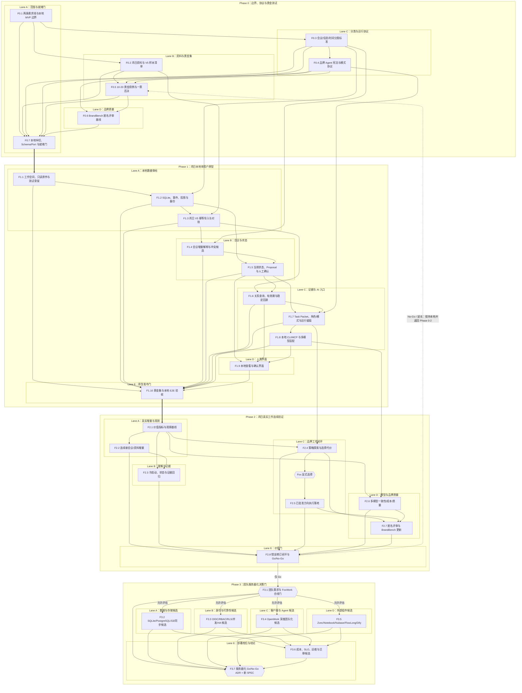
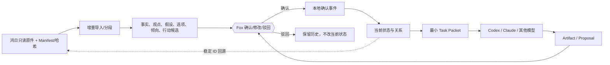
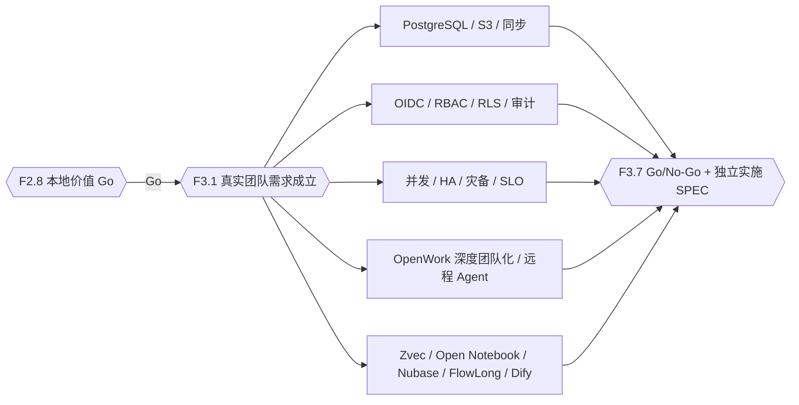

# 任务依赖图

## 读取说明

- 实线表示必须完成的依赖；标有“仅 Go”的边表示必须先通过人工价值门。
- Phase 0-2 是当前批准的产品验证主线；Phase 3 只有 F2.8=Go 才启动。
- Phase 3 的 PostgreSQL、S3、OIDC、HA、OpenWork 深度团队化和五组件均是决策候选，不表示已批准实施。
- Lane 只表示可并行的所有权面；实际启动仍以每个任务的依赖为准。
- 旧 42 项的逐项去向见[任务分解](task-breakdown.md#旧-42-项追踪表)。

## 全量依赖与并行 Lane



## 当前本地数据流



SQLite 保存单用户确认事件、当前投影和关系；FTS、摘要、模型输出和界面缓存是派生数据。Phase 1 不存在 PostgreSQL、S3、OIDC、Outbox、Dify 或其他服务器依赖。

## Phase 3 候选边界



从候选节点到 ADR 的连线表示“提供决策证据”，不是“自动采用”。F3.7=Go 后仍需新建实施 SPEC，旧 42 项不得直接恢复执行。

## 关键路径与并行窗口

主价值关键路径：

```text
F0.1 -> F0.3 -> F0.4 -> F0.5 -> F0.6 -> F0.7
-> F1.1 -> F1.2 -> F1.3 -> F1.4 -> F1.5 -> F1.6 -> F1.7 -> F1.8 -> F1.9 -> F1.10
-> F2.1 -> F2.2 -> F2.3 -> F2.8
```

品牌质量关键路径：`F0.4 -> F0.5 -> F0.6 -> F1.7 -> F1.10 -> F2.4 -> Fox 显式选择 -> F2.5 -> F2.7 -> F2.8`。

并行窗口：

- Phase 0：F0.2 与 F0.3/F0.4 并行；评分基线在黄金输入稳定后建立。
- Phase 1：F1.3 后可并行推进会议增量与只读证据关系；Task Packet 等状态/证据契约合并后推进。
- Phase 2：在同一确认状态版本上并行做冷启动/回查、策略探索和模型切换；执行任务必须等 Fox 选择。
- Phase 3：F3.1 放行后，数据、身份、客户端和外部组件四个候选面并行；F3.6 汇总，F3.7 决策。

## 阶段门与停止传播

| 门 | 通过条件 | 失败时 |
|:---|:---|:---|
| F0.7 实施就绪 | 边界、样本、分类、协议、黄金集和 BrandBench 均冻结 | 返回对应 Phase 0 任务，不写产品代码 |
| F1.10 原型门 | 八旅程可复核、七项一票否决为 0、本地恢复可用、Fox 可独立使用 | 保持 Phase 1，不进入真实工作主流程 |
| F2.8 价值门 | 连续真实工作、前后指标、匿名评审和错误修订支持 Go | 延长或 No-Go；不得用服务器建设补救价值缺口 |
| F3.1 团队需求门 | 真实多人场景、用户、共享动作与 FoxWork 合线结论明确 | 保持本地，不评估团队架构 |
| F3.7 服务器化门 | Fox 批准 ADR，收益、成本、风险、退出和迁移证据完整 | No-Go 或局部共享；不启动服务器实施 |

任一一票否决会使当前用例和阶段门失败，并阻断所有下游任务，直到完成 Fixture、修复和全量回归。
