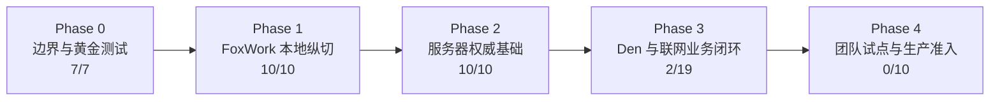
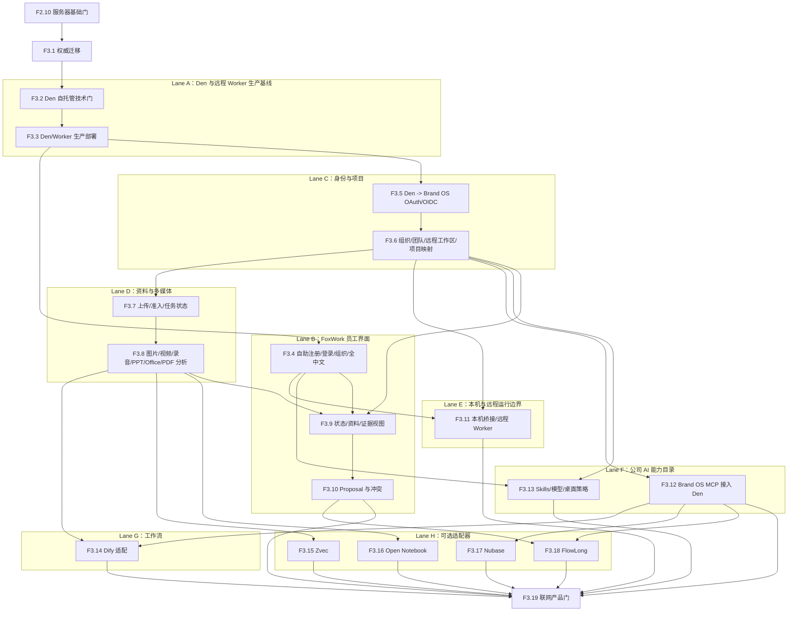
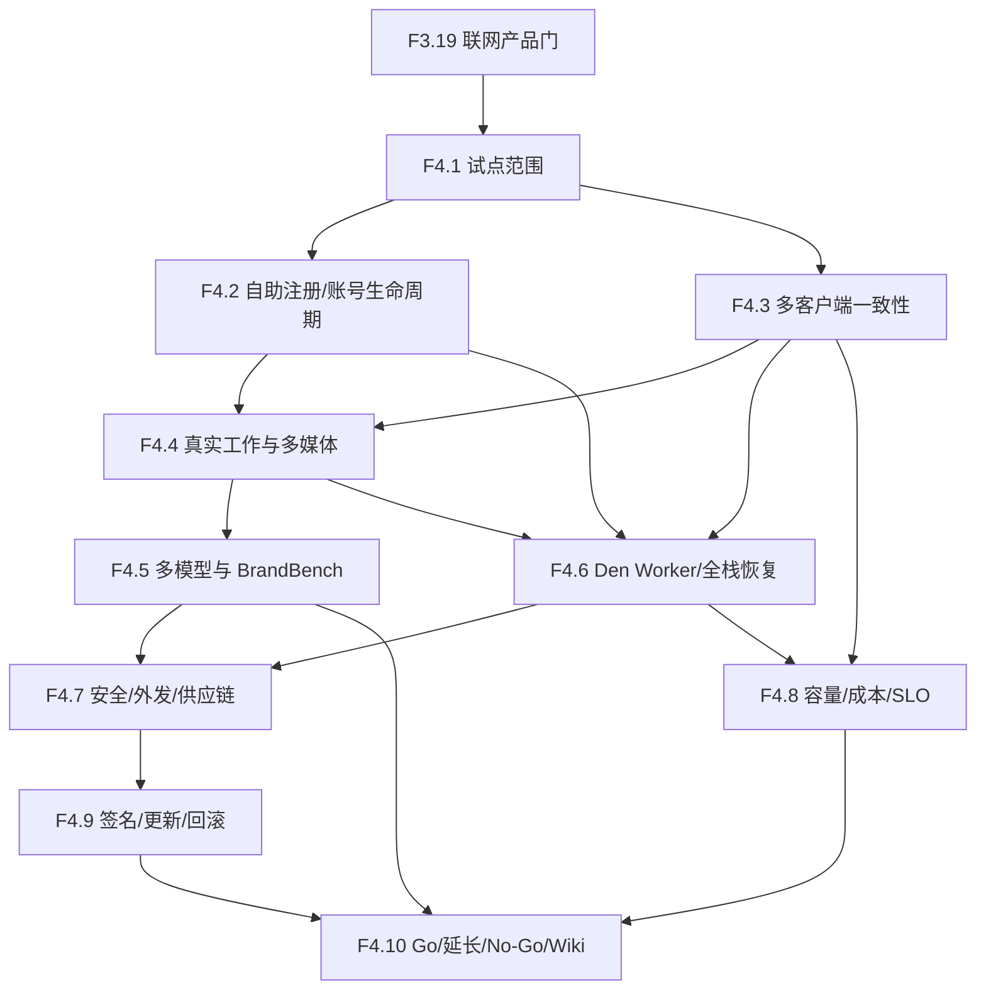
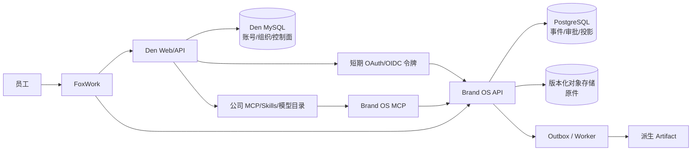

# 依赖图

> 当前活动方案：Den 统一控制面 + Brand Project OS 权威业务服务。任务定义以 [任务分解](task-breakdown.md) 为准。

## 总体顺序

Phase 0-2 和 F3.1 已完成。2026-07-24 的重定范围不重做这些成果，只替换旧的“双登录/不部署 Den”后续路径。

## Phase 0-2 已完成链路

```mermaid
flowchart LR
    F01["F0.1 边界"] --> F02["F0.2 样本"] --> F05["F0.5 黄金集"]
    F01 --> F03["F0.3 分类"] --> F04["F0.4 运行协议"] --> F05
    F05 --> F06["F0.6 BrandBench"] --> F07["F0.7 契约门"]

    F07 --> F11["F1.1 工作空间"] --> F12["F1.2 SQLite"] --> F13["F1.3 导入"]
    F13 --> F14["F1.4 会议增量"] --> F15["F1.5 Proposal"] --> F16["F1.6 证据"]
    F16 --> F17["F1.7 Task Packet"] --> F18["F1.8 CLI/MCP"] --> F19["F1.9 FoxWork"] --> F110["F1.10 本地门"]

    F110 --> F21["F2.1 服务器基线"]
    F21 --> F22["F2.2 PostgreSQL"]
    F21 --> F23["F2.3 S3"]
    F21 --> F24["F2.4 OIDC 协议"]
    F22 --> F25["F2.5 RBAC/RLS"]
    F24 --> F25
    F25 --> F26["F2.6 并发一致性"] --> F27["F2.7 审计/Outbox"]
    F23 --> F28["F2.8 HTTP API"]
    F27 --> F28 --> F29["F2.9 观测"] --> F210["F2.10 恢复门"]
```

## Phase 3

关键顺序：

1. Den Web/API/MySQL 与远程 Worker 生产基线先于员工登录改造；不能继续用测试 Mac 的 HTTP 和测试密钥做正式连接。
2. Den 到 Brand OS 的身份联邦先于项目、上传和 MCP；不能用共享服务令牌替代员工身份。
3. 原件上传和准入先于解析；解析结果先于状态/证据界面。
4. Brand OS MCP 和 Skills/共享模型在同一 Den 控制面下发，但业务 MCP 与模型密钥仍是不同权限面。
5. Den 远程工作区/Worker 是必验运行面；Zvec、Open Notebook、Nubase、FlowLong 可分别拒绝，NoOp 不阻断 F3.19。

## Phase 4

## 权威数据流

Den MySQL 与 Brand OS PostgreSQL/S3 没有跨库分布式事务。账号撤权通过令牌撤销、短期过期和可审计同步收敛；业务正式状态只在 Brand OS 事务中变化。

## 停止传播

- Den 不可用：禁止新登录和控制面变更；已有 Brand OS 短期会话按明确过期策略运行，不伪装成永久在线。
- Brand OS 不可用：FoxWork 可显示账号和 Den 控制面，但业务页只读降级或明确不可用，不写 Den MySQL 代替。
- 解析 Worker 不可用：原件仍可上传和回源，任务进入可重试状态，不生成无来源摘要。
- 可选组件不可用：回退 PostgreSQL FTS、内置解析或 NoOp，正式状态继续可读。
- 任一身份、权限、哈希、版本或中文发布门失败：停止进入 F3.19/F4.10。
