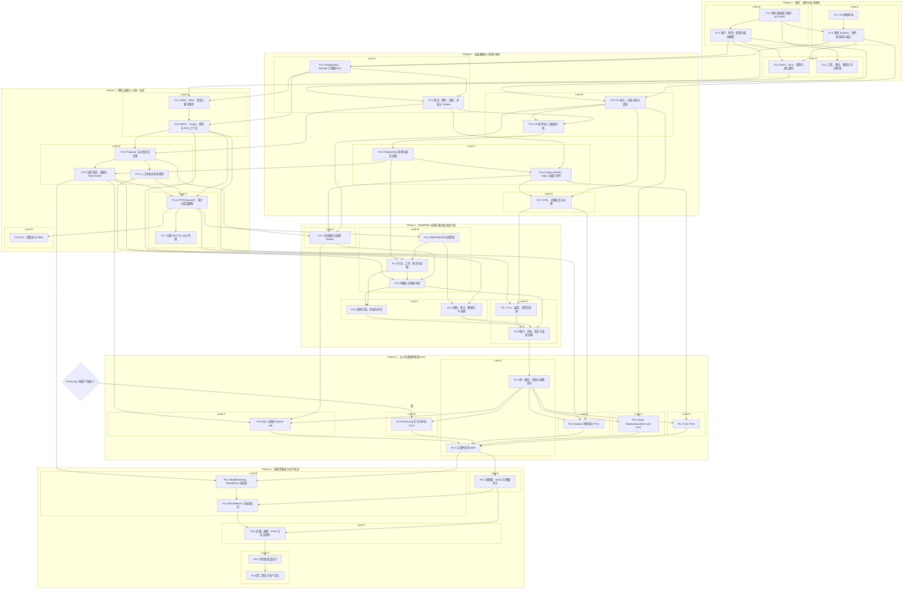
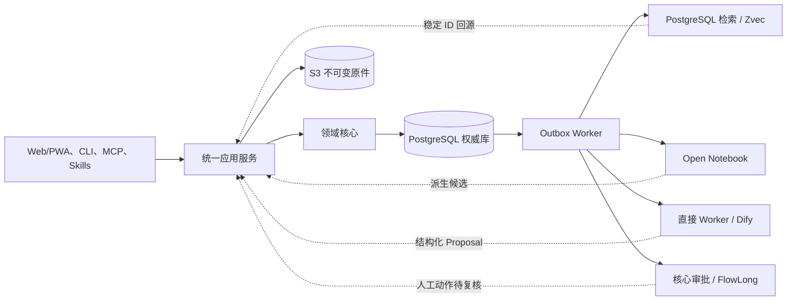

# 任务依赖图

## 读取说明

- 节点与[任务分解](task-breakdown.md)中的 42 个任务一一对应；箭头表示“前置任务完成后才可开始”。
- Lane 表示可独立派发的工作流，不代表同一 Lane 内任务可忽略显式依赖。
- `G_FLOW_LICENSE` 是外部书面许可门，不计入 42 个实施任务。
- Phase 1-4 共 29 项，形成“团队服务器试运行版”；Phase 5-6 在试运行版通过后执行。

## 全量依赖与并行 Lane

## 权威数据流与派生边界

只有 `D_PG` 接受正式业务状态写入；`D_S3` 只保存不可变内容原件。所有搜索、研究、AI 和流程数据均为可重建派生数据或协调状态。

## 关键路径

主关键路径是：`F1.2 -> F1.4 -> F2.1 -> F2.2 -> F2.4 -> F2.5 -> F3.5 -> F3.6 -> F4.2 -> F4.3 -> F4.4 -> F4.8 -> F5.1 -> F5.6 -> F5.7 -> F6.2 -> F6.3 -> F6.4 -> F6.5 -> F6.6`。

恢复能力的独立关键路径是：`F1.3/F1.4 -> F2.3 -> F2.7 -> F4.7 -> F4.8`。F2.7 未通过时，不允许以“功能可用”替代团队服务器发布门。

外部组件依赖、故障和退出细节见[团队服务器架构](team-server-architecture.md)、[数据一致性与可靠性计划](data-consistency-and-reliability.md)和[前端与 AI 访问规划](frontend-and-ai-access.md)。
