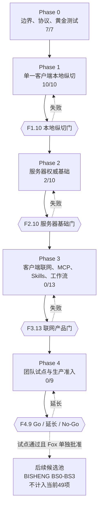
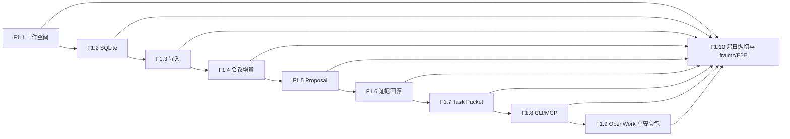
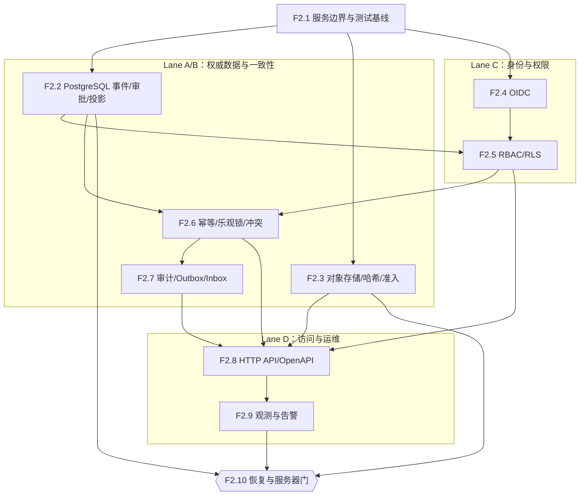
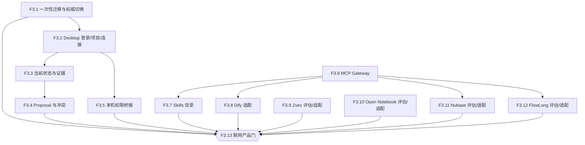
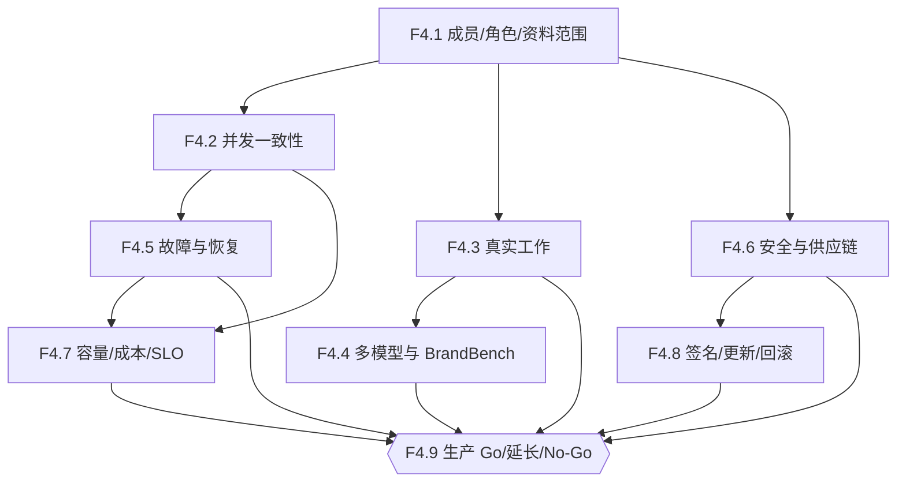
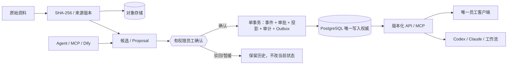

# 依赖图

## 总体顺序

任何阶段门未通过时，下游任务保持未开始。F1.10 和 F2.1-F2.2 已通过，当前从 F2.3 继续建设服务器权威基础。BISHENG 候选池不属于当前阶段依赖。

## Phase 1

F1.1-F1.10 已完成。F1.10 的真实鸿日桌面纵切、fraimz、黄金集和本地 E2E 已通过，Phase 1 阶段门关闭。

## Phase 2

## Phase 3

F3.9-F3.12 彼此独立，可并行评估。采用不是完成的唯一答案；有证据地拒绝并验证 NoOp 回退也算通过。

## Phase 4

## 权威数据流

## 停止传播

- F1.10 已通过；验收副本和来源 Manifest 保持只读，供后续迁移对账。
- F2.10 未通过恢复与一致性门：不得将本地 SQLite 降为缓存。
- F3.13 未通过：不得向团队分发或连接生产资料。
- 任一一票否决、跨项目越权、服务账号批准、双主或静默覆盖出现时，立即阻断当前阶段并补 Fixture、修复和全量回归。
- BISHENG 只有在 Phase 4 试点结论和 Fox 单独批准后才可进入正式任务图；在此之前不得连接公司生产资料。
