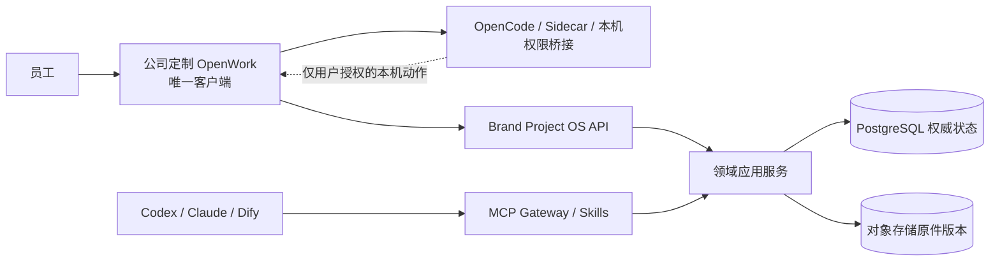
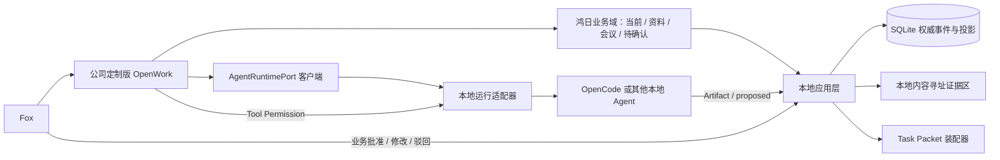

# 公司定制版 OpenWork 单一客户端集成计划

> 状态：客户端方向已批准；F1.9 离线与安全门已通过，当前执行 F1.10<br>
> 当前目标：把 OpenWork 改造成公司唯一员工客户端，先完成 Fox/鸿日本地纵向切片<br>
> 单一安装：OpenCode Runtime、Sidecar 和本机桥接随 OpenWork 安装包分发<br>
> 后续连接：公司服务器上的 Brand Project OS API、MCP Gateway 和 Skills<br>
> 决策依据：[ADR-0004](../adr/0004-openwork-single-client.md) 与 [ADR-0005](../adr/0005-single-client-server-authority.md)

## 规划结论

`different-ai/openwork` 的 Electron/React 桌面壳、会话流、工具权限、Skills/MCP、本地文件和 Agent 运行交互作为公司客户端基础。员工只安装公司定制版 OpenWork；Brand Project OS 作为业务能力层进入同一个软件，不另做第二个 Web 或桌面客户端。

当前产品核心是领域层、权威状态、内容寻址证据、分层 Task Packet、增量 Proposal 和 Fox 人工确认。OpenWork 是唯一员工客户端，但不能成为业务真相源；客户端运行数据被清理后，鸿日状态和证据仍必须完整。

本计划同时约束 Phase 1 本地纵切和 Phase 3 联网形态。Phase 1 不依赖服务器运行；F1.10 通过后按[任务分解](task-breakdown.md)建设服务器权威层，再把同一个客户端切到版本化 API。服务器不是第二个员工软件。

## 评估基线

当前固定基线：

- 稳定发布：[`v0.17.36@ddf3e482`](https://github.com/different-ai/openwork/tree/ddf3e482d2fdf3a374d0fbf4e23e01467a3014fc)（2026-07-20）。
- `OW-L0` 于 2026-07-22 有条件通过；完整记录见 [OpenWork OW-L0 技术选型记录](../phase1/openwork-ow-l0-evaluation.md)。
- `dev` 只用于观察近期结构，不作为 fork 或发布基线。

| 上游模块 | 当前能力 | 本地 MVP 的处理 |
|:---|:---|:---|
| `apps/app` | React/Vite UI、工作区、会话、连接和设置 | 仅复用壳与运行交互，新增独立鸿日业务域 |
| `apps/desktop` | Electron 桌面、本地文件和跨平台基础 | 候选本地壳；收紧 IPC、路径、导航和本地凭据 |
| `apps/server` | Workspace、Skills、MCP、会话和 OpenCode 连接 | 仅作 OpenWork 运行层；不能替代 Brand Project OS Service |
| `apps/orchestrator` | OpenCode/OpenWork 运行编排 | 当前不要求远程部署；封装在 `AgentRuntimePort` 后 |
| `packages/types` | 跨进程 Wire 类型 | 可复用运行 Wire 类型，不复制鸿日领域 Schema |
| `ee/**` | Den 等企业能力 | 不复制、不导入、不构建、不依赖 |

OpenWork 深度依赖 `@opencode-ai/sdk`，适合成为 OpenCode 控制面，但不能成为永久 Agent 抽象。Brand 业务页面、SQLite 领域层和 Task Packet 只认识本项目定义的 Schema。

## 当前目标与非目标

### 目标

1. Fox 在本地打开鸿日，立即看到当前阶段、批准决定、开放问题、最近会议和待确认变化。
2. 通过分层 Task Packet 启动一个本地 Agent，查看流式过程、工具请求、证据引用和 Artifact。
3. Agent 结果只能创建增量 Proposal；Fox 在独立业务确认界面批准、修改或驳回。
4. OpenCode Runtime、Sidecar 和本机能力桥接随一个安装包交付，不让员工管理第二个软件。
5. MCP、Skills 和业务 API 可以部署在公司服务器，并与本机权限桥接保持清晰边界。

### 非目标

- 不把 OpenWork 本地 SQLite、JSON、Session 或 Workspace 当作鸿日权威状态。
- 不把 OIDC、PostgreSQL 或远程 MCP 设为 Phase 1 本地纵切前置；它们在 Phase 2-3 分阶段实现。
- 不部署 OpenWork Den、`ee/**` 或第二个轻量 Web 后备。
- 不让 Tool Permission 承担事实、决定、约束、行动或时间的业务批准。
- 不在 fork 中复制 Fox 领域核心或让业务页面导入 `@opencode-ai/sdk`。
- 不另建 Brand Project OS Web/PWA 或第二个桌面客户端。

## 许可与来源边界

- 只使用根许可证声明中 `ee/**` 之外的 MIT 社区核心。
- `ee/**` 使用 FSL-1.1-MIT；当前切片不复制、不导入、不构建，也不以 Den 为运行依赖。
- 保留 MIT 许可证、版权声明和上游历史；生成第三方许可清单。
- OpenWork/Different AI 商标权不随代码许可证授予。本地原型使用清晰的内部标识，不宣称官方版本。
- 禁止连接未登记的上游生产云、遥测和更新端点；任何网络出口在切片中可见并可关闭。
- 若纵向切片通过，再固定实际稳定 tag/SHA 和内部 fork 策略；在此之前不把 `dev` 快照当成产品基线。

## 产品目标架构



OpenWork Server/OpenCode 只承载 Agent 运行。Brand Project OS Service 才承载业务 API、正式状态、审批和审计。MCP Gateway 调用应用服务，不直接写 PostgreSQL。

## Phase 1 本地目标架构



### 进程形态

优先顺序：

1. 进程内或 Electron 主进程调用本地应用库。
2. Unix Socket 或只监听 `127.0.0.1` 的短期令牌回环 API。
3. 受控本地子进程承载 OpenCode 适配器。
4. Phase 3 把同一客户端切到公司服务器 API、MCP 和 Skills；必须访问本机的能力仍由客户端受控执行。

远程 MCP 不是第二个客户端，也不是当前本地切片前置。服务器正式数据权威、团队身份和恢复要求由 ADR-0005 与 Phase 2 任务执行。

## 权威层与运行层

| 层 | 保存内容 | 允许写入 | 禁止事项 |
|:---|:---|:---|:---|
| Phase 1 本地领域应用层 | 来源、陈述、事件、当前投影、Proposal 和 Fox 人工动作 | 经幂等、版本和状态机校验的命令 | 绕过人工确认或用会话覆盖状态 |
| Phase 2+ 服务器应用层 | PostgreSQL 事件/审批/投影/审计和对象存储元数据 | 经身份、项目权限、幂等和版本校验的命令 | 客户端直连存储、长期双写、服务账号批准 |
| 内容寻址证据区 | 原始文件只读快照与版本 | 经哈希校验的准入和替代关系 | 同名覆盖、模型改写原件 |
| OpenWork UI | 交互状态、会话展示、运行筛选和本地设置 | 调用应用层与运行时端口 | 直写正式库或保存唯一业务事实 |
| OpenWork Server/Orchestrator（可选本地子进程） | 会话、流式事件、工具请求和运行配置 | 启动/取消 Agent、上报运行 | 成为服务器前置或业务批准面 |
| OpenCode/其他 Agent | 临时上下文、模型输出和工作目录变更 | 经 Tool Permission 执行；创建 Artifact/Proposal | 用工具允许冒充业务批准 |

## `AgentRuntimePort`

```text
list_runtimes(project_id)
create_run(task_packet_ref, runtime_policy, idempotency_key)
get_run(run_id)
stream_events(run_id, after_cursor?)
respond_tool_permission(request_id, decision, constraints)
cancel_run(run_id, reason)
list_artifacts(run_id)
publish_artifact(run_id, artifact_ref)
health(runtime_id)
```

OpenCode 是候选首个适配器。端口输出绑定 `run_id`、鸿日项目 ID、Task Packet 版本、品牌角色、工作模式、运行时/模型版本、事件游标、工具决策、数据出口、成本和结果哈希。

`publish_artifact` 只能登记 Artifact 或创建 `status=proposed` 的增量 Proposal。未来替换 Codex、Claude、OpenCode 或 OpenWork UI 时，SQLite、证据、会议分类、状态和人工确认契约不变。

## 产品信息架构

OpenWork 若被采用，首屏必须从会话中心改为鸿日工作台：

| 入口 | 核心内容 | 可复用 | 必须新建/隔离 |
|:---|:---|:---|:---|
| 当前 | 阶段、目标、批准决定/约束、开放项、最近变化 | 壳、路由、分栏 | 当前投影、状态版本、批准/工作层分区 |
| 资料 | 原件、版本、哈希、来源、索引和打开原文 | 文件浏览交互 | 内容寻址证据、回源定位和有效性 |
| 会议 | 模式、片段、分类、重复、冲突和增量变化 | 流式任务、详情面板 | 会议解释协议与稳定 ID |
| 待确认 | Proposal 差异、原话、影响和人工动作 | 可参考 permission 交互 | 独立业务确认 Schema、路由和审计 |
| 策略/执行 | 探索选择与执行规格 | 编辑器、Artifact 表面 | 显式工作模式与 Fox 切换闸门 |
| AI 工作 | Task Packet、会话、工具、Artifact 和采用结果 | 会话流、模型、Skills/MCP | 运行与鸿日任务的稳定关联 |
| 诊断 | SQLite、证据、索引、备份和金标 | 设置/连接壳 | 本地权威健康与验证结果 |

OpenWork `workspaceId/sessionId` 不能复用为鸿日 `project_id/task_id`。映射仅用于运行关联，可删除并重建。

## 两类确认

| 对比 | Fox 业务确认 | Tool Permission |
|:---|:---|:---|
| 目的 | 确认事实、决定、约束、行动、时间性质或状态变化 | 允许本次 Agent 读目录、执行命令、访问网络或调用工具 |
| 处理器 | 本地领域应用用例 | OpenWork/OpenCode 运行层 |
| 结果 | 追加人工动作与事件，更新当前投影 | 只改变本次运行范围 |
| 文案 | 批准、修改后批准、驳回、暂缓 | 本次允许、拒绝、限范围允许 |

业务待确认页不能调用 OpenWork 通用 permission API；Tool Permission 的“始终允许”也不能产生业务批准或模式切换。

## 本地安全

- Electron 启用 `contextIsolation`、Sandbox、窄化 preload 和 IPC Schema；渲染进程不获得任意 Node/文件系统能力。
- 本地数据库写入、证据准入、路径复核和人工确认都在主进程或受控本地应用层。
- 用户明确选择目录；复核符号链接、路径穿越、外部导航、下载、协议、MCP、Skill 和网络访问。
- 模型 API Key 进入系统安全存储或受控环境，不写入 OpenWork SQLite、项目目录、日志、导出包或崩溃报告。
- 回环 API 使用随机短期令牌并只绑定本机；OpenWork Server/Orchestrator 不监听局域网无认证端口。
- `.fox/runtime/`、OpenWork 数据和 Agent 会话均可删除；`.fox/state/project.db` 与证据区不由 OpenWork 迁移或清理逻辑管理。

## 本地验证工作包

这些 `OW-L` 编号只属于本计划，不修改现有任务分解。

| 工作包 | 内容 | 产出 | 继续门 |
|:---|:---|:---|:---|
| OW-L0 | 固定评估 SHA、许可证/`ee`/网络出口扫描、构建最小桌面 | 已完成：`v0.17.36@ddf3e482`，有条件通过 | 无 `ee`/Den/上游云硬依赖；真实资料接入前关闭默认外联 |
| OW-L1 | 接入只读鸿日当前状态、资料与证据打开 | “当前/资料”本地旅程 | 不写 OpenWork 状态作为业务真相 |
| OW-L2 | 接入 Task Packet、一个本地 Agent、流式事件与 Tool Permission | 一次可取消运行与 Artifact | 不要求远程 Server/Host；SDK 被端口隔离 |
| OW-L3 | 接入会议增量 Proposal 和独立 Fox 确认 | 会议 -> Proposal -> 人工确认纵向切片 | Tool Permission 与业务确认完全分离 |
| OW-L4 | 验证单一安装、启动、可靠性、运行时健康和公司分发边界 | 内部发布结论 | 员工不需第二个客户端，故障可诊断，维护成本可接受 |

### Gate 0：技术可用

OW-L0 已有条件通过，F1.9 已完成后续离线、安全、品牌和单安装包收口。当前 fork 默认关闭 PostHog、Den/Cloud、模型目录和上游更新，已更换内部工作名/AppID/协议/数据目录并收紧 Electron 网络权限。真实鸿日资料从 F1.10 起仍按授权清单只读接入。

### Gate 1：业务只读切片

OW-L1 通过。Fox 能从启动进入鸿日当前状态并打开证据；删除 OpenWork 数据后业务状态仍完整。

### Gate 2：Agent 与增量确认

OW-L2、OW-L3 通过。Agent 读取同一 Task Packet，结果只生成 Proposal，Fox 在独立界面确认；会议分类和日期性质通过金标。

### Gate 3：内部发布决定

OpenWork 已固定为员工客户端基础。OW-L4 与 Fox 真实体验未通过时阻断内部发布并修复，不切换到第二套员工客户端。

## 采用指标

- 从启动到显示鸿日当前状态的步骤和耗时。
- 完成会议 -> Proposal -> Fox 确认纵向旅程所需公司补丁量。
- 上游核心修改比例、冲突热点和月度同步预估。
- 本地进程数量、故障面、内存占用和无网络启动能力。
- Task Packet、证据、Tool Permission 和业务确认的边界清晰度。
- 与当前人工工作方式相比，Fox 完成真实工作的时间、重复解释次数和纠错负担。
- 停用 OpenWork 后正式数据零迁移的可验证性。

## 当前验收

1. 不启动团队服务器、PostgreSQL、S3、OIDC 或 Docker，也能完成本地纵向旅程。
2. OpenWork/OpenCode 会话或本地数据被删除后，鸿日状态、证据、Proposal 和人工批准完整。
3. 一个未读旧聊天的 Agent 通过 Task Packet 获得正确当前状态并打开证据。
4. `VIEW/PREFERENCE/OPTION/TENDENCY/TARGET_DATE` 不因会话或模型输出升级为正式决定/约束/截止。
5. Tool Permission 无法调用业务批准处理器；AI/服务账号没有人工确认控件。
6. OpenWork 运行数据被清理后，CLI/MCP 仍能校验核心状态、证据和 Proposal；这些入口用于恢复和 Agent 辅助，不作为第二个员工客户端。
7. 构建与运行不包含 `ee/**`、Den、上游生产云、未登记遥测或不可控更新。
8. Fox 明确认为客户端降低了真实工作摩擦，而不是只增加功能数量。

## Phase 2-4 联网与团队工作

F1.10 通过后，按活动 SPEC 实施以下内容：

- 公司独立私有 fork、稳定/集成/发布分支和固定 tag/SHA。
- 自有品牌、AppID、深链、代码签名、公证、私有更新、灰度和回滚。
- OIDC PKCE、系统钥匙串、团队角色和设备撤权；不建设第二个 Web 后备。
- OpenWork Server/Orchestrator 的员工终端或托管 Agent Worker 形态。
- 生成式服务端 SDK、兼容窗口、远程 MCP 和生产运行中心。
- macOS/Windows/Linux E2E、供应链、SBOM、上游同步和团队试运行。

实施顺序和阶段门见[任务分解](task-breakdown.md)与[里程碑](milestones.md)。它们已经批准，但不能回流为 F1.9/F1.10 的运行前置。

## 停止条件

- F1.9/F1.10 被要求先完成服务器化、OIDC、团队账户或远程 Host。
- 构建或运行依赖 `ee/**`、OpenWork Den、上游生产云或不可关闭遥测。
- OpenWork/Agent 状态出现正式业务直写路径。
- Tool Permission 与 Fox 业务确认共用 Schema、路由或最终化处理器。
- 业务页面必须深度依赖 `@opencode-ai/sdk`，无法以端口隔离。
- 上游核心补丁不可审计，或本地切片明显慢于薄客户端方案。
- 删除 OpenWork 数据会丢失鸿日正式状态、证据或人工批准。
