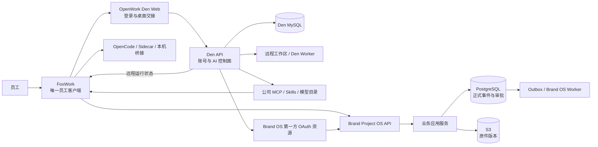

# FoxWork 与 OpenWork Den 深度集成 SPEC

> 状态：活动 SPEC，2026-07-24 第三次 rescope 后生效  
> 固定上游：OpenWork `v0.17.36@ddf3e482d2fdf3a374d0fbf4e23e01467a3014fc`  
> FoxWork 验收分支：`brand-os/f3.2-connected-client@e7ad696f5389a94f0ba5e5d0fba3d6763cfc4f60`  
> 当前任务：F3.3 Den 与远程 Worker 生产部署基线
> 决策依据：[ADR-0008](../adr/0008-den-self-registration-and-remote-workspaces.md)、[ADR-0007](../adr/0007-adopt-openwork-den-control-plane.md)、[ADR-0006](../adr/0006-foxwork-name-and-chinese-ui.md)、[ADR-0005](../adr/0005-single-client-server-authority.md)

## 目标

员工只安装 FoxWork，只维护一套公司账号。自助注册或登录后，员工进入唯一公司组织和获授权远程工作区，自动获得按成员或团队授权的模型、MCP、Skills、桌面策略和品牌项目工作区。员工不需要理解 API Key、MCP 配置、模型供应商或服务器地址，也不会再遇到第二套 Brand OS 登录或旧“团队连接”。

OpenWork Den 负责账号和 AI 能力控制面；Brand Project OS Service 负责品牌项目业务。两者必须一起提供完整产品体验，但不能合并成同一个数据库或共享一种高权限令牌。

## 已验证基线

F3.2 已在测试 Mac 的隔离环境完成真实验证，证据见 [OpenWork Den 自托管技术门](../phase3/openwork-den-self-host-gate.md)。通过项包括：

- Den API、Den Web 和独立 MySQL 可从固定源码构建并运行；
- 第一个用户创建唯一公司组织，后续员工加入同一组织，第二组织创建被拒绝；
- 员工可读取并通过 Den Agent MCP 搜索、执行公司 Skill；
- 员工可获得授权的共享 Provider、模型和托管凭据，撤权后列表消失且连接返回 403；
- 员工可读取并调用公司 MCP，撤权后 REST、工具目录和 Agent MCP 同时失效；
- FoxWork 桌面交接、登录和退出链路已验证；
- 管理员敏感操作要求新鲜登录，过期返回 `fresh_auth_required`。

本次验证基于上游已提交源码。`ddf3e482..HEAD` 对 `ee/`、Helm 和自托管文档没有依赖未提交业务补丁，因此不是用临时伪实现证明可用。

## 许可边界

OpenWork 根目录及 `ee/**` 之外使用 MIT；Den 所在的 `ee/**` 使用 `FSL-1.1-MIT`。它是源码可见企业版，不应写成 OSI 开源组件。

当前内部方案允许：

- 公司内部使用、复制和修改 Den；
- 给本公司员工分发修改后的 FoxWork；
- 为内部组织配置 MCP、Skills、模型和桌面策略。

当前方案禁止：

- 把 FoxWork/Den 作为与 OpenWork 相同或近似的对外竞争服务；
- 删除许可证、版权或第三方归属；
- 把 `ee/**` 误标为 MIT 自研代码；
- 使用 OpenWork 商标暗示官方发行或合作关系。

每个版本在其公开发布两周年后按许可证转为 MIT。正式发布前仍需生成第三方许可与 SBOM 清单；本文是工程采用边界，不替代法律意见。

## 产品分工

| 能力 | Den | Brand Project OS Service | FoxWork |
|:---|:---:|:---:|:---:|
| 注册、登录、会话、登出 | 负责 | 验证 Den 派发的第一方资源令牌 | 展示一次登录流程 |
| 公司组织、成员、团队 | 负责 | 保存稳定映射与业务授权审计 | 展示公司和成员可见状态 |
| 远程工作区与 Worker | 负责生命周期、分配和运行策略 | 只登记运行引用和业务产物 | 展示连接、运行和诊断状态 |
| MCP、Skills、共享模型、桌面策略 | 负责目录、分发和撤权 | 提供 Brand OS MCP 业务能力 | 登录后自动同步并使用 |
| 项目工作区与项目角色 | 提供入口和成员上下文 | 负责项目、角色、保密级别和 RLS | 展示获授权项目 |
| 图片、视频、录音、PPT、Office、PDF | 不保存原件 | 负责上传、准入、处理、证据和 Proposal | 拖入、查看进度、回源和处理结果 |
| 正式状态与人工确认 | 无权 | PostgreSQL 事件、审批和投影是唯一权威 | 有权限员工在独立页面明确操作 |
| 本机文件、终端和桌面 | 不可远程绕过 | 只下发任务和最小权限请求 | 主进程按用户授权执行 |
| Agent Session 与 Tool Permission | 负责运行控制 | 只登记运行引用和业务产物 | 展示并让员工批准本次工具动作 |

Den MySQL、Den Worker 文件系统、OpenWork Session、OpenCode Session、本机 SQLite/JSON 和模型摘要都是运行态或控制面数据。它们不能保存项目正式事实、负责人、截止时间、审批或原件唯一副本。

## 目标拓扑



FoxWork 只配置 Den Web 的公司入口。Den API、Brand OS API、MySQL、PostgreSQL 和对象存储地址由服务器端发现、反向代理或受控配置决定，不要求员工填写。

## 单账号与令牌链路

员工只经历一次 Den 登录，但 Den 和 Brand OS 必须使用不同用途的令牌：

1. FoxWork 打开公司 Den Web，完成注册或登录。
2. Den 完成桌面交接，FoxWork 得到 Den 客户端会话。
3. FoxWork 通过 Authorization Code + PKCE 请求 Brand OS 第一方资源授权。
4. Den 派发面向 Brand OS audience 的短期令牌，包含稳定 `issuer`、`subject`、组织和必要角色声明。
5. Brand OS 校验可信 Den 发行者、唯一公司组织和有效成员关系后，按 `(issuer, subject)` 查找或首次建立内部身份映射，再按项目成员关系和保密级别授权；邮箱不参与自动合并或重新绑定。
6. Den 账号、组织或成员撤权后，Den 能力和 Brand OS 令牌必须联动失效。

禁止直接把 Den Session Token 当作 Brand OS API Token，也禁止用共享 MCP 服务令牌冒充员工。FoxWork 可以在系统钥匙串保存两类密文令牌，但员工看不到第二套账号、密码或登录页。

F3.5 必须在 Den 中增加 Brand OS 第一方 OAuth 资源受众、组织声明、PKCE 和撤权联动。当前 Den 已有 OAuth Provider、OIDC Discovery 和 `openid/profile/email` 基础能力，但尚未证明 Brand OS 专用 audience 与组织声明，不能把 F3.2 写成身份联邦已完成。

## 公司组织与项目工作区

- Den 只允许一个公司组织，组织所有者完成初始引导。
- 普通员工以公司 Den 入口自助注册为默认路径，不能自行创建第二组织；管理员邀请只能作为辅助方式，不能成为登录 FoxWork 的前置条件。
- Den 远程工作区按成员/团队分配，必须与 Brand OS 项目授权显式映射，不能因创建运行空间自动获得项目权限。
- Den 团队用于分发模型、MCP、Skills 和桌面策略。
- Brand OS 项目用于控制品牌资料、业务动作、保密级别和人工确认。
- 一个 Den 组织可以映射多个 Brand OS 项目；团队可以映射项目成员组，但映射必须可审计，不能把组织管理员自动变成所有项目审批人。
- 首次登录只显示员工有权访问的项目；无项目权限时给出自然中文空状态，不显示数据库、OIDC 或 Scope 等内部术语。

## 多媒体资料链路

员工在 FoxWork 拖入文件后，文件不进入 Den Worker 作为正式资料：

```text
FoxWork 选择或拖入文件
  -> Brand OS 分片上传与断点续传
  -> 隔离区检查大小、MIME、SHA-256 和安全策略
  -> S3 VersionId + PostgreSQL 元数据转为 ACTIVE
  -> Brand OS Outbox/Worker 解析图片、视频、录音、PPT、Office、PDF
  -> 生成带页码、幻灯片号、时间码和原件版本的 Artifact/Proposal
  -> 员工在 FoxWork 查看、修改、批准或驳回
```

转写、OCR、摘要、Notebook、向量索引和模型输出都是可重建派生数据。它们不能替代原件，也不能未经员工确认更新正式状态。

## MCP、Skills 与模型

- Den 是公司能力目录。管理员按成员或团队分发 MCP、Skill、Provider、模型和桌面策略。
- Brand OS MCP 由 Brand OS Service 提供，并注册到 Den。它只暴露读取、回源、Task Packet 和创建 Proposal 等白名单能力。
- MCP 的项目 Scope 在服务端固定；输入 Schema 拒绝额外字段；撤权必须同时影响 REST、目录搜索和实际执行。
- Skill 只保存版本化工作法、工具顺序、输入输出和失败处理，不保存实时项目事实、原文、员工令牌或模型密钥。
- 模型 Provider 与共享密钥由 Den 管理，FoxWork 登录后自动取得可用模型。Brand OS 不读取或转存模型 API Key。
- Tool Permission 只授权本次文件、终端、网络或工具动作；业务批准使用不同路由、Schema、文案和审计。

## Worker 采用边界

上游当前 provisioner 只证明 `stub`、Render 和 Daytona，真实公司自托管远程 Worker 尚未通过技术门。远程工作区已经是最终产品要求，因此 F3.3 必须在测试环境选定或实现可替换的公司 Worker 路径并完成真实运行，不能继续把它写成可选项：

- 员工电脑上的本机任务由 FoxWork 本地 OpenCode/Sidecar 执行；
- Den 管理远程工作区/Worker，用于无需访问员工电脑的远程 Agent 运行；
- 公司服务器上的资料解析由 Brand OS Outbox/Worker 执行；
- Den Worker 和 Brand OS Worker 分角色、分凭据、分临时空间；
- 无论采用自有 provisioner、Daytona 或其他实现，都不能直连正式表、复用数据库超级用户或绕过 FoxWork 访问员工电脑。

## 全量中文与产品合并

F3.4 不是简单翻译：

- 产品名、菜单、按钮、注册登录、空状态、错误、安装、升级、深链、系统通知、Den 员工页面和后台管理员网页全部使用自然简体中文；
- 不提供语言切换，不允许缺失键回退英文、上游品牌或内部变量名；
- 删除旧“团队连接”账号页和第二套 Brand OS 登录入口；
- 保留一个“公司工作区”入口，显示登录状态、组织、项目、公司能力和同步问题；
- 管理员能力与普通员工能力分开，员工不需要理解 Den、OIDC、MCP Token 或 Provider 等实现词；
- 产物扫描覆盖源码字符串、打包资源、运行时错误和上游默认链接。

## 网络与内部部署

FoxWork 必须支持公司内网或受控覆盖网络中的 `http://` Den 入口，不能用客户端硬编码的 HTTPS 检查阻断连接。允许 HTTP 需要管理员显式配置并满足：入口不暴露公网、网络边界受公司控制、令牌不写 URL/日志、桌面交接限制来源和回调、风险在部署记录中可见。

公网或跨不可信网络部署必须使用 HTTPS。无论使用 HTTP 还是 HTTPS，都不能关闭 OAuth state/nonce/PKCE、来源校验、短期令牌、撤权和系统钥匙串保护。

## 分阶段实施

| 任务 | 交付 | 必须证明 |
|:---|:---|:---|
| F3.3 | Den Web/API/MySQL/远程 Worker 生产部署基线 | 可重复部署、迁移、密钥、健康、备份、升级和回滚；只暴露必要入口 |
| F3.4 | FoxWork 自助注册、登录、组织、桌面交接和完整中文化 | 一次登录、第二组织拒绝、员工端/管理员后台无英文回退、失败可恢复 |
| F3.5 | Den -> Brand OS 第一方 OAuth/OIDC | 独立 audience、组织声明、PKCE、短期令牌和撤权联动 |
| F3.6 | 组织/团队/远程工作区 -> 项目映射 | 首次登录、运行空间、项目列表、成员变化、跨项目拒绝和审计 |
| F3.7-F3.10 | 资料、解析、状态、证据和人工确认 | 多媒体版本链、处理进度、来源定位、并发冲突和人审闭环 |
| F3.11 | 本机桥接与远程 Worker | 本机动作只经 FoxWork 授权，Worker 生命周期和隔离可控 |
| F3.12-F3.13 | MCP、Skills、模型和策略目录 | 自动下发、最小权限、撤权、版本与回滚 |
| F3.14-F3.18 | Dify 与可选适配器 | 外发、许可、故障和 NoOp 退出 |
| F3.19 | 联网产品门 | 自助注册、单账号、全中文管理面、远程工作区、多媒体、AI 能力和核心业务端到端通过 |
| F4.1-F4.10 | 小团队试点与生产准入 | 真实成员、恢复、容量、安全、签名更新和 Go/No-Go |

## 发布与上游同步

- 生产构建固定上游 tag/SHA 和公司补丁提交，不从 `dev` 或 `latest` 临时构建。
- `ee/**` 补丁保留在相应目录并按 FSL 管理；社区补丁与企业补丁的许可归属分开记录。
- FoxWork 使用公司控制的产品名、Bundle ID、深链、数据目录、图标、签名、更新清单和发布通道。
- 默认关闭或替换上游遥测、公共云、模型目录、更新源和未登记外联；没有公司配置时不得回退上游服务。
- 每次上游同步运行 App、Desktop、Server、Orchestrator 类型检查与测试，并复测 Den 自助注册、登录、组织、远程工作区、MCP、Skills、模型、员工端/管理员后台中文和打包产物。
- 正式分发需保留许可证、版权、SBOM 和安全扫描结果。

## 验收标准

1. 新员工安装 FoxWork 后，可以注册或登录公司账号，不需要单独创建 Brand OS 账号。
2. 登录后自动进入唯一公司组织，并只看到获授权远程工作区、项目、模型、MCP 和 Skills；不能创建第二组织。
3. 账号、团队或项目撤权后，FoxWork、Den REST、Agent MCP、模型和 Brand OS API 在规定时间内一致拒绝。
4. 员工拖入图片、视频、录音、PPT、Office 或 PDF，能看到上传、检查、处理、失败和重试状态，并从分析结论回到原件位置。
5. AI、MCP、Skill、工作流、Agent 或服务账号只能读取或创建 Proposal，不能批准正式状态。
6. 清除 OpenWork/Den Session、模型会话、索引和派生数据后，PostgreSQL/S3 中的正式状态和原件仍完整。
7. Den 不可用时停止新登录和能力变更；已有短期 Brand OS 会话按明确过期策略运行，不能伪装永久在线。
8. FoxWork、Den 员工页面和 Den 后台管理员网页没有英文回退、上游品牌、内部键名或旧“团队连接”。
9. Den 远程工作区/Worker 在测试环境真实运行；Dify、Zvec、Open Notebook、Nubase 或 FlowLong 可关闭而不损坏核心业务权威。
10. 未通过 F3.19 前不接入真实鸿喜达资料、不向全员宣称生产可用，也不同步阶段 Wiki。

## 明确失败

- 登录 Den 后还要输入第二套账号、密码或登录码。
- 把 Den Session Token 直接复用为 Brand OS 高权限令牌。
- 把 Den 组织管理员自动当作品牌项目批准人。
- 把 Den MySQL、Worker 文件系统、OpenWork Session 或模型记忆当作业务权威。
- 用共享 MCP Token 冒充发起操作的员工。
- 公司 MCP 撤权后仍可通过搜索、缓存或旧会话执行。
- 多媒体分析结果没有原件版本、页码/时间码或来源定位。
- 为接入 OpenWork 而让 Brand OS 领域核心依赖 `ee/**`、Electron 或 OpenCode SDK。
- 在内网允许 HTTP 时一并关闭 OAuth/会话安全控制。
