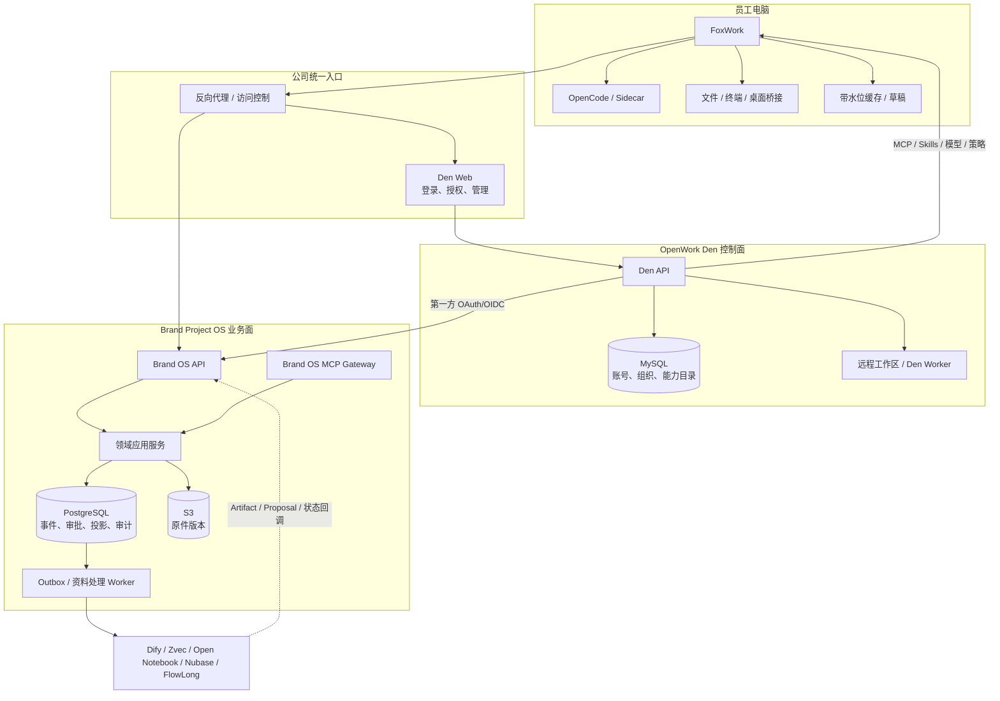

# 团队服务器架构 SPEC

> 当前档位：Fox 已批准“小团队托管部署”  
> 当前任务：F3.3 Den 与远程 Worker 生产部署基线
> 生效决策：ADR-0007、ADR-0005  
> 不启动条件：未经用户明确要求，本 SPEC 更新不启动 Web、数据库、Docker 或桌面应用

## 当前结论

公司服务器不是“只部署一个 MCP”。它包含账号与 AI 控制面、品牌项目业务服务、两套职责分离的数据存储、对象存储、后台任务、监控和备份。员工只访问一个公司入口并使用 FoxWork，不直接接触内部服务地址。

OpenWork Den 和 Brand OS 都是正式运行依赖，但权威范围不同：Den MySQL 对账号与能力配置负责；PostgreSQL/S3 对品牌项目业务负责。任一数据库都不能替代另一方，二者也不能通过双写形成共同业务真相。

## 目标拓扑

对 FoxWork 只暴露一个公司入口。反向代理在同一受控来源下提供 Den Web、桌面交接、OAuth 回调和 Brand OS API 路由；Den API、Brand OS 内部服务、MySQL、PostgreSQL、S3 管理端、Worker 和可选组件不单独暴露给员工电脑。

## 服务与数据职责

| 服务 | 正式保存 | 故障时行为 | 恢复重点 |
|:---|:---|:---|:---|
| Den Web/API/Worker | 自助注册登录、组织/团队、远程工作区、MCP、Skills、共享模型和策略 | 停止新登录、远程任务和能力变更；已有 Brand OS 短期会话按过期策略运行 | MySQL、密钥、OAuth 客户端、能力配置和 Worker 生命周期 |
| Brand OS API | 无状态业务入口 | 不返回伪成功；读写按依赖状态降级 | 镜像、配置、契约和路由 |
| PostgreSQL | 项目、映射、权限、事件、审批、投影、审计、Outbox | 核心写入停止，API 失去就绪 | PITR、事件链、全表摘要和投影重建 |
| S3 | 隔离对象、ACTIVE 原件、导出和备份对象 | 新上传暂停；已有元数据可查但缺失对象必须显错 | VersionId、SHA-256、版本桶和独立备份域 |
| Brand OS Worker | 资料解析、转写、OCR、派生和通知 | 积压后追平；正式事务不等待 | 租约、Inbox、死信、幂等和处理器版本 |
| FoxWork 本地 Runtime | Agent 会话、本机工具和临时产物 | AI 工作暂停；业务状态和证据仍可读 | 无需纳入正式业务备份 |
| 可选组件 | 工作流或派生数据 | 回退基线/NoOp，不影响核心 API | 配置、引用映射；派生数据可重建 |

## 网络与内部 HTTP

公司内网或受控覆盖网络可以使用 HTTP，但必须由管理员显式开启，且入口不能暴露公网。此模式至少满足：

- 只允许登记的私网网段、VPN 或 Tailscale 访问；
- FoxWork 校验公司入口允许列表和桌面交接来源；
- OAuth 保留 Authorization Code、S256 PKCE、state、nonce、短期令牌和撤权；
- Token 不进入 URL、日志、浏览器历史或 Renderer 存储；
- 管理入口使用更严格的网段、MFA 或新鲜登录；
- 部署清单明确记录“内网 HTTP”风险与适用边界。

公网、互联网中转或不可信 Wi-Fi 场景必须使用 HTTPS。客户端不得把“支持内网 HTTP”实现成全局忽略证书、允许任意来源或关闭身份校验。

## 信任区

- MySQL、PostgreSQL、S3 管理端、队列、监控和可选组件只在服务器私网可达。
- Den API 和 Brand OS API 使用独立数据库账号、密钥和备份凭据，不共享超级用户。
- FoxWork 本机桥接只建立出站连接，不监听局域网无认证端口。
- Brand OS MCP 使用短期资源令牌和项目 Scope；Den 目录授权不能替代实际调用鉴权。
- Dify、Open Notebook、Nubase、FlowLong 和 Worker 使用独立服务身份；任何服务身份都没有人工批准权限。
- 外部模型、Embedding、转录、网页抓取、插件和 HTTP 节点按数据外发处理，即使 Dify 本身部署在公司服务器。

## Den 部署基线（F3.3）

F3.3 必须产出：

1. 固定镜像摘要或固定源码 SHA 的 Den Web/API 构建；
2. 独立 MySQL 数据库、最小运行角色、迁移锁和 Schema 版本；
3. OAuth、会话、凭据加密、管理员引导、单组织自助注册和第二组织拒绝配置的秘密清单；
4. 公司统一入口、内网 HTTP/HTTPS 模式、回调和桌面交接配置；
5. `/livez`、`/readyz` 或等价探针，区分进程存活与依赖就绪；
6. MySQL 一致备份、空库恢复、账号/组织/能力配置核对；
7. 升级前备份、expand/contract 兼容策略和应用回滚；
8. 日志脱敏、低基数指标、告警和操作手册；
9. Den 许可证、版权、镜像来源和 SBOM 记录；
10. 远程工作区/Worker 的固定实现、隔离运行、创建/分配/停止/恢复/撤权/清理、健康和回滚证据。

F3.2 的单机临时服务只能证明技术可用，不能替代上述生产基线。

## Brand OS 部署基线

F2.1-F2.10 已完成配置、PostgreSQL/S3、身份、授权、一致性、API、审计、观测和恢复契约。生产化继续遵守：

- 无状态 API 镜像固定版本和摘要，禁用 `latest`；
- PostgreSQL 使用托管服务、连续 WAL、独立备份域和恢复演练；
- S3 开启版本控制、服务端加密和删除保护；
- 数据库迁移使用 advisory lock 与 expand-migrate-contract；
- Worker 与 API 分角色、分凭据，消费者不能写正式表；
- 发布前在隔离恢复库运行迁移、事件重建、权限和黄金测试；
- 服务器接受首个新正式写入后，不允许把 Phase 1 SQLite 升回权威。

## Worker 拓扑

### 员工终端 Runtime

- 随 FoxWork 安装，处理需要本机文件、终端或桌面交互的任务；
- 只访问员工明确选择且公司策略允许的路径；
- 任务授权绑定 `run_id`、项目、工具、路径、数据级别和过期时间；
- 客户端退出或设备离线时暂停，不把失联任务显示为运行中。

### Brand OS Worker

- 在公司服务器处理上传准入、OCR、音视频转写、PPT/Office/PDF 解析、索引和工作流；
- 使用 Outbox 租约、心跳、取消令牌、Inbox 去重和死信；
- 临时工作区按任务隔离并清理，持久产物先进入对象准入；
- 不访问员工个人目录、不持有数据库所有者或 S3 管理凭据。

### Den 远程 Worker

- 由 Den 管理远程工作区和 Agent 运行，不负责资料准入或正式状态写入；
- 当前上游只有 `stub`、Render 和 Daytona provisioner，真实公司部署实现尚未证明；
- F3.3 必须在测试环境选定或实现可替换路径，完成真实创建、连接、停止、恢复、撤权和清理；
- 临时文件、Session 和模型摘要可删除，业务产物只能经 Brand OS API 形成 Artifact 或 Proposal；
- 不挂载员工电脑，不持有 PostgreSQL/S3 管理凭据，不与 Brand OS Worker 混用身份。

## 小团队部署档位

| 部分 | 首个生产形态 | 备注 |
|:---|:---|:---|
| 公司入口 | 1 个受控反向代理入口 | 内网 HTTP 可显式开启；公网必须 HTTPS |
| Den | 1 组 Den Web/API + 受管 MySQL + 可替换远程 Worker | 先保证备份恢复、运行隔离与可升级，不虚构 HA |
| Brand OS | 1 个可替换 API 节点 + 独立 Worker | 允许维护窗口，镜像可回滚 |
| 正式业务库 | 托管 PostgreSQL | 目标 RPO <= 5 分钟 |
| 原件 | 版本化 S3 兼容对象存储 | 使用独立备份域核对 VersionId |
| 可选组件 | 按任务逐项部署 | 核心旅程不依赖 |
| 客户端 | 签名 FoxWork 稳定通道 | F4.9 前只作受控验收 |

首发不引入 Kubernetes，也不把“两台自行复制的数据库”写成高可用。成员、负载或 SLO 接近上限后，再评估双应用节点、多可用区数据库和 Worker 池。

## 服务目标

Fox 已批准以下内部目标，仍需 F4.8 实测：

| 指标 | 目标 |
|:---|:---|
| 核心 API 月可用性 | 不低于 99.5% |
| 读取接口 P95 | 不高于 500 ms |
| 非 AI 写入 P95 | 不高于 1 s |
| Outbox/检索追平 P95 | 不高于 5 s |
| PostgreSQL RPO | 不高于 5 分钟 |
| 核心服务 RTO | 不高于 60 分钟 |

Den MySQL 的 RPO/RTO 不能自动套用上表。F3.3 先测出备份恢复能力，F4.8 再由 Fox 批准最终目标。AI 生成时延按模型和运行时单独统计，不计入核心 API SLO。

## 健康、监控与告警

- `live` 只证明进程可响应；`ready` 检查各服务的必需依赖。
- Den 的 MySQL 或关键配置失败时 Den 失去就绪；Brand OS 的 PostgreSQL/S3/身份依赖失败时按功能失去就绪。
- Den Worker 故障应使远程运行面明确失去就绪，但不得损坏 Brand OS 业务权威；Dify、Zvec、Open Notebook、Nubase、FlowLong 故障不得让 Brand OS 核心 API 整体失去就绪。
- 指标覆盖登录失败、令牌撤权、MCP 拒绝、API 延迟、5xx、冲突、Outbox 水位、处理队列、备份年龄、WAL、磁盘、对象对账和客户端版本。
- 日志使用 `request_id`、`correlation_id`、`run_id`；不记录 Token、密码、模型密钥、完整原文、未脱敏 Prompt 或签名 URL。

## 发布与恢复顺序

1. 备份并验证 Den MySQL、PostgreSQL、S3 VersionId 和配置清单。
2. 在隔离环境恢复并运行账号/组织、身份联邦、事件重建、对象哈希和权限烟测。
3. 先扩展服务端兼容契约，再发布 Den/Brand OS，再灰度 FoxWork。
4. 观察登录、撤权、错误率、冲突、Outbox 和处理队列。
5. 应用可回滚；数据库默认向前修复。破坏性收缩至少延迟一个发布周期。
6. 故障切换必须由获授权员工确认恢复点和入口切换。

## 阶段门

1. F3.3：Den Web/API/MySQL 与远程 Worker 可重复部署、恢复、升级和回滚。
2. F3.4-F3.6：单账号自助注册、员工端/管理员后台全中文、公司组织、远程工作区和项目身份联邦闭环。
3. F3.7-F3.13：资料、多媒体、业务视图、本机边界和公司能力目录闭环。
4. F3.19：Den 远程工作区/Worker 必须通过；核心业务在其他可选组件关闭时仍通过；通过后统一同步 Wiki。
5. F4.6：Den、Brand OS、MySQL、PostgreSQL、S3、队列和客户端故障恢复演练。
6. F4.8：容量、成本和 SLO 实测。
7. F4.9：FoxWork 签名、公证、内部更新、灰度和回滚。
8. F4.10：Fox 明确 Go、延长或 No-Go；未经该门不宣称生产可用。
