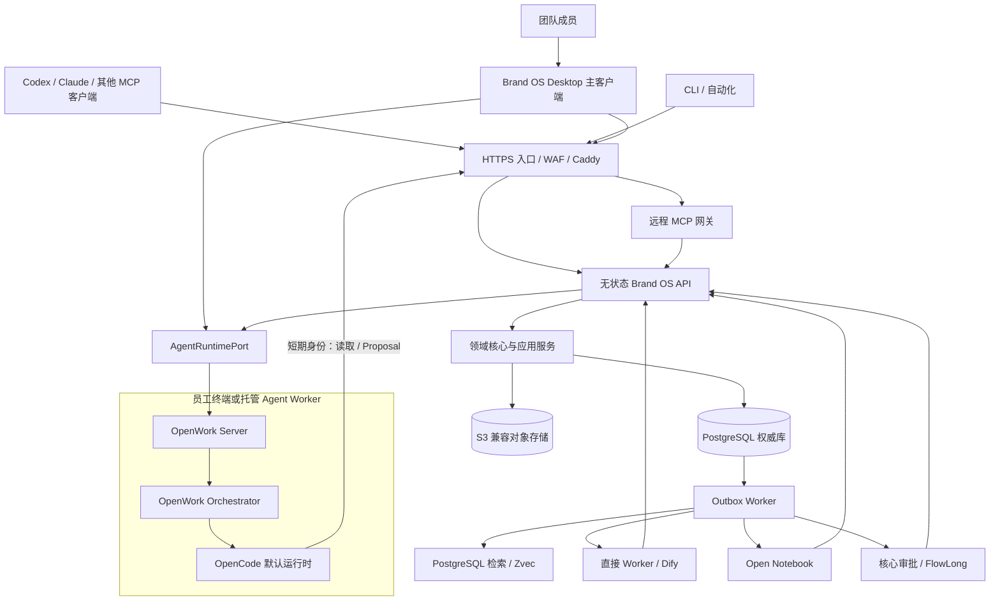

# 团队服务器架构

> 状态：已批准，按 Phase 2-4 分阶段实施 
> 当前进度：F2.1-F2.9 已通过，当前执行 F2.10 恢复、故障演练和服务器阶段门 
> 当前生效决策：[ADR-0005：单一客户端与服务器权威服务](../adr/0005-single-client-server-authority.md)

F2.1 已完成配置优先级、秘密注入、服务器组件职责和健康报告基线。F2.2 已完成 PostgreSQL v1-v6 权威存储，F2.3 已完成 PostgreSQL v7 对象元数据与 S3 原件准入，F2.4 已完成 PostgreSQL v8 员工绑定、OIDC 协议校验和加密会话，F2.5 已完成 PostgreSQL v9 项目授权与强制 RLS，F2.6 已完成幂等重放、乐观版本和可复核冲突差异，F2.7 已完成 PostgreSQL v10 审计、Outbox/Inbox、死信和 Worker 权限边界，F2.9 已完成 PostgreSQL v11 共享限流、观测契约、健康指标和告警去重。各项均通过一次性或进程内验证。当前仍不启动常驻服务，不执行公司 S3/OIDC 初始化，也不迁移鸿日正式数据。

旧可视化交付：[可编辑 Draw.io 源文件](../diagrams/team-server-architecture.drawio)；[嵌入源数据的 PNG](../diagrams/team-server-architecture.drawio.png)。旧图包含轻量 Web 等已取消边界，只作历史参考；当前拓扑以本文和 ADR-0005 为准，后续需单独更新图文件。

## 当前结论

生产形态采用“服务器唯一权威、公司定制 OpenWork 唯一员工客户端、AI 多入口共用同一应用服务”。团队自托管指数据、账号、密钥和备份由公司控制，不要求所有基础设施运行在同一台自建主机上，也不允许员工电脑或 Agent Worker 形成第二个正式写入面。

OpenWork 已被选定为客户端基础。OpenWork Server、Orchestrator 和 OpenCode 只组成隔离 Agent Runtime；它们的会话、SQLite、运行配置和工具权限不属于正式状态。完整条件见 [OpenWork 深度集成计划](openwork-deep-integration.md) 和 [ADR-0004](../adr/0004-openwork-single-client.md)。

## 与 Phase 1 的边界

- Phase 1 已用 SQLite、内容寻址本地证据区和本地 CLI/MCP 完成纵切，没有运行本页服务器拓扑。
- F1.10 已通过；验收数据库、来源 Manifest 和证据哈希作为后续迁移对账基线。
- F2.1 已冻结服务器配置、职责和健康基线，F2.2-F2.7 已完成 PostgreSQL 权威存储、S3 原件准入、OIDC 员工会话、项目权限、冲突处理和派生任务边界；当前从 F2.8 开始，依次完成 API、观测、恢复、联网客户端和团队试点。
- Phase 3 使用一次性迁移和冻结本地写入完成权威切换，不提前运行双套可写系统。

## 组件职责

| 组件 | 保存内容 | 写入规则 | 故障时行为 |
|:---|:---|:---|:---|
| PostgreSQL | 身份映射、项目权限、领域事件、正式投影、审批、Outbox、审计 | 只经领域应用服务写入 | 核心写入停止，禁止伪成功 |
| 对象存储 | 原始文件、提交件、版本化导出和备份 | 临时区校验后转为不可变正式对象 | 新上传暂停，已登记状态保持可查 |
| Brand OS Desktop | UI 状态、短期缓存、草稿、设备配置和令牌引用 | 只调 API；离线仅草稿/Proposal | 显示带水位快照和故障状态，不提供第二套 Web 入口 |
| API/MCP | 身份、权限、业务用例和协议适配 | 无状态；不得保存独立业务事实 | 任一副本可替换 |
| OIDC/身份会话 | 员工认证、预绑定外部身份、短期服务器会话和身份审计 | 只生成交互式员工身份；不判断项目权限或业务批准 | 提供方故障时停止新登录/刷新，既有本地撤销继续有效 |
| OpenWork Server/Orchestrator | Agent 会话、运行配置、流式事件、工具请求和产物引用 | 只经 `AgentRuntimePort`；正式结果经 API 成为 Proposal | 运行暂停/重试，权威查询与审批不受影响 |
| OpenCode | 默认交互式 Agent 运行时 | 使用短期任务身份和最小 Task Packet | 可由其他 `AgentRuntimePort` 适配器替换 |
| Worker | Outbox 消费、投影外派、通知和重建 | 至少一次投递，消费者幂等 | 积压后追平，不阻塞正式事务 |
| PostgreSQL 检索 | 首发关键词、过滤、权限回源 | 派生字段可重建 | 作为 Zvec 降级路径 |
| Zvec | 混合检索索引 | 单活动写 Worker；只存稳定 ID 和派生字段 | 降级到 PostgreSQL 检索 |
| Dify | AI 工作流运行、模型编排和运行日志 | 仅接收最小 Task Packet，返回 Proposal | 切换直接 Worker 或暂停 AI 任务 |
| Open Notebook | 研究工作台和内容处理 | 单向副本，结果只作为候选 | 主系统保持完整 |
| FlowLong | 复杂人工流程协调 | 回调需核心重新鉴权和提交 | 使用内置审批状态机 |
| Nubase | Auth/Storage/Gateway 平台 POC | 不直接写正式领域表 | 完全禁用不影响核心 |

## Agent Worker 拓扑

### 员工终端 Worker

- 随 Brand OS Desktop 安装，用于本地代码仓库、文件和交互式终端任务。
- 只访问用户明确选择且组织策略允许的目录；路径、符号链接和外部命令由 Electron 主进程与 Worker 双重校验。
- 使用 OIDC 用户会话换取短期任务委托令牌，令牌绑定 `run_id`、项目、工具、目录、数据级别和过期时间。
- 桌面退出或设备离线会暂停依赖本机的任务；服务端明确显示最后心跳，不把它误报为仍在运行。

### 托管 Worker

- 用于定时、批量、会议处理和团队自动化，在私网隔离工作区运行。
- 每个任务使用短期服务身份，不能访问成员个人目录、生产数据库或对象存储管理凭据。
- 工作区按任务销毁；需要保留的产物先进入对象隔离区，经哈希和 Schema 校验后登记。
- 多实例领取使用任务租约、心跳、幂等键和取消令牌；Worker 崩溃后可恢复或重新调度，不重复形成 Proposal。

两类 Worker 使用相同 `AgentRuntimePort` 和运行事件 Schema。OpenWork Server/Orchestrator 不对公网开放，管理端不复用 OpenWork Den，也不共享 Brand OS 数据库超级用户。

## 部署档位

以下档位用于 Phase 2-4；实际生产档位由恢复演练和试点负载决定：

| 档位 | 服务端拓扑 | 客户端/Worker | 用途 | RPO / RTO | 结论 |
|:---|:---|:---|:---|:---|:---|
| 服务端开发与演示 | Docker Compose，PostgreSQL、对象存储和单 API 节点 | 未签名开发桌面 + 本机 Runtime | CI、迁移演练、隔离 POC | 不作为生产承诺 | Phase 2 使用 |
| 小团队生产 | 应用节点 + 托管 PostgreSQL + 托管对象存储 + 独立备份域 | 签名稳定版桌面；按需托管 Worker | 第一批内部成员 | 初始目标 5 分钟 / 60 分钟 | Phase 4 依据恢复演练确认 |
| 高可用生产 | 2 个以上应用节点 + 负载均衡 + 多可用区 PostgreSQL + 版本化对象存储 | 灰度桌面通道 + 多托管 Worker | 试点负载达到升级门后 | 初始目标 1 分钟 / 15-30 分钟 | 按测量采用 |

不采用“两台自建 PostgreSQL 即高可用”的方案。缺少仲裁、自动故障转移和成熟备份体系时，它会增加脑裂风险。首发也不引入 Kubernetes；无状态容器、托管数据库和自动化发布已经能满足小团队需求。

## 网络与信任区

- 公网只开放 443。OIDC 回调、API、MCP 和桌面更新使用独立路径或域名及最小安全策略。
- PostgreSQL、对象存储管理端、Redis、Zvec、Dify、Open Notebook、FlowLong、OpenWork Server/Orchestrator 和监控管理端不得直接暴露公网。
- 员工终端 Worker 只建立出站连接；不在局域网监听无认证端口。桌面与本机 Worker 的 IPC/回环 HTTP 使用随机短期令牌、来源校验和窄化路由。
- 运维入口使用 VPN、Tailscale、堡垒机或云厂商私网控制面，并启用 MFA。
- API 到外部模型、Embedding、转录、网页抓取和插件的出口实行提供商白名单、任务级授权和审计。
- Dify、Open Notebook、Nubase、FlowLong 和托管 Agent Worker 使用独立服务账号、独立数据库或 Schema，不共享数据库超级用户。

## 健康、监控与告警

- F2.1 已冻结 `live`/`ready` 的语义并提供 `service-health.v1` 报告模型。实现阶段将把它们挂到 HTTP 路由，但 F2.1 不启动路由或依赖探针。
- `/livez` 只确认进程仍可服务，避免依赖抖动触发重启风暴。
- `/readyz` 检查 PostgreSQL、Schema、对象存储、OIDC 和必要配置；Zvec、Dify、Notebook、FlowLong、OpenCode 或 Agent Worker 故障不得让核心 API 整体失去就绪状态。
- 指标至少覆盖可用率、P95 延迟、5xx、连接池、死锁、版本冲突、Outbox 延迟、Worker 租约/心跳、Agent 队列、运行取消、工具拒绝、备份年龄、WAL、磁盘、证书和外部模型错误率。
- 桌面运行中心显示核心 API、事件水位、Outbox、搜索、Agent Worker、Dify/Notebook/FlowLong 和客户端更新状态；普通成员只看必要状态，管理员可看详细诊断。
- 严重告警：核心不可用超过 3 分钟、数据库不可用、WAL 归档停止、最近成功备份超过 24 小时、磁盘超过 90%、跨项目越权、未授权业务升级或签名更新失败。
- 日志使用 `request_id`、`correlation_id` 和 `run_id`；禁止记录 Token、密码、完整原文、未脱敏提示词、对象签名 URL 或模型密钥。

## 初始内部服务目标

| 指标 | 首个生产目标 |
|:---|:---|
| 核心 API 月可用性 | 首发不低于 99.5%，高可用档不低于 99.9% |
| 读取接口 P95 | 不高于 500 ms |
| 非 AI 写入 P95 | 不高于 1 s |
| Outbox/检索追平 P95 | 不高于 5 s |
| 桌面在线事件可见延迟 P95 | 服务端提交后不高于 5 s |
| Agent 运行状态可见延迟 P95 | Worker 上报后不高于 3 s |
| PostgreSQL RPO | 不高于 5 分钟 |
| 核心服务 RTO | 不高于 60 分钟 |
| 初始并发 | 50 个在线会话、10 个并发写请求 |

所有目标必须以压测、监控和独立恢复演练证明，不能只依据云服务商或上游项目宣传。AI 生成时延按运行时和模型单独统计，不混入核心 API SLO。

## 服务端发布与迁移

1. 镜像固定版本和摘要，生产禁用 `latest`。
2. 迁移采用 expand-migrate-contract，并通过 PostgreSQL advisory lock 保证只有一个迁移任务执行。
3. 发布前在脱敏恢复库运行迁移、金标回归、权限测试和关键查询。
4. 保留最近两个应用版本；应用可快速回滚，数据库默认向前修复。
5. 破坏性迁移至少延迟一个发布周期，并在执行前创建可验证恢复点。
6. 单应用节点允许明确维护窗口；升级为双节点后采用滚动或蓝绿发布。

## 桌面发布与上游同步

1. 公司独立 fork 只构建 OpenWork MIT 社区核心；CI 扫描 `ee/**`、Den、上游云、遥测、商标和更新端点越界。
2. 产品名、AppID、深链协议、包名、图标、签名和更新清单全部由公司控制。
3. macOS 完成代码签名与公证，Windows 完成受信代码签名，Linux 包提供校验和与签名；更新清单和安装包都必须验签。
4. 稳定、灰度和开发通道使用不同授权；服务端维护最小/推荐客户端版本，可阻断已知不安全版本并提供明确升级、只读或回退路径。
5. 持续监控 `upstream/dev`，但月度同步和生产构建只选择稳定 tag 与审查过的提交 SHA；严重安全修复可加急回移。许可、SBOM、类型、IPC、E2E、API 兼容、升级/回退全部通过后才能进入稳定通道。
6. 客户端与 API 至少保持一个发布周期的向后兼容；服务端先扩展，桌面升级覆盖后再收缩旧契约。

## 扩容门

满足任一条件时评估双应用节点、更高数据库规格和托管 Worker 池：连续 30 天正式使用、活跃成员超过 5 人、月可用性接近 99.5% 下限、CPU 或连接池连续一周超过 70%、核心请求 P95 连续超标、托管运行排队 P95 超过 2 分钟。扩容后的服务目标提高到 99.9%，但不改变权威边界，也不把员工终端 Worker 视为服务器容量。

## 实施门

本页已经批准，但仍按以下顺序执行：

1. F1.10 已通过冷启动、会议分类、证据回源、增量 Proposal、探索/执行、多模型一致和品牌质量金标。
2. F2.10 通过身份、权限、一致性、审计、备份恢复和内部运行目标验收。
3. F3.1 完成 SQLite/本地证据到 PostgreSQL/S3 的单向迁移、对账、回滚演练和停止双写。
4. F3.13 通过唯一客户端、MCP/Skills、Dify 和外部组件 NoOp 回退验收。
5. Phase 4 用真实成员、并发和故障数据确认部署档位，未经 F4.9 不宣称生产可用。
